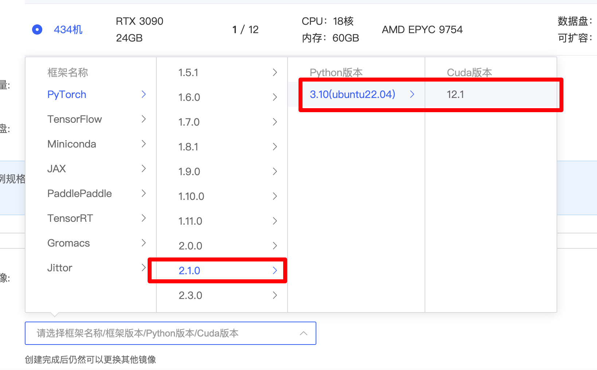

# Index-1.9B-Chat connects to LangChain

## Environment preparation

Rent a 3090 or other 24G video memory graphics card machine on the [AutoDL](https://www.autodl.com/) platform. As shown in the figure below, select `PyTorch`-->`2.1.0`-->`3.10(ubuntu22.04)`-->`12.1`.



Next, open the `JupyterLab` of the server you just rented, and open the terminal in it to start environment configuration, model download and run `demo`.

pip changes the source and installs dependent packages.

```shell
# Upgrade pip
python -m pip install --upgrade pip
# Change the pypi source to accelerate the installation of the library
pip config set global.index-url https://pypi.tuna.tsinghua.edu.cn/simple

pip install modelscope==1.9.5
pip install langchain==0.2.3
pip install transformers==4.39.2 accelerate==0.27.0 tiktoken==0.7.0 einops scipy transformers_stream_generator==0.0.4 peft==0.10.0 deepspeed==0.14.3
pip install huggingface_hub==0.23.4
pip install sentencepiece==0.1.99
```

## Model download

Use the `snapshot_download` function in `modelscope` to download the model. The first parameter is the model name, the parameter `cache_dir` is the download path of the model, the parameter `revision` is the version of the model, and master represents the main branch, which is the latest version.

Create a new `download.py` file in the `/root/autodl-tmp` path and enter the following content in it. Remember to save the file after pasting the code, as shown in the figure below. And run `python /root/autodl-tmp/download.py` to download. The model size is 8 GB and it takes about 5 minutes to download the model.

```python
import torch
frommodelscope import snapshot_download, AutoModel, AutoTokenizer
import os

model_dir = snapshot_download('IndexTeam/Index-1.9B-Chat', cache_dir='/root/autodl-tmp', revision='master')
```

The following result appears in the terminal, indicating that the download is successful.


## Code preparation

To build LLM applications conveniently, we need to customize an LLM class based on the locally deployed Index-LM and connect Index to the LangChain framework. After completing the customized LLM class, the LangChain interface can be called in a completely consistent manner without considering the inconsistency of the underlying model call.

Customizing the LLM class based on the local deployment Index is not complicated. We only need to inherit a subclass from the LangChain.llms.base.LLM class and rewrite the constructor and _call function:

```python
from langchain.llms.base importt LLM
from typing import Any, List, Optional
from langchain.callbacks.manager import CallbackManagerForLLMRun
from transformers import AutoTokenizer, AutoModelForCausalLM, GenerationConfig, LlamaTokenizerFast
import torch

class Index_LLM(LLM): # Define an Index_LLM class that inherits from LLM
# Class variables, initialized to None, will be assigned in the initialization method
tokenizer: AutoTokenizer = None
model: AutoModelForCausalLM = None

def __init__(self, mode_name_or_path: str): # Initialization method, accepts model path or name as parameter

super().__init__() # Call the initialization method of the parent classprint("Loading model from local...") # Print prompt information for loading model
# Use AutoTokenizer to load tokenizer from pre-trained model
self.tokenizer = AutoTokenizer.from_pretrained(mode_name_or_path, use_fast=False, trust_remote_code=True)
# Use AutoModelForCausalLM to load language model from pre-trained model
self.model = AutoModelForCausalLM.from_pretrained(
mode_name_or_path,
torch_dtype=torch.bfloat16, # Set PyTorch data type to bfloat16
device_map="auto", # Let the model automatically select the device
trust_remote_code=True # Trust remote code
)# Load generation configuration from pre-trained model
self.model.generation_config = GenerationConfig.from_pretrained(mode_name_or_path)
print("Complete loading of local model") # Print prompt message of model loading completion

def _call(self, prompt: str, stop: Optional[List[str]] = None,
run_manager: Optional[CallbackManagerForLLMRun] = None,
**kwargs: Any): # Define _call method for generating text

messages = [{"role": "user", "content": prompt }] # Define message list, including user's role and content
# Apply chat template to generate input ID
input_ids = self.tokenizer.apply_chat_template(messages, tokenize=False, add_generation_prompt=True)
# Convert the input ID to the input format required by the model and convert it to a PyTorch tensor
model_inputs = self.tokenizer([input_ids], return_tensors="pt").to('cuda')
# Generate text using the model and set generation parameters
generated_ids = self.model.generate(
model_inputs.input_ids,
max_new_tokens=512, # Maximum number of newly generated tokens
top_k=5, # Number of tokens sampled each time
top_p=0.8, # Sampling by probability distribution
temperature=0.3, # Temperature parameter, affecting the randomness of generated text
repetition_penalty=1.1, #Repeated penalty to avoid repeated generation of the same text
do_sample=True # Whether to use sampling
)
# Extract the actual generated text ID from the generated ID
generated_ids = [
output_ids[len(input_ids):] for input_ids, output_ids in zip(model_inputs.input_ids, generated_ids)
]
# Decode the generated ID into text and skip special tokens
response = self.tokenizer.batch_decode(generated_ids, skip_special_tokens=True)[0]
return response # Returns the generated text

@property
def _llm_type(self) -> str: # Define an attribute to return the type of the model
return "Index_LLM"
```

In the aboveIn the class definition, we rewrite the constructor and _call function respectively:

- For the constructor, we load the locally deployed ChatGLM4 model at the beginning of the object instantiation to avoid the time waste caused by reloading the model for each call;

- The `_call` function is the core function of the LLM class. Langchain will call this function to call LLM. In this function, we call the generate method of the instantiated model to call the model and return the call result.

In addition, when implementing a custom LLM class, according to the requirements of the langchain framework, we need to define the `_identifying_params` attribute. The function of this attribute is to return a dictionary containing parameters that can uniquely identify this LLM instance. This function is very important for caching and tracking because it can help the system identify different model configurations, thereby performing effective cache management and log tracking.

In the overall project, we encapsulate the above code as LLM.py, and will directly introduce the custom ChatGLM4_LLM class from this file later.

## Call

Then you can use it like any other langchain big model function.

```python
from LLM import Index_LLM
llm= Index_LLM(mode_name_or_path = "/root/autodl-tmp/Index-1.9B-Chat")
print(llm("Who are you?"))
```

