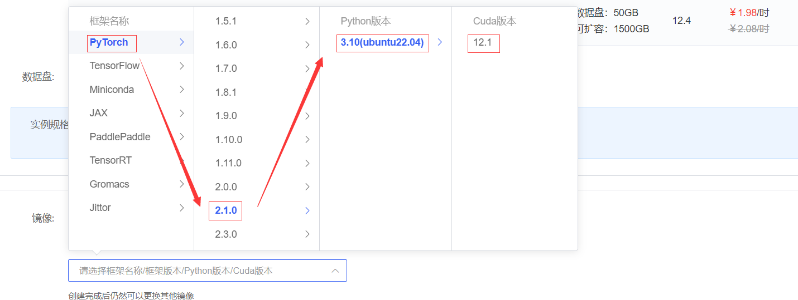
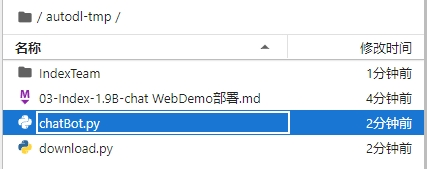
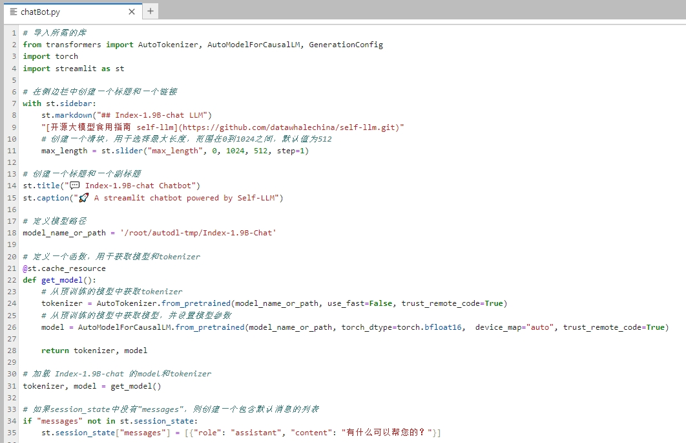
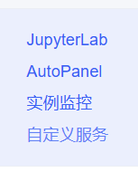
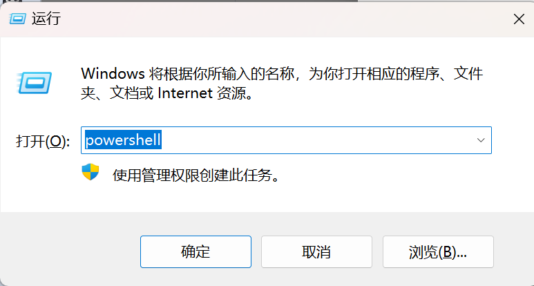
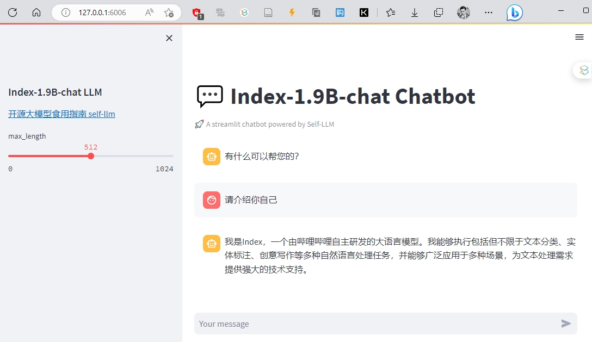

# Index-1.9B-chat WebDemo deployment

## Environment preparation

Rent a 3090 or other 24G video memory graphics card machine on the [AutoDL](https://www.autodl.com/) platform. As shown in the figure below, select `PyTorch`-->`2.1.0`-->`3.10(ubuntu22.04)`-->`12.1`.



Next, open the `JupyterLab` of the server you just rented, and open the terminal in it to start environment configuration, model download and run `demo`.

pip changes the source and installs dependent packages.

```bash
# Upgrade pip
python -m pip install --upgrade pip
# Change the pypi source to accelerate the installation of the library
pip config set global.index-url https://pypi.tuna.tsinghua.edu.cn/simple

pip install modelscope==1.9.5
pip install transformers==4.39.2
pip install streamlit==1.24.0
pip install sentencepiece==0.1.99
pip install accelerate==0.27.0
pip install transformers_stream_generator==0.0.4
pip install tiktoken==0.7.0
pip install huggingface_hub==0.23.4
```

## Model download

Use the `snapshot_download` function in `modelscope` to download the model. The first parameter is the model name, the parameter `cache_dir` is the download path of the model, the parameter `revision` is the version of the model, and master represents the main branch, which is the latest version.

Create a new `download.py` file in the `/root/autodl-tmp` path and enter the following content in it. Remember to save the file after pasting the code, as shown in the figure below. And run `python /root/autodl-tmp/download.py` to execute the download. The model size is 8 GB, and it takes about 5 minutes to download the model.

```python import torch from modelscopeimport snapshot_download, AutoModel, AutoTokenizer
import os

model_dir = snapshot_download('IndexTeam/Index-1.9B-Chat', cache_dir='/root/autodl-tmp', revision='master')
```

The following result appears in the terminal, indicating that the download is successful.


## Code preparation

Create a new file `chatBot.py` in the `/root/autodl-tmp` path and enter the following content in it. Remember to save the file after pasting the code. The following code has very detailed comments. If you have any questions, please raise an issue.





chatBot.py code is as follows

```
# Import required libraries
from transformers import AutoTokenizer, AutoModelForCausalLM, GenerationConfigimport torch
import streamlit as st

# Create a title and a link in the sidebar
with st.sidebar:
st.markdown("## Index-1.9B-chat LLM")
"[Open Source Large Model Eating Guide self-llm](https://github.com/datawhalechina/self-llm.git)"
# Create a slider to select the maximum length, ranging from 0 to 1024, with a default value of 512
max_length = st.slider("max_length", 0, 1024, 512, step=1)

# Create a title and a subtitle
st.title("💬 Index-1.9B-chat Chatbot")
st.caption("🚀 A streamlit chatbot powered by Self-LLM")

# Define the model path
model_name_or_path = '/root/autodl-tmp/Index-1.9B-Chat'

# Define a function to get the model and tokenizer
@st.cache_resource
def get_model():
# Get tokenizer from pre-trained model
tokenizer = AutoTokenizer.from_pretrained(model_name_or_path, use_fast=False, trust_remote_code=True)
# Get model from pre-trained model and set model parameters
model = AutoModelForCausalLM.from_pretrained(model_name_or_path, torch_dtype=torch.bfloat16, device_map="auto", trust_remote_code=True)

return tokenizer, model

# Load the model and tokenizer of Index-1.9B-chat
tokenizer, model = get_model()

# If there is no "messages" in session_state, create a list with default messages
if "messages" notin st.session_state:
st.session_state["messages"] = [{"role": "assistant", "content": "How can I help you?"}]

# Traverse all messages in session_state and display them on the chat interface
for msg in st.session_state.messages:
st.chat_message(msg["role"]).write(msg["content"])

# If the user enters content in the chat input box, do the following
if prompt := st.chat_input():
# Add the user's input to the messages list in session_state
st.session_state.messages.append({"role": "user", "content": prompt})
# Display the user's input on the chat interface
st.chat_message("user").write(prompt)

# Build input 
input_ids = tokenizer.apply_chat_template(st.session_state.messages,tokenize=False,add_generation_prompt=True) model_inputs = tokenizer([input_ids], return_tensors="pt").to('cuda') generated_ids = model.generate(model_inputs.input_ids , max_new_tokens=512) generated_ids = [ output_ids[len(input_ids):] for input_ids, output_ids in zip(model_inputs.input_ids, generated_ids) ] response = tokenizer.batch_decode(generated_ids, skip_special_tokens=True)[0] # Convert the output of the model Add to session_state in the messages list
st.session_state.messages.append({"role": "assistant", "content": response})
# Display the output of the model on the chat interface
st.chat_message("assistant").write(response)
# print(st.session_state)
```

## Run demo

Run the following command in the terminal to start the streamlit service

```
streamlit run /root/autodl-tmp/chatBot.py --server.address 127.0.0.1 --server.port 6006
```

Click on Custom Service



Click on Linux


Then press win+R to open PowerShell



Enter ssh and password, press Enter to finish


Open the link http://localhost:6006/ in the browser to see the chat interface. The running effect is as follows: