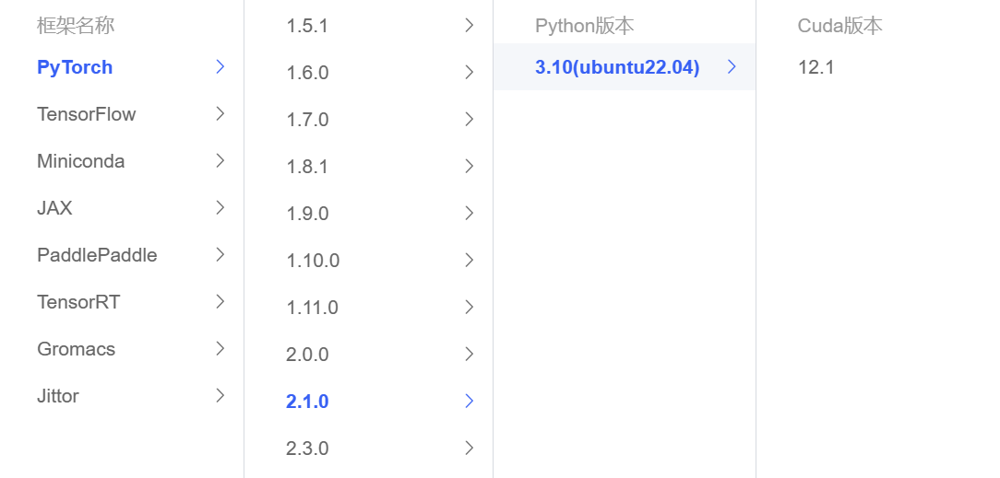
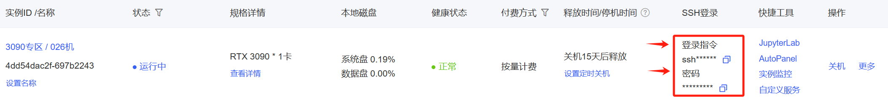

# Index-1.9B-Chat Lora fine-tuning

In this section, we briefly introduce how to fine-tune Bilibili's Index-1.9B-Chat large language model with Lora based on frameworks such as transformers and peft. Lora is an efficient fine-tuning method. For a deeper understanding of its principles, please refer to the blog: [Zhihu | Lora in a Simple Way](https://zhuanlan.zhihu.com/p/650197598).

This tutorial will provide you with a [Notebook](./04-Index-1.9B-Chat%20Lora.ipynb) file in the same directory to help you learn better.

## **Environment preparation**

Rent a container instance with 24G video memory size such as 3090 in the `AutoDL` platform, and select the image as follows `PyTorch`→`2.1.0`→`3.10(ubuntu22.04)`→`12.1`



Next, open the local device terminal and use `ssh` to access. Copy the login command and password in the terminal to complete the login



`ssh`The interface after successful login is as shown in the figure👇


Or you can directly open `AutoDL` and select `JupyterLab` in the shortcut tool on the web page and click the terminal to open it (this method does not require verification🫠)

Next, start environment configuration, model download and run demonstration ~

`pip` Change source to speed up downloading and installing dependent packages

```bash
python -m pip install --upgrade pip
# Change pypi source to speed up library installation
pip config set global.index-url https://pypi.tuna.tsinghua.edu.cn/simple

pip install modelscope==1.9.5
pip install transformers==4.39.2
pip install streamlit==1.24.0
pip install sentencepiece==0.1.99
pip install accelerate==0.27.0 pip install transformers_stream_generator==0.0.4
pip install datasets==2.8.0
pip install peft==0.10.0

# Optional
MAX_JOBS=8 pip install flash-attn --no-build-isolation 
```

> Considering that some students may encounter some problems in configuring the environment, we have prepared an environment image of `Index-1.9B-Chat` on the `AutoDL` platform. Click the link below and create an `Autodl` example directly.
> ***https://www.codewithgpu.com/i/datawhalechina/self-llm/Index***

> Note: `flash-attn` will be slow to install, and it will take about ten minutes.

In this tutorial, we will place the fine-tuning dataset in the root directory [/dataset](../dataset/huanhuan.json).

## Model download 

Use the `snapshot_download` function in `modelscope` to download the model. The first parameter is the model name and the parameter `cache_dir` is the model, the parameter `revision` is the version of the model, and master represents the main branch, which is the latest version.

Create a `download.py` file in the `/root/autodl-tmp` path and enter the following content in it. Remember to save the file after pasting the code, as shown in the figure below. And run `python /root/autodl-tmp/download.py` to execute the download. The model size is 8 GB, and it takes about 5 minutes to download the model.

```python
import torch
from modelscope import snapshot_download, AutoModel, AutoTokenizer
import os

model_dir = snapshot_download('IndexTeam/Index-1.9B-Chat', cache_dir='/root/autodl-tmp', revision='master')
```

The following result appears in the terminal, indicating that the download is successful.


## Instruction set construction

`LLM` fine-tuning generally refers to the instruction fine-tuning process. The so-called instruction fine-tuning means that the fine-tuning data we use is in the form of 👇```json
{
"instruction":"Answer the following user questions and output only the answer.",
"input":"What is 1+1?",
"output":"2"
}
```

Wherein, `instruction` is the user instruction, telling the model what task it needs to complete; `input` is the user input, which is the input content required to complete the user instruction; `output` is the output that the model should give.

That is, our core training goal is to enable the model to understand and follow user instructions. Therefore, when constructing the instruction set, we should build a task instruction set specifically for our target task. For example, in this section we use the [Chat-甄嬛](https://github.com/KMnO4-zx/huanhuan-chat) project as an example. Our goal is to build a personalized `LLM` that can simulate the conversation style of 甄嬛, so the instructions we construct are as follows:

```json
{
"instruction": "Who are you?",
"input":"",
"output":"My father is Zhen Yuandao, Shaoqing of Dali Temple."

}
```

All the instruction datasets we constructed are in the root directory.

## Data formatting

The data for `Lora` training needs to beAfter formatting and encoding, enter the model for training. If you are familiar with the `PyTorch` model training process, we generally need to know that the input text is encoded to` input_ids` to encode the output text to `labels`. The results after the encoding are multi -dimensional vector. Sample, coding its input, output text, and returning a coded dictionary: `` `` `` `` `` `` `` `` `` python def process_func (example): max_length = 384 # The Chinese word is divided into multiple tokens, so you need to let go of the maximum length to ensure the integrity of the data input_i. DS, Attention_Mask, Labels = [], [], [] Instruction = Tokenizer (F "<nk> System. Now you want to play the woman around the emperor-Zhen Huan Reserved_0User {exmple ['Instance'] + Examp. le ['input']} reserved_1Assistant ", add_special_tokens = false) # add_special_tokens does not add special_tokens at the beginning
response = tokenizer(f"{example['output']}", add_special_tokens=False)
input_ids = instruction["input_ids"] + response["input_ids"] + [tokenizer.pad_token_id]
attention_mask = instruction["attention_mask"] + response["attention_mask"] + [1] # Because we also need to pay attention to eos token, we add 1
labels = [-100] * len(instruction["input_ids"]) + response["input_ids"] + [tokenizer.pad_token_id] 
if len(input_ids) > MAX_LENGTH: # Do a truncation
input_ids = input_ids[:MAX_LENGTH]attention_mask = attention_mask[:MAX_LENGTH]
        labels = labels[:MAX_LENGTH]
    return {
        "input_ids": input_ids,
        "attention_mask": attention_mask,
        "labels": labels
    }
```

`Index-1.9B-Chat` 采用的`Prompt Template`格式如下👇

```text
<unk>system现在你要扮演皇帝身边的女人--甄嬛 reserved_0 user小姐，别的秀女都在求中选，唯有咱们小姐想被撂牌子，菩萨一定记得真真儿的—— reserved_1 assistant嘘——都说许愿说破是不灵的。<unk>
```


## 加载tokenizer和半精度模型

模型以半精度形式加载，如果你的显卡比较新的话，可以用`torch.bfolat`形式加载。对于自定义的模型一定要指定`trust_remote_code`参数为`True`。

```python
tokenizer = AutoTokenizer.from_pretrained('/root/autodl-tmp/Tsumugii24/Index-1.9B-Chat/', use_fast=False, trust_remote_code=True)

model = AutoModelForCausalLM.from_pretrained('/root/autodl-tmp/Tsumugii24/Index-1.9B-Chat/', device_map="auto", trust_remote_code=True, torch_dtype=torch.bfloat16)
```

## Define LoraConfig

Many parameters can be set in the `LoraConfig` class, but there are not many main parameters. Let's talk about them briefly. Students who are interested can directly look at the source code.

- `task_type`: model type
- `target_modules`: the name of the model layer to be trained, mainly the layer of the `attention` part. Different models have different corresponding layer names. You can pass in an array, a string, or a regular expression.- `r`: the rank of `lora`, for details, please refer to `Lora` principle

- `lora_alpha`: `Lora alaph`, for specific functions, please refer to `Lora` principle

What is the scaling of `Lora`? Of course it is not `r` (rank), this scaling is `lora_alpha/r`, and the scaling in this `LoraConfig` is 4 times.

```python
config = LoraConfig(
task_type=TaskType.CAUSAL_LM, 
target_modules=["q_proj", "k_proj", "v_proj", "o_proj", "gate_proj", "up_proj", "down_proj"],
inference_mode=False, # Training mode
r=8, # Lora rank
lora_alpha=32, # Lora alaph, for specific functions, see Lora principle
lora_dropout=0.1 # Dropout ratio
)
```

## Customize TrainingArguments parameters

`TrainingArguments`The source code of this class also introduces the specific function of each parameter. Of course, you can explore it yourself. Here are a few commonly used ones.

- `output_dir`: output path of the model
- `per_device_train_batch_size`: As the name implies `batch_size`
- `gradient_accumulation_steps`: gradient accumulation. If the video memory is small, you can set `batch_size` to a smaller value to increase the gradient accumulation
- `logging_steps`: the number of steps required to output a log
- `num_train_epochs`: As the name implies `epoch`
- `gradient_checkpointing`: gradient check. Once this is enabled, the model must execute `model.enable_input_require_grads()`. You can explore this principle by yourself, so I won’t go into details here

```python
args = TrainingArguments(
output_dir="./output/Index-1.9B-Chat-lora",
per_device_train_batch_size=4,
gradient_accumulation_steps=4,
logging_steps=10,
num_train_epochs=3,
save_steps=100,
learning_rate=1e-4,
save_on_each_node=True,
gradient_checkpointing=True
)
```

## Train with Trainer

```python
trainer = Trainer(
model=model,
args=args,
train_dataset=tokenized_id,
data_collator=DataCollatorForSeq2Seq(tokenizer=tokenizer, padding=True),
)
trainer.train()
```

## Load lora weight inference

After training, you can use the following method to load `lora` weights for inference:

```python
from transformers import AutoModelForCausalLM,AutoTokenizer
import torch
from peft import PeftModel

model_path = '/root/autodl-tmp/Tsumugii24/Index-1.9B-Chat/'
lora_path = 'lora_path'

# Load tokenizer
tokenizer = AutoTokenizer.from_pretrained(model_path)

# Load model
model = AutoModelForCausalLM.from_pretrained(model_path, device_map="auto",torch_dtype=torch.bfloat16)

# Load lora weights
model = PeftModel.from_pretrained(model, model_id=lora_path, config=config)

prompt = "Who are you?"
messages = [
{"role": "system", "content": "Now you have to play the role of the emperor's woman--Zhen Huan"},
{"role": "user", "content": prompt} ] text = tokenizer.apply_chat_template(messages, tokenize=False, add_generation_prompt=True) model_inputs = tokenizer([text], return_tensors="pt").to('cuda' ) generated_ids = model.generate( model_inputs.input_ids, max_new_tokens=512 ) generated_ids = [ output_ids[len(input_ids):] for input_ids, output_ids in zip(model_inputs.input_ids, generated_ids) ] response = tokenizer.batch_decode(generated_ids, skip_special_tokens= True)[0] print(response)```

