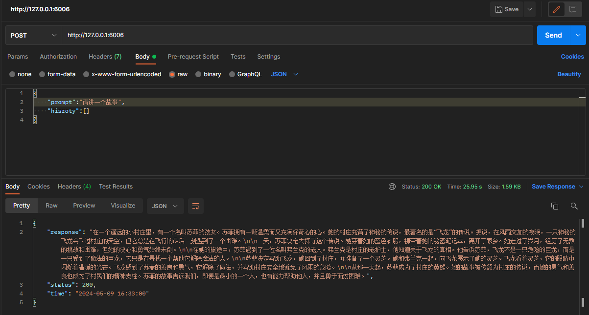

# Phi-3-mini-4k-instruct FastApi deployment call

## Environment preparation

Rent a 3090 or other 24G graphics card machine in the autodl platform. As shown in the figure below, select PyTorch-->2.0.0-->3.8(ubuntu20.04)-->11.8.

Next, open JupyterLab on the server you just rented, and open the terminal to start environment configuration, model download and run demonstration.


### Create a working directory

Create the working directory for this phi3 practice `/root/autodl-tmp/phi3`

```bash
# Create a working directory
mkdir -p /root/autodl-tmp/phi3
```

### Install dependencies

```bash
# Upgrade pip
python -m pip install --upgrade pip
# Replace the installation of the pypi source acceleration library
pip config set global.index-url https://pypi.tuna.tsinghua.edu.cn/simple

pip install fastapi==0.104.1
pip install uvicorn==0.24.0.post1
pip install requests==2.25.1
pip install modelscope==1.9.5
pip install streamlit==1.24.0
pip install sentencepiece==0.1.99
pip install accelerate==0.24.1
```

Since the transformers version required by phi3 is `4.41.0.dev0 version`.

You can first check the version of your transformers package through the following command

```bash
pip list |grep transformers
```

If the version is incorrect, you can upgrade it through the following command

```bash
# phi3 upgrades transformers to version 4.41.0.dev0
pip uninstall -y transformers && pip install git+https://github.com/huggingface/transformers
```

## Model downloadUse the `sapshot_download` function in modelscope to download the model. The first parameter is the model name, and the parameter `cache_dir` is the download path of the model.

Create a `download.py` file in the /root/autodl-tmp path and enter the following content in it. Remember to save the file after pasting the code, as shown in the figure below. And run `python /root/autodl-tmp/download.py` to download. The model size is 8 GB, and it takes about 10~15 minutes to download the model.

```python
#Model download
from modelscope import snapshot_download
model_dir = snapshot_download('LLM-Research/Phi-3-mini-4k-instruct', cache_dir='/root/autodl-tmp/phi3', revision='master')
```

## Code preparation

Create a `api.py` file in the `/root/autodl-tmp` path and enter the following content in it. Remember to save the file after pasting the code. The following code has detailed comments. If you have any questions, please feel free to ask.Issue.

```python
from fastapi import FastAPI, Request
from transformers import AutoTokenizer, AutoModelForCausalLM, GenerationConfig
import uvicorn
import json
import datetime
import torch

# Set device parameters
DEVICE = "cuda" # Use CUDA
DEVICE_ID = "0" # CUDA device ID, empty if not set
CUDA_DEVICE = f"{DEVICE}:{DEVICE_ID}" if DEVICE_ID else DEVICE # Combine CUDA device information

# Clean up GPU memory function
def torch_gc():
if torch.cuda.is_available(): # Check if CUDA is available
with torch.cuda.device(CUDA_DEVICE): # Specify CUDA device
torch.cuda.empty_cache() # Clear CUDA cache
torch.cuda.ipc_collect() # Collect CUDA memory fragments

# Create FastAPI application
app = FastAPI()

# Endpoint for handling POST requests
@app.post("/")
async def create_item(request: Request):
global model, tokenizer # Declare global variables to use models and tokenizers inside functions
json_post_raw = await request.json() # Get JSON data for POST request
json_post = json.dumps(json_post_raw) # Convert JSON data to string
json_post_list = json.loads(json_post) # Convert string to Python object
prompt = json_post_list.get('prompt') # Get prompt in request
history = json_post_list.get('history', []) # Get the history in the request

print(prompt)
messages = [
{"role": "user", "content": prompt}
]

# Call the model for conversation generation
input_ids = tokenizer.apply_chat_template(conversation=messages, tokenize=True, add_generation_prompt=True, return_tensors='pt')
output_ids = model.generate(input_ids.to('cuda'),max_new_tokens=2048)

response = tokenizer.decode(output_ids[0][input_ids.shape[1]:], skip_special_tokens=True)

now = datetime.datetime.now() # Get the current time
time =now.strftime("%Y-%m-%d %H:%M:%S") # Format time as a string
# Build response JSON
answer = {
"response": response,
"status": 200,
"time": time
}
# Build log information
log = "[" + time + "] " + '", prompt:"' + prompt + '", response:"' + repr(response) + '"'
print(log) # Print log
torch_gc() # Perform GPU memory cleanup
return answer # Return response

# Main function entry
if __name__ == '__main__':
# Load pre-trained tokenizer and model
model_name_or_path = '/root/autodl-tmp/phi3/model/LLM-Research/Phi-3-mini-4k-instruct'
tokenizer = AutoTokenizer.from_pretrained(model_name_or_path)
model = AutoModelForCausalLM.from_pretrained(model_name_or_path, 
device_map="cuda", 
torch_dtype="auto", 
trust_remote_code=True, 
).eval()

# Start FastAPI application
# Use port 6006 to map the port of autodl to the local, so as to use the api locally
uvicorn.run(app, host='0.0.0.0', port=6006, workers=1) # Start the application on the specified port and host
```

By default, it is deployed on port 6006 and is called through the POST method. You can use curl to call it as follows:

```bash
curl -X POST "http://127.0.0.1:6006" \
-H 'Content-Type: applicationn/json' \
-d '{"prompt": "Hello", "history": []}'
```
The response is as follows:
```json
{
"response": "Hello! If you need help or have any questions, please feel free to let me know.",
"status": 200,
"time": "2024-05-09 16:36:43"
}
```

SSH port mapping

```bash
ssh -CNg -L 6006:127.0.0.1:6006 -p [SSH port of your autodl machine] root@[your autodl machine address]
ssh -CNg -L 6006:127.0.0.1:6006 -p 36494 root@region-45.autodl.pro
```

After port mapping, use postman to access

