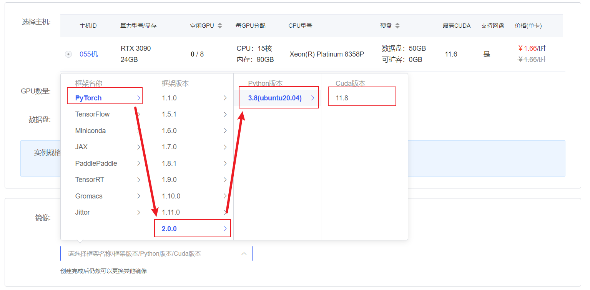
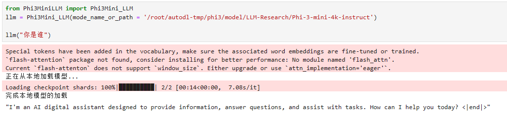
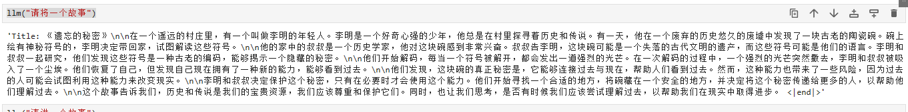

# Phi-3-mini-4k-instruct langchain access

## Environment preparation

Rent a 3090 or other 24G video memory graphics card machine in the autodl platform, as shown in the following figure, select PyTorch-->2.0.0-->3.8(ubuntu20.04)-->11.8.

Next, open JupyterLab on the server you just rented, and open the terminal in it to start environment configuration, model download and run demonstration. 



### Create a working directory

Create the working directory for this phi3 practice `/root/autodl-tmp/phi3`

```bash
# Create a working directory
mkdir -p /root/autodl-tmp/phi3
```

### Install dependencies

```bash
# Upgrade pip
python -m pip install --upgrade pip
# Replace the pypi source acceleration library installation
pip config set global.index-url https://pypi.tuna.tsinghua.edu.cn/simple

pip install fastapi==0.104.1
pip install uvicorn==0.24.0.post1
pip install requests==2.25.1
pip install modelscope==1.9.5
pip install streamlit==1.24.0
pip install sentencepiece==0.1.99
pip install accelerate==0.24.1
pip install langchain==0.1.15
```

Since the transformers version required by phi3 is `4.41.0.dev0 version`.

You can first check the version of your transformers package through the following command

```bash
pip list |grep transformers
```

If the version is incorrect, you can upgrade it through the following command

```bash
# phi3 upgrades transformers to version 4.41.0.dev0
pip uninstall -y transformers && pip install git+https://github.com/huggingface/transformers
```

## Model download

Use the `napshot_download` function in modelscope to download the model. The first parameter is the model name, and the parameter `cache_dir` is the model download path.

Create a new `download.py` file in the /root/autodl-tmp path and enter the following content in it. Remember to save the file after pasting the code, as shown in the figure below. And run `python /root/autodl-tmp/download.py` to download. The model size is 8 GB. It takes about 10~15 minutes to download the model.

```python
#Model download
from modelscope import snapshot_download
model_dir = snapshot_download('LLM-Research/Phi-3-mini-4k-instruct', cache_dir='/root/autodl-tmp/phi3', revision='master')
```

## Code preparation

To build LLM applications conveniently, we need to customize a LLM based on the locally deployed Phi-3-mini-4k-instruct.LM class, connect Phi-3-mini-4k-instruct to the LangChain framework. After completing the custom LLM class, you can call the LangChain interface in a completely consistent way without considering the inconsistency of the underlying model call.

Customizing the LLM class based on the locally deployed Phi-3-mini-4k-instruct is not complicated. We only need to inherit a subclass from the LangChain.llms.base.LLM class and rewrite the constructor and _call function.

We create a new py file `Phi3MiniLLM.py` and write the following content:

```python
from langchain.llms.base import LLM
from typing import Any, List, Optional
from langchain.callbacks.manager import CallbackManagerForLLMRun
from transformers import AutoTokenizer, AutoModelForCausalLM, GenerationConfig
import torch

class Phi3Mini_LLM(LLM):
# Customize LLM class based on local Phi-3-mini
tokenizer: AutoTokenizer = None
model: AutoModelForCausalLM = None
def __init__(self, mode_name_or_path :str):
super().__init__()
print("Loading model from local...")
self.tokenizer = AutoTokenizer.from_pretrained(mode_name_or_path, use_fast=False)
self.model = AutoModelForCausalLM.from_pretrained(mode_name_or_path, device_map="cuda", 
torch_dtype="auto", 
trust_remote_code=True,)
self.model.generation_config = GenerationConfig.from_pretrained(mode_name_or_path) self.model.generation_config.pad_token_id = self.model.generation_config.eos_token_id self.model = self.model.eval() print("Complete loading of local model") def _call (self, prompt : str, stop: Optional[List[str]] = None, run_manager: Optional[CallbackManagerForLLMRun] = None, **kwargs: Any): messages = [ {"role": "user", "content" : prompt}]
# Call the model for conversation generation
input_ids = self.tokenizer.apply_chat_template(conversation=messages, tokenize=True, add_generation_prompt=True, return_tensors='pt')
output_ids = self.model.generate(input_ids.to('cuda'),max_new_tokens=2048)

response = self.tokenizer.decode(output_ids[0][input_ids.shape[1]:], skip_special_tokens=True)
return response

@property
def _llm_type(self) -> str:
return "Phi3Mini_LLM"
```

## Code running

ThenIt can be used like any other langchain large model function. Run on jupyter

```python
from Phi3MiniLLM import Phi3Mini_LLM
llm = Phi3Mini_LLM(mode_name_or_path = '/root/autodl-tmp/phi3/model/LLM-Research/Phi-3-mini-4k-instruct')
print(llm("Who are you"))
```

At this point, the Phi-3-mini-4k-instruct model has actually been connected to langchain



Tell a story by calling the phi3-mini-4k-instruct model through langchain



## TODO

Build local knowledge base data. Build a local knowledge base assistant through langchain.