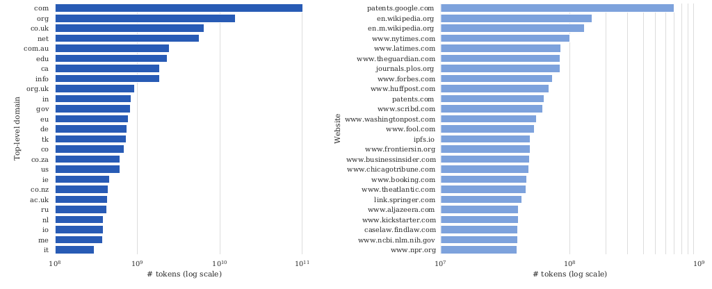
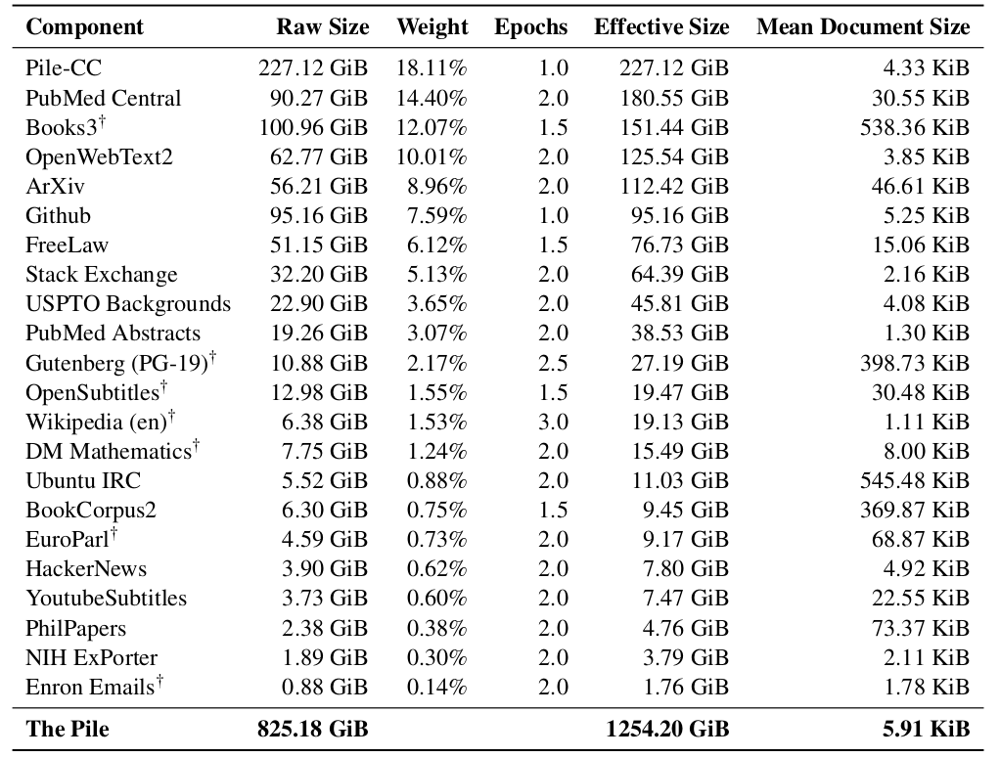

# Chapter 5 Data Behind Large Models

So far, we have discussed the behavior (powers and detriments) of large language models. Now, we are going to peel back the first layer of the onion and start discussing how these models are built. The starting point for any machine learning method is the training data, so this is where we start.

Addendum: Usually in machine learning, the training data and the test (evaluation) data are similar, or at least of the same type. But for large language models, the training data is "raw text".

## 5.1 Data Behind Large Language Models

Let's be clear that large language models are trained on "raw text". In order to achieve high capabilities (such as language and world knowledge), these texts should cover a wide range of domains, genres, languages, etc.

The web is a natural place (but not the only place) to find such text, so this will be our main focus. The web is absolutely huge. As a lower limit, Google's search index is 100PB (reference). The actual web is probably larger, and the deep web (referring to all the web pages that cannot be recognized by search engines) is even larger than this.

It is worth noting that private datasets stored in large companies are even larger than publicly available data. For example, [Walmart](https://www.forbes.com/sites/bernardmarr/2017/01/23/really-big-data-at-walmart-real-time-insights-from-their-40-petabyte-data-cloud) generates 2.5PB of data every hour!

[Common Crawl](https://en.wikipedia.org/wiki/Common_Crawl) is a non-profit organization that crawls the web and provides free snapshots to the public. Due to its convenience, it has become the standard data source for many models such as T5, GPT-3, and Gopher. For example, Common Crawl's April 2021 snapshot has 320TB of data, which is several orders of magnitude smaller than Google's index.

Despite the abundance of web data, [Bender et al.](https://dl.acm.org/doi/pdf/10.1145/3442188.3445922) pointed out in a 2021 study:
- Large-scale data still has an uneven representation of the global population.
- Web data overrepresents young users from developed countries.
- GPT-2's training data is based on Reddit. According to a 2016 survey by Pew Internet Research, 67% of Reddit users in the United States are male and 64% are between the ages of 18 and 29.
- Only 8.8-15% of Wikipedia editors are female.
- Online harassment may make=Some groups of people (e.g. transgender, people with different neurodevelopment) are excluded.
- Filtering "bad words" may further marginalize some groups of people (e.g. LGBT+).
Therefore, we conclude that it is critical to understand and document the composition of datasets used to train large language models.

### 5.1.1 WebText and OpenWebText datasets

The WebText dataset was used to train the GPT-2 model. The goal was to obtain a dataset that was both diverse and high quality. Previous studies mainly trained on datasets such as news, Wikipedia, or novels, while Common Crawl contains a lot of junk information (such as meaningless text and template text). [Trinh and Le](https://arxiv.org/pdf/1806.02847.pdf) selected a small part of Common Crawl in 2018 based on the overlap of n-grams with the target task. The process of creating WebText includes: crawling all external links with at least 3 likes, filtering out Wikipedia for evaluation on a Wikipedia-based benchmark, and finally obtaining 40GB of text.

Although OpenAI has not publicly released the WebText dataset, the [OpenWebText dataset](https://skylion007.github.io/OpenWebTextCorpus/) is available atConceptually, it copied the construction method of WebText. That is to say, although OpenWebText is not a copy of WebText directly released by OpenAI, it follows the production ideas and methods of WebText, with the aim of simulating and reproducing the data characteristics and structure of WebText as much as possible. In this way, researchers can use OpenWebText to conduct some experiments and research that originally required WebText datasets. OpenWebText extracts all URLs from the [Reddit submission dataset](https://files.pushshift.io/reddit/submissions/), uses Facebook's [fastText](https://github.com/facebookresearch/fastText) to filter out non-English content, delete nearly duplicate content, and finally obtain 38GB of text.

In the 2020 RealToxicityPrompts study, [Gehman et al.](https://arxiv.org/pdf/2009.11462.pdf) conducted a toxicity analysis of the two datasets: 2.1% of OpenWebText had a toxicity score of >=50%, and 4.3% of WebText had a toxicity score of >=50%. The reliability and toxicity of news are negativeThe correlation (Spearman ρ = −0.35), and 3% of the content in OpenWebText comes from banned or quarantined subreddits, such as /r/The_Donald and /r/WhiteRights.

### 5.1.2 Colossal Clean Crawled Corpus (C4)

The [C4 corpus](https://www.tensorflow.org/datasets/catalog/c4) was used to train the T5 model. This corpus started with the Common Crawl snapshot in April 2019 (1.4 trillion tokens), removed "bad words" (https://github.com/LDNOOBW/List-of-Dirty-Naughty-Obscene-and-Otherwise-Bad-Words/blob/master/en)", removed codes ("{"), and filtered out non-English text through langdetect, resulting in 806GB of text (156 billion tokens).

[Dodge et al.](https://arxiv.org/pdf/2104.08758.pdf) conducted an in-depth analysis of the C4 dataset in 2021. The analysis mainly involves the following aspects:
-Metadata: provenance, discursive data.
- Included data: machine or human authoring, social bias, data contamination.
- Excluded data: medical or health data, demographic identity.
It is worth noting that the 2020 study by [Raffel et al.](https://arxiv.org/pdf/1910.10683.pdf) only provides reconstruction scripts; running these scripts alone costs thousands of dollars. Also, a surprising amount of data comes from patents.google.com. 65% of the pages in the Internet Archive are included, and of those, 92% were written within the past decade. However, while 51.3% of pages are hosted in the United States, relatively few pages come from India, despite the large number of English speakers there. In addition, some of the text from patents.google.com is automatically generated, so there may be systematic errors: for example, patents filed in the official language of a foreign country (such as Japanese) are automatically translated into English; others are automatically generated by optical character recognition (OCR).


### 5.1.3 Data pollution problem of benchmark

When we evaluate the capabilities of large language models, we often use some benchmark data, such as question-answer pairs.. However, if the benchmark data has appeared in the model's training data, the benchmark performance may be biased. Generally speaking, in machine learning, it is relatively easy to ensure the separation of training data and test data (we call it data hygiene). But for large language models, both training data and benchmark data come from the Internet, and it is somewhat difficult to ensure their complete separation in advance.

Take the [XSum summary](https://huggingface.co/datasets/xsum) dataset as an example. The input is an introduction about a former Arsenal goalkeeper, and the output is the news that the goalkeeper was appointed as technical director. The details are as follows. There are two types of contamination. One is input and output contamination, that is, both input and output appear in the training data, and the proportion is between 1.87% and 24.88%. The other is that only the input appears in the training data, such as the QNLI dataset from Wikipedia, and the proportion of this contamination is between 1.8% and 53.6%.
```
**Input**: _The 48-year-old former Arsenal goalkeeper played for the Royals for four years. He was appointed youth academy director in 2000 and has been director of football since 2003. A West Brom statement said: “He played a key role in the Championship club twice winning promotion to the Premier League in 2006 and 2012.
**Output**: _West Brom have appointed Nicky Hammond as technical director, ending his 20-year association with Reading._
```

In addition, we should also note that this data pollution is not caused by the way the dataset is hosted, because datasets are usually stored in the form of JSON files rather than web pages. Therefore, it can also be said that the current data pollution is a feature that is difficult to avoid by itself.

However, the dataset may also cause multiple problems. First, there is the possibility of representative damage. For example, we found that the co-occurrence frequency of words related to specific ethnic groups (such as "Jewish" and "Arab") and positive emotion words is different, which may reflect some bias of the model. Second, the selection and filtering of the dataset may also lead to distribution damage.For example, only about 10% of the content of the filtered version of Common Crawl (i.e. C4) is retained. However, content related to sexual orientation is more likely to be filtered out, and some of it is not offensive. Certain dialects are also more likely to be filtered out, such as African American English and Hispanic English, while the filtering rate of white American English is much lower.

### 5.1.4 GPT-3 dataset


GPT-3's dataset is mainly derived from Common Crawl, which is similar to a reference dataset - WebText. GPT-3 downloaded 41 shards of Common Crawl data (2016-2019). By training a binary classifier to predict the difference between WebText and Common Crawl, if the classifier thinks that the document is closer to WebText, then the document has a greater probability of being retained. When processing data, GPT-3 uses a fuzzy deduplication method (detecting 13-gram overlaps and removing windows or documents if they appear in fewer than 10 training documents) and removes data from the benchmark dataset. In addition, GPT-3 also expands the diversity of data sources (including WebText2, Books1, Books2, and Wikipedia). During training, Comman Crawl is downsampled, it accounts for 82% of the dataset, but only contributes 60% of the data.

However, GPT-3 also suggests that we may be able to find other higher-quality data sources besides web crawlers. EleutherAI (a non-profit organization dedicated to building open language models) has taken this idea further. They released a dataset for language models called The Pile, the core idea of ​​which is to obtain data from smaller high-quality data sources (such as academic and professional resources).

### 5.1.5 The Pile dataset

[The Pile](https://arxiv.org/pdf/2101.00027.pdf) dataset contains 825GB of English text, composed of 22 high-quality datasets. When GPT-2Pile (1.5B parameters) was trained with this dataset and compared with GPT-3 (175B parameters) trained with the GPT-3 dataset, the researchers found that The Pile contains a lot of information that the GPT-3 dataset did not cover well. They also analyzed issues such as derogatory content and gender/religious bias, and the results were roughly the same as previous studies.



In general, the amount of web and private data is huge, but simply using all data (even Common Crawl)Training does not make efficient use of computing resources. Filtering and curation of data (e.g. OpenWebText, C4, GPT-3 datasets) is necessary but may introduce bias. Curating non-web high-quality datasets (e.g. The Pile) is promising, but these datasets also need to be carefully documented and reviewed.

## 5.2 Dataset Documentation

In this article, we will dive into general principles of data and not discuss the specifics of language model datasets for the time being. The importance of documentation has long been understood, yet in the field of machine learning, this process is often treated haphazardly. To better understand this, let's look at some examples from other fields: in the electronics industry, each component has a detailed data sheet containing information about its operating characteristics, test results, recommended usage, etc.; or the US Food and Drug Administration requires that all foods must be labeled with nutritional information. The 2018 paper by [Gebru et al.](https://arxiv.org/pdf/1803.09010.pdf) profoundly influenced this field by proposing community norms around documentation. [Bender and Friedman](https://aclanthology.org/Q18-1041.pdf) also proposed a framework more suitable for language datasets in their 2018 paper "Data Statements". Both works emphasize transparency.

Data DocumentationThe main purpose of the archive is twofold: on the one hand, it gives the creators of the dataset an opportunity to reflect on their decisions and the potential harms that may have arisen in the process of creating the dataset, such as social bias; on the other hand, it allows the users of the dataset to understand when the dataset can be used and when it should not be used.

Throughout the life cycle of a dataset, we need to consider many issues, such as the motivation for creating the dataset, who is the creator of the dataset, and who funded the creation of the dataset. In the components of the dataset, we need to understand what the instances in the dataset represent, whether there is missing information, whether it contains confidential data, etc. In the collection process, we need to understand how the data of each instance was obtained, who participated in the data collection, how they were paid, and whether ethical review was conducted. In the preprocessing, cleaning, and labeling stages, we need to understand whether these tasks have been completed and whether there is corresponding software available. In terms of the use of the dataset, we need to understand whether the dataset has been used for certain tasks and whether there are tasks that are not suitable for the dataset. In the distribution stage, we need to understand how the dataset will be distributed and whether there are any third parties that impose intellectual property rights or other restrictions on the data. In the maintenance stage, we need to understand who will be responsible for maintaining the dataset and whether the dataset will be updated.

Work specifically on natural language processing (NLP) datasets, such as data declarations, also covers other aspects such as curation philosophy, language diversity, and demographic information of speakers and annotators.Taking "[The Pile" dataset](https://arxiv.org/pdf/2201.07311.pdf) as an example, we can better understand these issues.

## 11.3 Data Ecosystem

So far, we have focused on the analysis and documentation of existing large language model datasets, but in fact data is a broad concept that can be studied from many other perspectives.

In terms of data management, we usually think of datasets as fixed objects in machine learning research, which are collected and directly thrown into the training algorithm. However, in the database field, there is a whole subfield that thinks about the ecosystem of how data is produced and used, which is particularly relevant in the industrial field.

Some of these issues are discussed in the data section of the basic model report. [Data governance](https://en.wikipedia.org/wiki/Data_governance) focuses on how an organization creates data, maintains its quality and security. The BigScience project initiated by Hugging Face aims to collect a large multilingual dataset and train a large language model. [BigScience Data Governance Working Group](https://www.youtube.com/watch?v=NL1_kMOkHm8) is developing a framework to responsibly curate high-quality data sources instead of indiscriminately scraping the web.


Data dignity is a concept from Microsoft and RadicalxChange that tries to think about the nature of data. People create data, and because people live in a social environment, data is not just the property of individuals, but the property of the group. For example, emails, genetic data. At the individual level, data has no value, but at the collective level, it has huge value. Related is a framework for assigning value to given data points in the context of machine learning [Data Shapley](https://arxiv.org/pdf/1904.02868.pdf). The current situation is that people give up their data for free, and big companies get a lot of value and power from it. For example, Alice and Bob are both writers. Alice provides writing examples for free, which can be used to train a language model that can replace Bob. We should think of data as labor rather than property rights. Data privacy works at the individual level, and this is not enough. One proposal is data unions, which are intermediary organizations between data producers and data buyers that can collectively negotiate on behalf of data producers. For more details, please [read this article](https://www.radicalxchange.org/media/papers/data-freedom-act.pdf).

## Further reading Documentation for datasets:

- [Datasheets for datasets](https://arxiv.org/pdf/1803.09010.pdf). _Timnit Gebru, Jamie H. Morgenstern, Briana Vecchione, Jennifer Wortman Vaughan, H. Wallach, Hal Daumé, Kate Crawford_. Communications of the ACM 2018.
- [Data Statements for Natural Language Processing: Toward Mitigating System Bias and Enabling Better Science](https://aclanthology.org/Q18-1041.pdf). _Emily M. Bender and Batya Friedman_.ACL 2018.
- [Model Cards for Model Reporting](https://arxiv.org/pdf/1810.03993.pdf). _Margaret Mitchell, Simone Wu, Andrew Zaldivar, P. Barnes, Lucy Vasserman, B. Hutchinson, Elena Spitzer, Inioluwa Deborah Raji, Timnit Gebru_. FAT 2018.

Datasets:

- [CommonCrawl](http://commoncrawl.org/)
- [OpenWebText](https://skylion007.github.io/OpenWebTextCorpus/) Similar to WebText, used to train GPT-2.
- [Exploring the Limits of Transfer Learning with a Unified Text-to-Text Transformer](https://arxiv.org/pdf/1810.03993.pdf).g/pdf/1910.10683.pdf). _Colin Raffel, Noam M. Shazeer, Adam Roberts, Katherine Lee, Sharan Narang, Michael Matena, Yanqi Zhou, W. Li, Peter J. Liu_. J. Mach. Learn. Res. 2019. Introduces **Clossal Clean Crawled Corpus (C4)** and the T5 model.
- [CCNet: Extracting High Quality Monolingual Datasets from Web Crawl Data](https://arxiv.org/pdf/1911.00359.pdf). _Guillaume Wenzek, Marie-Anne Lachaux, A. Conneau, Vishrav Chaudhary, Francisco Guzm’an, Armand Joulin, Edouard Grave_. LREC 2019. Introduces**CCNet**.
- [The Pile: An 800GB Dataset of Diverse Text for Language Modeling](https://arxiv.org/pdf/2101.00027.pdf). _Leo Gao, Stella Rose Biderman, Sid Black, Laurence Golding, Travis Hoppe, Charles Foster, Jason Phang, Horace He, Anish Thite, Noa Nabeshima, Shawn Presser, Connor Leahy_. 2020. Introduces **The Pile**. Introduces **The Pile**, used to train GPT-J.
- [Unsupervised Cross-lingual Representation Learning at Scale](https://arxiv.org/pdf/1911.02116.pdf). _A. Conneau, Kartikay Khandelwal, Naman Goyal, Vishrav Chaudhary, Guillaume Wenzek, Francisco Guzmán, Edouard Grave, Myle Ott, Luke Zettlemoyer, Veselin Stoyanov_. ACL 2019. Introduces cleaned versions of CommonCrawl corpus on 100 datasets, used to train XLM-R.

Analysis of datasets:

- [Documenting Large Webtext Corpora: A Case Study on the Colossal Clean Crawled Corpus](https://arxiv.org/pdf/2104.08758.pdf). _Jesse Dodge, Ana Marasović, Gabriel Ilharco, Dirk Groeneveld, Margaret Mitchell, Matt Gardner_. EMNLP 2021.
- [Quality at a Glance: An Audit of Web-Crawled Multilingual Datasets](https://arxiv.org/pdf/2103.12028.pdf). _Isaac Caswell, Julia Kreutzer, Lisa Wang, Ahsan Wahab, D. Esch, Nasanbayar Ulzii-Orshikh, A. Tapo, Nishant Subramani, A. Sokolov, Claytone Sikasote, Monang Setyawan, S. Sarin, Sokhar Samb, B. Sagot, Clara Rivera, Annette Rios Gonzales, Isabel Papadimitriou, Salomey Osei, Pedro Ortiz Suarez, Iroro Orife, Kelechi Ogueji, Rubungo Andre Niyongabo, Toan Q. Nguyen, Mathias Muller, A. Muller, S. Muhammad, N. Muhammad, Ayanda Mnyakeni, Jamshidbek Mirzakhalov, Tapiwanashe Matangira, Colin Leong, Nze Lawson, Sneha Kudugunta, Yacine Jernite, M. Jenny, Orhan Firat, Bonaventure F. P. Dossou, Sakhile Dlamini, N. D. Silva, Sakine cCabuk Balli, Stella Rose Biderman, A. Battisti, Ahmed Baruwa, Ankur Bapna, P. Baljekar, Israel Abebe Azime, A. Awokoya, Duygu Ataman, Orevaoghene Ahia, Oghenefego Ahia, Sweta Agrawal, Mofetoluwa Adeyemi_. 2021.

Filtering datasets:

- [An Empirical Exploration in Quality Filtering of Text Data](https://arxiv.org/pdf/2109.00698.pdf). _Leo Gao_. 2021.
- [Deduplicating Training Data Makes Language Models Better](https://arxiv.org/pdf/2107.06499.pdf). _Katherine Lee, Daphne Ippolito, Andrew Nystrom, Chiyuan Zhang, D. Eck, Chris Callison-Burch, Nicholas Carlini_. 2021.

Data ecosystems:

- [Foundation models report (data section)](https://crfm.stanford.edu/assets/report.pdf#data)
- [BigScience data governance working group](https://www.youtube.com/watch?v=NL1_kMOkHm8)
- [Data Shapley: Equitable Valuation of Data for Machine Learning](https://arxiv.org/pdf/1904.02868.pdf). _Amirata Ghorbani, James Y. Zou_. ICML 2019.
- [Data Freedom Act](https://www.radicalxchange.org/media/papers/data-freedom-act.pdf)