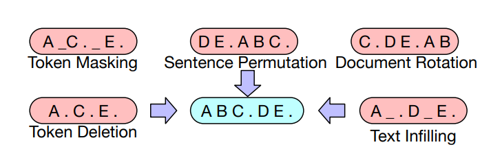
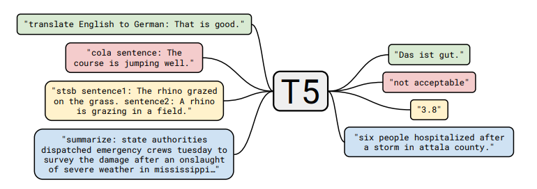

# Chapter 6 Model Training

In the previous chapter, we discussed the model structure of large language models (e.g., Transformer).
In this chapter, we will discuss how to train large language models.
This chapter is divided into two parts: objective function and optimization algorithm.

## 6.1 Objective Function

We study the objective functions of three types of language models:
1. Decoder-only models (e.g., GPT-3): compute unidirectional contextual embeddings, one token at a time
2. Encoder-only models (e.g., BERT): compute bidirectional contextual embeddings
3. Encoder-decoder models (e.g., T5): encode input, decode output

We can use any model that maps token sequences to contextual embeddings (e.g., LSTM, Transformers):

$$
\phi : V^L \to \mathbb{R}^{d \times L}. 
$$

$$
\left[\text{the}, \text{mouse}, \text{ate}, \text{the}, \text{cheese}\right] \stackrel{\phi}{\Rightarrow} \left[\binom{1}{0.1}, \binom{0}{1}, \binom{1}{1}, \binom{1}{-0.1}, \binom{0}{-1} \right].
$$

### 6.1.1 Decoder-only Model

Recall that the autoregressive language model defines a conditional distribution:

$$
p(x_i \mid x_{1:i-1}).
$$

We define it as follows:
- Map $x_{1:i-1}$ to the context embedding $\phi(x_{1:i-1})$.
- Apply the embedding matrix $E \in \R^{V \times d}$ to obtain the score $E \phi(x_{1:i-1})_{i-1}$ for each token.
- Exponentiate and normalize it to get the distribution of predictions $x_i$.

In short:

$$
p(x_{i+1} \mid x_{1:i}) = softmax(E \phi(x_{1:i})_i).
$$

#### 6.1.1.1 Maximum Likelihood

Let $\theta$ be all the parameters of the large language model. Let $D$ be the training data consisting of a set of sequences.
Then, we can follow the maximum likelihood principle and define the following negative log-likelihood objective function:$$
O(\theta) = \sum_{x \in D} - \log p_\theta(x) = \sum_{x \in D} \sum_{i=1}^L -\log p_\theta(x_i \mid x_{1:i-1}).
$$

And there are many ways to optimize this objective function efficiently.

### 6.1.2 Encoder-only model

#### 6.1.2.1 Unidirectional to Bidirectional

Using the above maximum likelihood, we can train a decoder-only model, which produces (unidirectional) contextual embeddings. But if we don't need to generate, we can provide stronger bidirectional contextual embeddings.

#### 6.1.2.2 BERT

We first introduce the objective function of [BERT](https://arxiv.org/pdf/1810.04805.pdf), which consists of the following two parts:
- Masked language modeling
- Next sentence prediction

Take the sequence in the natural language inference task (predicting implicit, contradictory or neutral) as an example:

$$
x_{1:L} = [\text{[CLS]}, \text{all}, \text{animals}, \text{breathe}, \text{[SEP]}, \text{cats}, \text{breathe}].
$$

There are two special tokens:
- $\text{[CLS]}$ : contains the embedding used to drive the classification task
- $\text{[SEP]}$ : used to tell the model the position of the first sequence (e.g., premise) and the second sequence (e.g., hypothesis).

According to the formula in the previous chapter, the BERT model is defined as:

$$
\text{BERT}(x_{1:L}) = \text{TransformerBlock}^{24}(\text{EmbedTokenWithPosition}(x_{1:L}) + \text{SentenceEmbedding}(x_{1:L})) \in \mathbb{R}^{d \times L},
$$

Among them, $\text{SentenceEmbedding}(x_{1:L})$ returns one of the following two vectors according to the sequence
- For the left side of $\text{[SEP]}$, return $e_A \in \mathbb{R}^d$ 
- For the right side of $\text{[SEP]}$, return $e_B \in \mathbb{R}^d$

BERT-large has $n_\text{heads} = 16$ attention heads and $d_\text{model} = 1024$ , for a total of 355M parameters.

##### 6.1.2.2.1 Masked Language Model
The basic idea of ​​the masked language model is to train by adding noise and then predicting:

$$
[\text{the}, \text{[MASK]}, \text{ate}, \text{[MASK]}, \text{cheese}] \Rightarrow [\text{the}, \text{mouse}, \text{ate}, \text{the}, \text{cheese}].
$$

More generally, we can think of it as similar to a denoising autoencoder, where we map a noisy/incomplete version $\tilde x_{1:L}$ and try to reconstruct the original $x_{1:L}$ .

$$
\tilde x_{1:L} \Rightarrow x_{1:L}.
$$

**Modeling**: We first define the model distribution. Given an input $\tilde x_{1:L}$ and its context embedding, the modelPredict each token independently:

$$
p(x_i \mid \tilde x_{1:L}) = \text{softmax}(E \phi(\tilde x_{1:L})_i).
$$

**Mask:** We define a (random) noise function $A(\tilde x_{1:L} \mid x_{1:L})$ ：

<!-- $$\underbrace{x_{1:L}}_\text{original} \stackrel{A}{\Rightarrow} \underbrace{\tilde x_{1:L}}_\text{noised}.$$ -->

Here is the definition of $A$:
- Assume $I \subset \{1, \dots, L\}$ represents a random 15% of all positions.
- For each $i \in I$:
- With probability 0.8, $\tilde x_i \leftarrow \text{[MASK]}$ 
- With probability 0.1, $\tilde x_i \leftarrow x_i$
- With probability 0.1, $\tilde x_i \leftarrow \text{random word from } \mathcal{V}$

**Reduce distribution shift:** If we always use $\text{[MASK]}$ to replace the selected token in $I$, then:
- During training, the input to BERT is all sequences with $\text{[MASK]}$.
- When testing, we will input sentences without $\text{[MASK]}$, which will cause the distribution to change. A heuristic solution is to replace with real words 20% of the time (here refers to the training time).

##### 6.1.2.2.2 Next sentence prediction
Recall that BERT is trained on concatenated pairs of sentences. The goal of next sentence prediction is to predict whether the second sentence follows the first sentence.

$$
[\text{[CLS]}, \text{the}, \text{mouse}, \text{ate}, \text{the}, \text{cheese}, \text{[SEP]}, \text{it}, \text{was}, \text{full}] \Rightarrow 1.
$$

$$
[\text{[CLS]}, \text{the}, \text{mouse}, \text{ate}, \text{the}, \text{cheese}, \text{[SEP]}, \text{hello}, \text{world}] \Rightarrow 0.
$$

Then use the embedding of $\text{[CLS]}$ to do binary classification.

##### 6.1.2.2.3 Dataset
$\mathcal{D}$ is a set of samples $(x_{1:L}, c)$ constructed as follows:
- Let $A$ be a sentence in the corpus.
- With probability 0.5, $B$ is the next sentence.
- With probability 0.5, $B$ is a random sentence in the corpus.
- Let $x_{1:L} = [\text{[CLS]}, A, \text{[SEP]}, B]$ 
- Let $c$ represent whether $B$ is the next sentence.

##### 6.1.2.2.4 Training Objectives
The training objectives of BERT are:

<!-- $$\mathcal{O}(\theta)=\sum_{\left(x_{1: L} c\right) \in \mathcal{D}} \underbrace{\mathbb{E}_{I, \tilde{x}_{1: L} \sim A\left(\cdot \mid x_{1: L} I\right)}\left[\sum_{i \in I}-\log p_\theta\left(\tilde{x}_i \mid x_{1: L}\right)\right]}_{\text {masked language modeling }}+\underbrace{-\log p\left(c \mid \phi\left(x_{1: L}\right)_1\right)}_{\text {next sentence prediction }} .$$ -->

LaterWe will discuss training, but here is a quick summary of BERT:
- BERT (along with ELMo and ULMFiT) showed that a unified architecture (the Transformer) can be used for multiple classification tasks.
- BERT really shifted the NLP community to the pre-training + fine-tuning paradigm.
- BERT showed the importance of deep bidirectional contextual embeddings, although this may be compensated by model size and fine-tuning strategies ([p-tuning](https://arxiv.org/pdf/2103.10385.pdf)).

#### 6.1.2.3 RoBERTa
[RoBERTa](https://arxiv.org/pdf/1907.11692.pdf) improves on BERT by:
- Removed the next sentence prediction objective (found it not helpful).
- Trained with more data (16GB of text $\Rightarrow$ 160GB of text ).
- Trained longer.
- RoBERTa significantly improves BERT's accuracy on various benchmarks (e.g., from 81.8 to 89.4 on SQuAD).

### 6.1.3 Encoder-decoder model

Task example (text generation from table):

$$
[\text{name}, \text{:}, \text{Clowns}, \text{|}, \text{eatType}, \text{:}, \text{coffee}, \text{shop}] \mathbb{R}ightarrow [\text{Clowns}, \text{is}, \text{a}, \text{coffee}, \text{shop}].
$$

Recall encoder-decoder models (e.g., BART, T5):
- First, the input is bidirectionally encoded like BERT.
- Then, the output is autoregressively decoded like GPT-2.

#### 6.1.3.1 BART (Bidirectional Auto-Regressive Transformers)
BART ([Lewis et al. 2019](https://arxiv.org/pdf/1910.13461.pdf)) is an encoder-decoder model based on the Transformer.

- Uses the same encoder architecture as RoBERTa (12 layers, hidden dimension 1024).
- Trained on the same data as RoBERTa (160GB of text).

BART uses the following transformation $A(\tilde x_{1:L} \mid x_{1:L})$ ：

Based on the BERT experiment, the final model performs the following transformations:

- Mask 30% of the tokens in the document

- Shuffle all clauses

Finally, through fine-tuning, BART shows strong results on both classification and generation tasks.

#### 6.1.3.2 T5 (Text-to-Text Transfer Transformer)

T5 ([Raffel et al., 2020](https://arxiv.org/pdf/1910.10683.pdf)) is another Transformer-based encoder-decoder model.

Pre-training task:
Given a piece of text, split it into input and output at random positions:

$$
[\text{the}, \text{mouse}] \Rightarrow [\text{ate}, \text{the}, \text{cheese}].
$$

The paper tried many different unsupervised objectives:

And found that “i.i.d. noise, replace spans" works best (although many objectives are similar).

The paper also puts all classic NLP tasks in a unified framework, called the "Text-to-Text" task:

Taking the classification task as an example, the differences between different models are as follows:
- BERT uses the embedding of $\text{[CLS]}$ to predict.
- T5, GPT-2, GPT-3, etc. (generative models) convert classification tasks into natural language generation.

Note:
- The paper conducts in-depth research on many aspects of the entire pipeline (dataset, model size, training objectives, etc.).
- Based on these insights, they trained an 11B model.

## 6.2 Optimization Algorithm

Now, we turn our attention to how to optimize the objective function.

For simplicity, let's take the autoregressive language model as an example:

$$
O(\theta) = \sum_{x \in D} -\log p_\theta(x).
$$

### 6.2.1 Stochastic Gradient Descent (SGD)
The simplest optimization algorithm is stochastic gradient descent with small batches. The steps of this algorithm are as follows:
- Initialize the parameter $\theta_0$
- Repeat the following steps:
-Sample small batch $B_t \subset D$ 
- Update parameters according to gradient:

$$
\theta_t \leftarrow \theta_{t-1} - \eta \frac{1}{|B_t|} \sum_{x \in B_t} \nabla_\theta (-\log p_\theta(x)).
$$

The key points of optimization include:

1. We hope that the parameter $\theta$ can converge quickly

2. We hope that the optimization is numerically stable

3. We hope that memory is efficient (especially for large models)

These points are often contradictory (for example, through low-precision training, fast convergence and reduced memory usage can be achieved, but it will lead to unstable training)

Therefore, we can optimize from several levels:

1. For classical optimization: second-order methods, constrained optimization, etc.
2. For machine learning: random methods, implicit regularization + early stopping
3. For deep learning: initialization, normalization (changing model architecture)
4. For large language models: learning rates and some intuition (e.g., second-order methods) are still useful due to stability issues, but there are many other unique challenges to overcome to make large language models train effectively. Unfortunately, most of these are ad hoc and poorly understood.

### 6.2.2 Adam (adaptive moment estimation)

[Adam](https://arxiv.org/pdf/1412.6980.pdf) algorithm has the following two innovations:
1. Introducing momentum (continuing to move in the same direction).
2. Each dimension of the parameter $\theta_0$ has an adaptive (different) step size (inspired by second-order methods).

Its steps are as follows:
- Initialize parameters $\theta_0$
- Initialize momentum $m_0, v_0 \leftarrow 0$
- Repeat the following steps:
- Sample small batch $B_t \subset D$
- Update parameters as follows:
- Calculate gradients

$g_t \leftarrow \frac{1}{|B_t|} \sum_{x \in B_t} \nabla_\theta (-\log p_\theta(x)).$

- Update first-order and second-order momentum

$m_t \leftarrow \beta_1 m_{t-1} + (1 - \beta_1) g_t$

$v_t \leftarrow \beta_2 v_{t-1} + (1 - \beta_2) g_t^2$

- Correct the deviation

$\hat m_t \leftarrow m_t / (1 - \beta_1^t)$

$\hat v_t \leftarrow v_t / (1 - \beta_2^t)$

- Update parameters

$\theta_t \leftarrow \theta_{t-1} - \eta \, \hat m_t / (\sqrt{\hat v_t} + \epsilon).$

Storage occupancy analysis:

Adam increases the storage from 2 times the model parameters ($\theta_t,g_t$) to 4 times ($\theta_t,g_t,m_t,v_t$).

### 6.2.3 AdaFactor

[AdaFactor](https://arxiv.org/pdf/1804.04235.pdf) is an optimization algorithm to reduce storage occupancy. It has the following features:
- Instead of storing $O(m \times n)$ matrices like $m_t,v_t$, it stores the sum of rows and columns $O(m + n)$ and reconstructs the matrix
- Removes momentum
- It is used to train T5
- AdaFactor may make training fasterDifficult (see [Twitter thread](https://twitter.com/_arohan_/status/1468673364889726985?s=20&amp;t=i7E0NN5ytysukMGVWG7lfQ) and [blog post](https://blog.ceshine.net/post/adafactor/))

### 6.2.4 Mixed Precision Training

[Mixed Precision Training](https://arxiv.org/pdf/1710.03740.pdf) is another way to reduce storage
- Generally speaking, the default precision is: FP32 (32-bit floating point)
- Other optional precision: FP16 (16-bit floating point), but the problem is that any value less than $2^{-24}$ will become 0.
- Solution: Store the main weights in FP32 and perform all other operations in FP16.
- Loss scaling: Scale up the loss to avoid gradient values ​​being too small.
- Result: Storage is reduced by half.

### 6.2.5 Learning Rate

- Typically, the learning rate decays over time.
- For the Transformer modeltype, we actually need to increase the learning rate by warming up.
- [Huang et al., 2020](https://www.cs.toronto.edu/~mvolkovs/ICML22020_tfixup.pdf) show that one potential reason is to prevent the gradient of layer normalization from vanishing, leading to instability when training with the Adam optimizer.

### 6.2.6 Initialization

- Given a matrix $W \in \mathbb{R}^{m \times n}$ , the standard initialization (i.e., xavier initialization) is $W_{ij} \sim N(0, 1/n)$ .
- GPT-2 and GPT-3 scale the weights by an additional $1/\sqrt{N}$ , where $N$ is the number of residual layers.
- T5 increases the attention matrix by $1/\sqrt{d}$ ([code](https://github.com/tensorflow/mesh/blob/master/mesh_tensorflow/transformer/attention.py#L459)).

Taking GPT-3 as an example, the parameters used are as follows:
- Adam parameters: $\beta_1 = 0.9, \beta_2 = 0.95, \epsilon = 10^{-8}$ 
- Small batch size: 3.2 million tokens (about 1500 sequences)
- Use gradient clipping ($g_t \leftarrow g_t / \min(1, \|g\|_2)$)
- Linear learning rate warmup (first 375 million tokens)
- [Cosine learning rate](https://arxiv.org/pdf/1608.03983v5.pdf) decayed to 10%
- Gradually increase batch size
- Weight decay set to 0.1

## Further reading

- [Mixed precision training](https://lilianweng.github.io/lil-log/2021/09/24/train-large-neural-networks.html#mixed-precision-training)
- [Fixing Weight Decay Regularization in Adam](https://arxiv.org/pdf/1711.05101.pdf). I. Loshchilov, F. Hutter. 2017. Introducing AdamW
- [ELECTRA: Pre-training Text Encoders as Discriminators Rather Than Generators](https://arxiv.org/pdf/2003.10555.pdf). Kevin Clark, Minh-Thang Luong, Quoc V. Le, Christopher D. Manning. ICLR 2020.
- [DeBERTa: Decoding-enhanced BERT with Disentangled Attention](https://arxiv.org/pdf/2006.03654.pdf). Pengcheng He, Xiaodong Liu, Jianfeng Gao, Weizhu Chen. ICLR 2020.