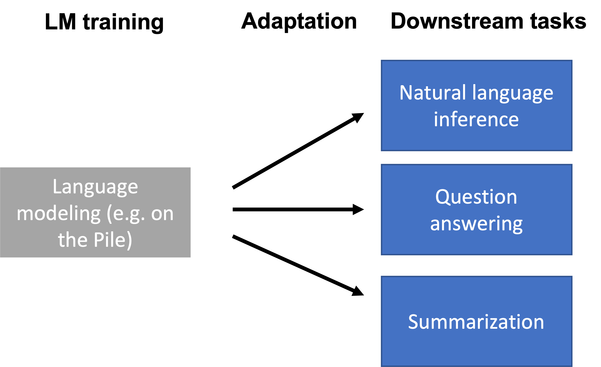
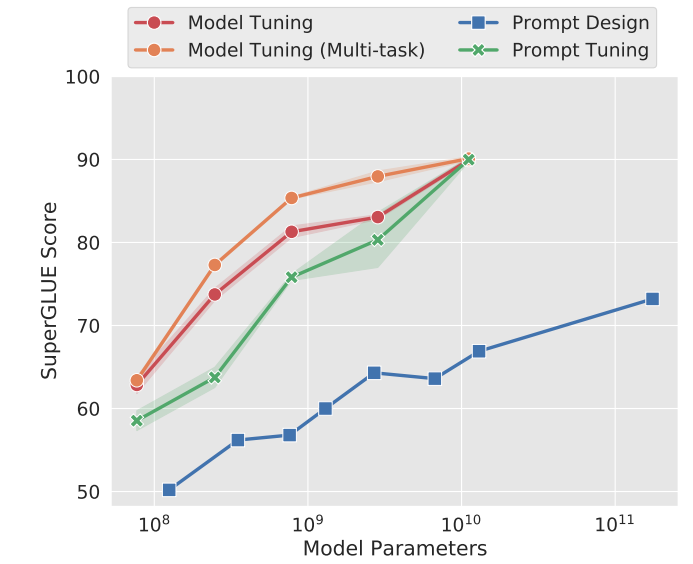
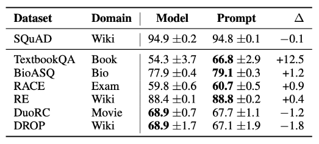
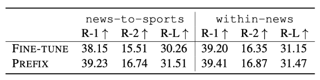
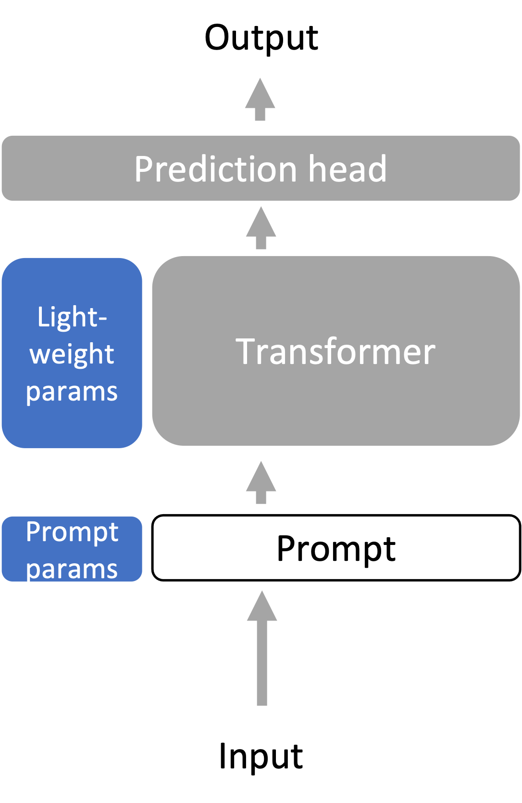

# Chapter 7 Adaptation of Big Models



We have been able to perform some tasks using language models (e.g. in contextual learning) by only giving prompts. However, the prompting approach is not applicable to all downstream tasks, such as natural language inference (NLI), question answering (QA), converting web forms to text, parsing electronic health records (EHR), etc.

Downstream tasks may differ from the training data of the language model (e.g., Pile dataset) in format and topic, or need to be updated with new knowledge over time. Therefore, the language model needs to be adapted to the downstream task using task-specific data or domain knowledge.

## 7.1 Introduction

### 7.1.1 Why is Adaptation needed?
In the era of automation and artificial intelligence, language models have become a rapidly developing field. These models are trained to respond to a wide variety of tasks, but are they really suitable for all tasks? Before exploring this issue, we need to understand how language models are trained and clarify the possible differences between downstream tasks and the original training tasks.

In terms of how language models are trained, language models, such as GPT-3, are usually task-agnostic.A method or model that is optimized for any specific task. In the context of machine learning and artificial intelligence, task-agnostic generally refers to a method that can run on multiple different tasks without being specifically tuned or trained for each individual task. For example, a task-agnostic language model is not trained to be optimized for a specific task, such as sentiment analysis, text summarization, or question answering. Instead, it is designed to capture the general characteristics and structure of language so that it can be used for many different downstream tasks. The advantage of this approach is flexibility and broad applicability, as the same model can be used for a wide variety of applications. However, it can also pose challenges, as a general-purpose model may not perform as well on a specific task as a model trained specifically for that task. This leads to the question of how to adapt task-agnostic models to the needs of specific tasks in order to achieve optimal performance in different application scenarios. ], meaning that they are trained on a broad domain rather than for a specific task. The advantage of this approach is that the model has broad applicability, but it also poses some challenges. For example, the diversity of downstream tasks, different downstream tasks can be pre-trained very differently with language models, which can cause problems. For example, the Natural Language Inference (NLI) task may be completely different from the language modeling task on the Pile dataset. Consider the following example:
```
- **Premise**: I havee never seen an apple that is not red.
- **Hypothesis**: I have never seen an apple.
- **Correct output**: Not entailment (the reverse direction would be entailment)
```
This format may not be natural for the model because it is far from the model's training scope.

In addition, the difference from the original training task may cause some challenges when dealing with downstream tasks. These differences can be discussed in detail from the following aspects:

1. **Format difference**:
- **Natural Language Inference (NLI)**: Downstream tasks such as NLI involve the comparison of two sentences to produce a single binary output. This is very different from the tasks where language models are usually used to generate the next token or fill in the MASK token. For example, the logical reasoning process of NLI involves multiple levels of comparison and understanding, not just generating the next possible word based on the given context.
- **BERT training with MASK tags**: BERT uses MASK tags during training, while many downstream tasks may not use these tags. This difference may lead to significant adjustments to the model when targeting specific tasks.

2. **Topic transfer**Change**:
- **Domain-specific needs**: Downstream tasks may focus on specific topics or domains, such as medical record analysis or legal document parsing. These tasks may involve specialized terminology and knowledge that are far from the general training tasks of the model.
- **Flexibility of broad topics**: Language models may need to handle a variety of different topics. If the downstream task suddenly focuses on a new or very unique domain, this may exceed the training scope of the model.

1. **Time shift**:
- **New knowledge needs**: Over time, new information and knowledge emerge. For example, GPT-3 was trained before Biden became president, so it may lack the latest information about his presidency.
- **Non-public information needs**: Sometimes downstream tasks may involve information that was not made public during training. This may require more domain-specific expertise and adjustments.

So we can summarize "Why do we need language model adaptation?", the differences between downstream tasks and language model training tasks are very complex. These differences can be explored in terms of format, topic, and time, each of which may involve many specific challenges and needs. By gaining a deeper understanding of these differences, we can better understand how to effectively adapt language models to meet the needs of various downstream tasks.

### 7.1.2 General adaptation configuration
The following provides a general configuration using pre-trained languageThe parameters of the model (LM) are used to adapt the general settings of the downstream tasks. Below I will divide this process into related and progressive parts:

1. **Pre-trained Language Model**:
At the beginning of the adaptation phase, we already have a pre-trained language model, represented by parameters $θLM$. This model is trained to understand and generate language, but not specifically for any specific task.

2. **Downstream Task Dataset**:
We have obtained a set of sample data from the downstream task distribution $P_{task}$. These data can be specific instances of tasks such as text classification and sentiment analysis. Each sample consists of an input x and a target output y, such as: $\left(x^{(1)}, y^{(1)}\right), \ldots,\left(x^{(n)}, y^{(n)}\right)$.

3. **Adaptation Parameters**:
In order to make the pre-trained LM suitable for a specific downstream task, we need to find a set of parameters $\gamma$, which can come from a subset of existing parameters or introduce new parameters, $\Gamma$. These parameters will be used to adjust the model so that it performs better on a specific task.

4. **Task Loss FunctionFunction)**:
We need to define a loss function $\ell_{\text {task }}$ to measure the performance of the model on the downstream task. For example, cross entropy loss is a common choice to measure the difference between the probability distribution predicted by the model and the true distribution.

5. **Optimization Problem**:
Our goal is to find a set of adaptation parameters $\gamma_{\text {adapt }}$ that minimizes the task loss on the entire downstream dataset. Mathematically, this can be expressed as the following optimization problem:
$$
\gamma_{\text {adapt }}=\operatorname{argmin}_{\gamma \in \Gamma} \frac{1}{n} \sum_{i=1}^n \ell_{\text {task }}\left(\gamma, \theta_{\mathrm{LM}}, x_i, y_i\right) .
$$

Through this process, we can obtain a set of adaptation parameters $\gamma_{\text {adapt }}$, which are used to parameterize the adapted model $p_{adapt}$. In this way, we can adapt the general, task-independent pre-trained language model to a specific downstream task to achieve betterGood performance. This adaptation method combines the versatility of the model with the effectiveness of specific tasks, which not only retains the flexibility of the model but also ensures efficient performance on specific tasks.

## 7.2 Several current mainstream adaptation methods

### 7.2.1 Probing

The Probing strategy is a fine-tuning strategy that has been widely used in the large-scale pre-training stage. This section will discuss the introduction and application of the Probing strategy, and explore the strategy of fixed-length representation.

#### 7.2.1.1 Introduction of Probing Method

Probing is a technique for [analyzing and understanding the internal representation of the model](https://arxiv.org/pdf/1909.03368.pdf). It introduces a new parameter set $\Gamma$ to define Probing, which is usually a linear or shallow feedforward network. Through the Probing method, we can examine and understand the representation of the model. For example, if a simple probe can predict the part-of-speech tag (POS), then these representations "store" POS information.

#### 7.2.1.2 Applicability and Adaptation of Probing

Probing is mainly applicable to encoder-only models (e.g., [BERT](https://arxiv.org/pdf/1810.04805.pdf)),But the decoder model can also be used ([Liu et al. 2021](https://arxiv.org/pdf/2103.10385.pdf)). For Adaptation, we train a Probing (or prediction head) from the last layer representation of the language model (LM) to the output (e.g., class label), and the overall form is shown in the figure below:
![[./images/probing.png.png]]

#### 7.2.1.3 Fixed-length representation strategy

We can find that the Probing method learns the output of the pre-trained model through a linear or shallow feedforward network, and obtains the ability to analyze and understand the model content representation, thereby achieving good performance in downstream tasks. It is worth mentioning that the Probing method has fixed weights for the pre-trained model itself, and only trains linear or shallow feedforward networks with a small number of parameters, so it is in line with Adaptation, greatly reducing the training cost.

But this raises another question. For the input of the pre-trained model, how much content does the linear or shallow feedforward network need to represent? Therefore, the strategy of fixed-length representation is naturally introduced. Since many tasks (such as classification) require fixed-length output, how the Transformer encoder maps $L$ tokens to 1 embedding vector becomes a problem. Two common strategies are introduced below:

1.**CLS token strategy ([Devlin et al. 2018](https://arxiv.org/pdf/1810.04805.pdf))**: During pre-training and fine-tuning, we prefix the prompt with a special token called CLS. We use the embedding vector corresponding to the CLS token as the "sequence-level" embedding.
2. **Average token strategy**: Another common approach is to average $L$ tokens. Note that since each embedding vector is contextual and position-dependent, this does not make the model permutation invariant.

#### 7.2.1.4 Summary

Probing, as a powerful analysis tool, works by freezing the language model representation encoder (grey in the figure above) and optimizing the probe (prediction head, blue in the figure above) for a specific task. These models can be linear or shallow feed-forward prediction heads, providing a flexible way to understand and explain the inner workings of deep learning models. The strategy of fixed-length representation also further promotes this purpose, providing a flexible and effective solution.

### 7.2.2 Fine-tuning

Fine-tuning uses the language model parameters $θLM$ as the optimization initialization. The optimized parameter family $\Gamma$ includes all language model parameters and task-specific prediction head parameters., the pre-trained optimizer state is discarded.

During fine-tuning, a learning rate at least an order of magnitude smaller than that used during pre-training is usually used, and the fine-tuning time is much shorter than that of pre-training. This means that large language models specialized for each downstream task need to be stored, which can be quite expensive. However, fine-tuning is optimized on a larger family of models (i.e., very expressive) and generally has better performance than probes.

#### 7.2.2.1 Fine-tuning for zero-shot capabilities

Zero-shot learning is a machine learning paradigm that is able to generalize on tasks or categories that have not been seen during training. It allows the model to interpret and process completely new information without any specific examples. This capability is critical for many practical applications, especially when samples of new tasks or categories are difficult to obtain.

The ability to learn from zero samples gives the model greater flexibility and generalization ability, and the ability to quickly adapt to unseen tasks. This is extremely important in the real world, because we often encounter new tasks or situations that have not appeared in the training data. Zero-shot learning models can quickly solve these problems without the need for tedious retraining each time.

Fine-tuning for zero-shot performance is a further optimization of an existing model that can improve the model's performance on unseen tasks. Here is the impact of fine-tuning on zero-shot performance:

- **Model Adjustment**：Techniques such as [FLAN](https://arxiv.org/pdf/2109.01652.pdf) and [T0](https://arxiv.org/pdf/2110.08207.pdf) fine-tune models to achieve better zero-shot performance. They do this by unifying the prompt format for many downstream tasks and fine-tuning the model to perform a wide variety of tasks based on this format.
- **Performance Improvement**: Zero-shot performance on unseen tasks is significantly improved compared to the original language model. This suggests that fine-tuning can effectively improve the generalization ability of the model.
- **Learning New Skills**: The model is learning to perform zero-shot tasks using the prompt format. Such a prompt format helps guide the model to understand and complete completely new tasks, thus achieving true zero-shot learning.

#### 7.2.2.2 Fine-tuning for Human-Aligned Language Models

In current LLMs, instructions are often used as input prompts to guide the model to produce a specific type of output. Effective instructions can allow the model to better understand the needs of human users and generate useful, honest, and harmless feedback. LLMs are harmful by referring to previously learned content. Human feedback refers to feedback collected from human users or evaluators to evaluate whether the output of the model meets people's expectations and needs. Human feedback plays an important role in model training.and fine-tuning.

#### 7.2.2.3 The process and impact of fine-tuning

Fine-tuning can make language models better aligned with human values ​​and goals. Here are the three steps that InstructGPT takes to fine-tune the GPT-3 model:

1. **Collecting human-written demonstration behaviors**: This step involves collecting examples that meet human expectations and fine-tuning these examples with supervision.

2. **Instruction-based sampling with human preferences**: For each instruction, sample k outputs from the LM in step 1. Then collect human feedback on which sampled output is the most preferred. This data is cheaper than step 1.

3. **Fine-tune the LM with reinforcement learning objectives**: Fine-tune the LM in step 1 with reinforcement learning objectives to maximize human preference rewards.

After such fine-tuning, the 1.3B InstructGPT model was preferred over the 175B GPT-3 85% of the time, and 71% when using few-shot prompts. On closed-domain Q&A/summary, InstructGPT generates fictitious information 21% of the time, an improvement over GPT-3's 41%. When prompted to be respectful, InstructGPT produces 25% less toxic output than GPT-3.


#### 7.2.2.4 Summary

- Freeze (grey): No action required- Optimization (blue, different for each task): all parameters of the language model, plus a new prediction head.

Fine-tuning is a powerful tool to make pre-trained language models better match human expectations and needs. Through supervised learning, human feedback, and reinforcement learning, the performance of models for specific tasks and scenarios can be significantly improved. However, there are still challenges that need to be addressed, such as bias and the generation of fabricated information, to ensure the safe and reliable use of language models. Despite some challenges and limitations, fine-tuning remains a very powerful tool in modern machine learning.

### 7.2.3 Lightweight Fine-tuning
Lightweight Fine-Tuning is a special fine-tuning technique that aims to combine the expressiveness of full fine-tuning with the advantages of being more resource-efficient. Lightweight fine-tuning attempts to maintain the same expressiveness as full fine-tuning without the need to store the full language model for each task. In other words, it hopes to reduce the model storage requirements and computational burden while still achieving excellent performance.

#### 7.2.3.1 Variants of Lightweight Fine-tuning

There are many variants of lightweight fine-tuning, some of the main methods include:

1. **Prompt Tuning ([Prompt Tuning](https://arxiv.org/pdf/2104.08691.pdf))**: By fine-tuning the modelPrompt tuning can be viewed as a more flexible fine-tuning method that allows users to guide the output of the model by adjusting the input prompts instead of directly modifying the model parameters.
2. **Prefix Tuning**: Similar to prompt tuning, prefix tuning also focuses on the input part. It adjusts the behavior of the model by adding specific prefixes to customize it for specific tasks.
3. **Adapter Tuning**: Adapter Tuning is a method of fine-tuning a model by inserting trainable "adapter" modules between the hidden layers of the model. These adapter modules allow the model to be fine-tuned without changing the original pre-trained parameters, thereby reducing storage and computation requirements.

#### 7.2.3.2 Prompt Tuning
Prompt Tuning is a special fine-tuning technique that is mainly used for text classification tasks. Prompt Tuning is inspired by inference-based adaptive prompt design/engineering. Different from traditional fine-tuning methods, prompt tuning focuses on optimizing input prompts instead of changing the internal parameters of the model.

Promptt Tuning works by adding $k$ learnable, continuous token embeddings (defined as $Γ$) in front of the input. Therefore, the new input length is now $L^{′} = L + k$, where $L$ is the length of the original input. These additional token embeddings are learned by training on labeled task data.

Meanwhile, the entire pre-trained language model is frozen, which means that the main part of the model does not change during fine-tuning. As the size of the frozen language model increases, the performance of hint tuning becomes increasingly competitive and can even be comparable to full fine-tuning (also known as "model tuning"). This shows that excellent performance can be achieved by tuning the input hints even without changing the pre-trained parameters.

Hint tuning involves different initialization strategies, such as:

- **Embedding of random vocab words**: Random words are selected as embeddings.

- **Embedding of class label words**: Words related to the class label are used for embeddings.

- **Random init**: This method generally does not work well and is not recommended.

It is worth mentioning that [P-Tuning v2](https://arxiv.org/pdf/2110.07602.pdf)This work is a full-layer version of prompt tuning. Parameters at all levels benefit both text classification and generation tasks.

Overall, Prompt Tuning is an innovative lightweight fine-tuning method that achieves task-specific optimizations by adding learnable embeddings to the input instead of changing the entire model structure. This not only reduces computational and storage requirements, but also allows the use of larger frozen models to achieve comparable performance to full fine-tuning. In tasks such as text classification, prompt tuning provides a flexible and efficient solution.



#### 7.2.3.3 Prefix Tuning
Prefix Tuning is a fine-tuning method specifically designed for language generation tasks and has been developed on BART and GPT-2 models. Here is a detailed explanation of Prefix Tuning:

Prefix Tuning is implemented by adding k positions at the beginning of the input and connecting additional learnable weights as keys and values ​​at each attention layer. These additional weights allow the model to learn task-specific context and structure during fine-tuning. Although Prefix Tuning is similar to Prompt Tuning in some ways (for example, both involve fine-tuning input), there are important differences between the two.Unlike Pompt Tuning, Prefix Tuning not only adds learnable inputs, but also adds learnable weights in each attention layer. These weights can better capture task-specific dependencies and contextual information.

Prefix tuning uses a generalized definition of attention operation that receives 3 parameters: key ($K$), value ($V$), and query ($Q$), with dimensions $ℝ^{d×L^′}$, $ℝ^{d×L^′}$, and $ℝ^{d×L}$, respectively. The definition is as follows:

$$\text{Attn-op}(Q,K,V)=V\text{softmax}\left(\frac{K^TQ}{\sqrt{d}}\right)
$$
For self-attention, we set $L^{'}$ = $L$, and define $K$ = $W_{\text{key}}x_{1:L}$, $V$ = $W_{\text{value}}x_{1:L}$, $Q$ = $W_{\text{query}}x_{1:L}$, where $W_{\text{key}}$, $W_{\text{value}}$, $W_{\text{query}}$ are the learned weight matrices.

For attention head $i$, Prefix Tuning is performed by converting the learnableThe learned weights $P(i)_{\text{key}}$, $P(i)_{\text{value}} \in \mathbb{R}^{d \times k}$ are concatenated with the key and value to compute the attention with large $L' = L + k$. This calculation was proposed by [He et al., 2022](https://arxiv.org/pdf/2110.04366.pdf):
$$
K_{\text{prefix}} = [P(i)_{\text{key}}, K]
$$

$$
V_{\text{prefix}} = [P(i)_{\text{value}}, V]
$$
$$\text{head}_i = \text{Attn-op}(Q,K_{\text{prefix}},V_{\text{prefix}})
$$
where $Q = W_{\text{query}}x_{1:L}$, as in regular self-attention.

Trainable parameters at all levels can enhance the performance of the model, allowing the model to be optimized at a more granular level.

Overall, prefix adjustment provides a powerful means of fine-tuning the model by adding learnable weights to the key and value parts of the attention mechanism. This approach allows the model to better capture task-specific patterns and integrate well with other techniques such as cue adaptation.The techniques complement each other and provide a flexible and powerful task-specific optimization method.

#### 7.2.3.3 Adapter Tuning

Adapter Tuning is a fine-tuning technique that is implemented by adding a new learning "bottleneck" layer (called an adapter) between each (frozen) Transformer layer.

Adapter Tuning is usually a 2-layer residual network that operates on each element $x \in \mathbb{R}^d$ in the sequence. The adapter computation is defined as follows:
$$
\text{Adapter}(x) = x + W_{\text{up}}\sigma(W_{\text{down}}x)
$$
Where $W_{\text{down}} \in \mathbb{R}^{r \times d}$ and $W_{\text{up}} \in \mathbb{R}^{d \times r}$ are learned weights that project $x$ into a bottleneck dimension $r$ and then back to dimension $d$. The symbol $\sigma$ denotes a nonlinear activation function. The result $\text{Adapter}(x)$ is a vector with the same dimensions as $x$ in $\mathbb{R}^d$.

In summary, adapter adjustment provides aA flexible fine-tuning approach allows the model to be tuned by introducing new learnable layers without changing the original Transformer layers. This approach, combined with techniques such as prompt tuning and prefix tuning, provides an efficient and scalable solution for natural language processing tasks. The adapter is designed so that it can enhance the performance of specific tasks without sacrificing the overall model structure.

#### 7.2.3.4 Other properties of Lightweight Fine-tuning

- The expressive power of Lightweight Fine-tuning is quite complex because it is closely linked to a specific pre-trained language model (LM). If the weight of the pre-trained LM is 0, Promt/Prefix Tuning will not work.
- The Promt/Prefix/Adapter Tuning mentioned above provides a way to implement a personalized model. Suppose we want to deploy a personalized model for N users. With Prefix Tuning, we can store N prefixes, one for each user. Then, within a mini-batch, the personalized model for each user can be run in parallel by appending the corresponding user-specific prefix before each input. This approach implements user-specific tuning while effectively utilizing parallel processing power.
- The robustness of Lightweight Fine-tuning methods has been improved. These methods tend toPrefix Tuning helps improve out-of-distribution (OOD) performance compared to full fine-tuning, e.g. on texts of different topics or domains. For example, [Prompt Tuning improves OOD accuracy](https://arxiv.org/pdf/2104.08691.pdf): Prompt Tuning performs better on F1 results compared to full fine-tuning (model tuning) trained on SQuAD and tested on the out-of-domain MRQA 2019 task.



- Prefix Tuning helps improve model accuracy out-of-domain (OOD), e.g. in the XSUM summarization task, where the model is fine-tuned on news articles and tested on sports (news to sports) or trained on {world, uk, business} articles and tested on {health, tech} articles (within news). The evaluation metric used in the XSUM task is ROUGE-L, an automatic evaluation metric based on subsequences of length L matched to a reference summary. It is worth noting that when the test dataset is not out-of-domain distribution, the accuracy of Prefix Tuning is usually slightly lower than the full fine-tuning of the model.





#### 7.2.3.5 Summary

- Freezing (grey): entire/most of the language model

- Optimizing (blue, varies by task): small amount of additional parameters (<1% of parameters)

- Methods: hint adjustment, prefix adjustment, adapter adjustment, and other methods ([LoRA](https://arxiv.org/pdf/2106.09685.pdf), [BitFit](https://arxiv.org/pdf/2106.10199.pdf), etc.)

## 7.3 Overall Summary

We need to adapt large language models to a variety of downstream tasks, which may be very different from language modeling.

1. **Probing**: Probing methods train a task-specific prediction head on top of a frozen language model, treating the language model as a good representation extractor. Freezing the language model tends to limit the expressive power of this method.

2. **Fine-tuning**: Fine-tuning treats large language model parameters as initialization for further training of downstream tasks, which is more expressive than detection, but also more expensive because we have to save the entire model for each downstream task.
3. **Lightweight fine-tuning**: Lightweight fine-tuning strikes a balance between fine-tuning and detection, only a small number of parameters are optimized (<1% of the model), but it optimizes the high-leverage part of the model, so it is still very expressive.
Through the above method, it can be more flexible to cope with a variety of downstream tasks, which not only achieves precise adaptation to specific tasks, but also controls the cost of computation and storage to a certain extent, so as to achieve better performance and efficiency in practical applications.

## Further reading

- [Multitask Prompted Training Enables Zero-Shot Task Generalization](https://arxiv.org/pdf/2110.08207.pdf). _Victor Sanh, Albert Webson, Colin Raffel, Stephen H. Bach, Lintang A. Sutawika, Zaid Alyafeai, Antoine Chaffin, Arnaud Stiegler, Teven Le Scao, Arun Raja, Manan Dey, M SAIFUL BARI, Canwen Xu, Urmish Thakker, Shanya Sharma Sharma, Eliza Szczechla, Taewoon Kim, Gunjan Chhablani, Nihal V. Nayak, Debajyoti Datta, Jonathan Chang, Mike Tian-Jian Jiang, Han Wang, Matteo Manica, Sheng Shen, Zheng Xin Yong, Harshit Pandey, Rachel Bawden, Thomas Wang, Trishala Neeraj, Jos Rozen, Abheesht Sharma, Andrea Santilli, Thibault Févry, Jason Alan Fries, Ryan Teehan, Stella Rose Biderman, Leo Gao, T. Bers, Thomas Wolf, Alexander M. Rush_. 2021. Introduces **T0** from BigScience.
- [Finetuned Language Models Are Zero-Shot Learners](https://arxiv.org/pdf/2109.01652.pdf). _Jason Wei, Maarten Bosma, Vincent Zhao, Kelvin Guu, Adams Wei Yu, Brian Lester, Nan Du, Andrew M. Dai, Quoc V. Le_. 2021. Introduces **FLAN** from Google.

- [Prefix-Tuning: Optimizing Continuous Prompts for Generation](https://arxiv.org/pdf/2101.00190.pdf). _Xiang Lisa Li, Percy Liang_. ACL/IJCNLP 2021.
- [Training language models to follow instructions with human feedback](https://cdn.openai.com/papers/Training_language_models_to_follow_instructions_with_human_feedback.pdf).Long Ouyang,Jeff Wu Xu Jiang, Diogo Almeida, Carroll L. Wainwright, Pamela Mishkin, Chong Zhang, Sandhini Agarwal, Katarina Slama, Alex Ray, John Schulman, Jacob Hilton, Fraser Kelton, Luke Miller, Maddie Simens, Amanda Askell†, Peter Welinder, Paul Christiano, Jan Leike, Ryan Lowe. InstructGPT paper.
- [The Power of Scale for Parameter-Efficient Prompt Tuning](https://arxiv.org/pdf/2104.08691.pdf), Brian Lester, Rami Al-Rfou, Noah Constant. EMNLP 2021. Introduces prompt tuning.
- [Towards a Unified View of Parameter-Efficient Transfer Learning](https://arxiv.org/pdf/2110.04366.pdf), Junxian He, Chunting Zhou, Xuezhe Ma, Taylor Berg-Kirkpatrick, Graham Neubig. ICLR 2022.
- [P-Tuning v2: Prompt Tuning Can Be Comparable to Fine-tuning Universally Across Scales and Tasks](https://arxiv.org/pdf/2110.07602.pdf), Xiao Liu, Kaixuan Ji, Yicheng Fu, Zhengxiao Du, Zhilin Yang, Jie Tang. arXiv 2021.