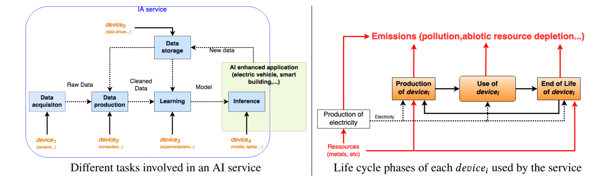
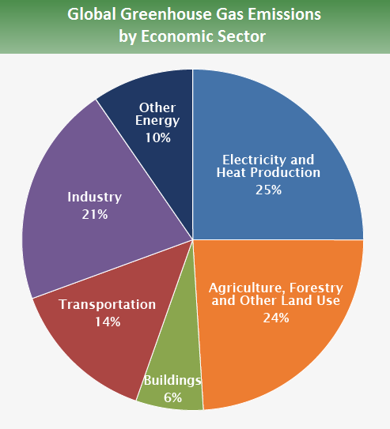
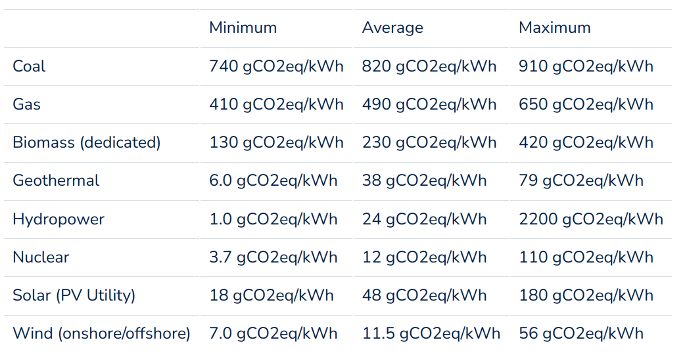
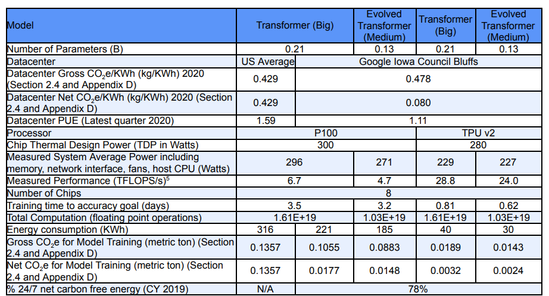

# Chapter 12 Environmental Impacts

In this chapter, we start with a question: What are the environmental impacts of large language models?

One answer given here is: **Climate change**

On the one hand, we have all heard about the serious effects of climate change ([Article 1](https://www.cnn.com/2021/09/17/us/catastrophic-climate-change-un-report/index.html), [Article 2]("https://climate.nasa.gov/effects/)):

- We are already 1.2°C above pre-industrial levels

- Need to stay below 1.5°C to avoid a climate crisis

- On current trajectory, we will reach 2.7°C in the next few decades

On the other hand, we see a huge increase in the amount of computation required to train large language models (and thus CO2 emissions). Here are some data:

- [Strubell et al., 2018](https://arxiv.org/pdf/1906.02243.pdf) estimated that training emitted 626,000 pounds of CO2 (the lifetime emissions of 5 cars).
- DeepMindThe Gopher report from the arxiv.org study estimates that CO2 generated by training is 380 tons.

In this chapter, we will learn how to relate large language models to environmental impact.

Learning objectives:
- Gain a comprehensive understanding of the environmental impact of large language models.
- Be able to calculate the emissions generated by training a specific language model.
- Raise awareness of monitoring and mitigating (negative) environmental impacts, and even take personal responsibility.

Notes:
- The focus of this chapter is to understand the (environmental) costs. Large language models provide a large improvement in performance, but the costs need to be considered. How to do this is very challenging.
- At the same time, the benefits and costs are often very uneven across the world's population, with costs "falling disproportionately on the poor and vulnerable".
- All numbers provided are estimates because:
- Lack of monitoring and information on data centers
- This information is often private
- It is difficult to assign credit/responsibility using amortized costs (e.g., building a data center + training many models, training one model + adapting it to many downstream tasks).

## 12.1 Life Cycle Assessment

This section mainly explores language models from multiple perspectives based on the paper [Ligozat et al. (2021)](https://arxiv.org/pdf/2110.11822.pdf)/ AI on climate impact:

From a **philosophical perspective**, most work on the environmental impact of AI and machine learning focuses on greenhouse gas emissions (inspired by climate change), but it is more important (although difficult) to take a systems approach to think about:
- The full impact on the environment (emissions, water footprint)
- The entire life cycle of IT equipment (e.g., production, use, end of life)

From a **Life Cycle Assessment (LCA)** perspective:
- Life Cycle Assessment (LCA) (ISO 14040 and 14044) provides a framework for doing this.
- A "systems perspective" is needed to avoid "a solution to one problem that creates several new, often overlooked problems."

From the **life cycle** of IT equipment:
- Production:
- Raw material extraction: all processes of extracting ore and converting it into metal
- Manufacturing: all processes including manufacturing equipment
- Transportation: equipment transportation process
- Use: actual energy consumption of equipment
- End of life: dismantling, recycling/disposing of equipment

At this point, we would like to explain **Life cycle considerations**:
- Production
- We do not have a life cycle assessment for GPU/TPU
- French data centers that only use CPUs: 40% of greenhouse gas emissions come from the production stage ([Berthoud et al. 2020](https://hal.archives-ouvertes.fr/hal-02549565v4))
- Data centers are built for many purposes and credits need to be allocated to determine the share due to large language models (which is hard to estimate in advance as the situation changes quickly).
- Example: manufacturing accounts for 75% of the total emissions of an iPhone 5

- Use
- Depends mainly on the carbon intensity of the energy source (coal or hydroelectric)

- End of life
- Usually not well documented
- 80% of electronic devices are not formally recycled

In particular, during the use phase:
- Data: data needs to be acquired, generated and stored
- Learning: training large language models
- This includes experiments and hyperparameter tuning.
- This is a "one-time cost" until you need to update the model again.

- Inference: running the model in production
- Example: Google receives 5.6 billion search queries per day ([source](https://blog.hubspot.com/marketing/google-search-statistics)).

- Often a much smaller model distilled from a larger model is deployed (much smaller if task specific).
- If you need to make multiple predictions (e.g. sentiment, topic classification, etc.), you can encode the sentence once(e.g., BERT), and use different task-specific classification heads.

From the perspective of **environmental impact**:

- Greenhouse gas emissions: contribute to climate change

- Water footprint: fresh water is a scarce resource in some regions

- Data centers use water for cooling (which requires electricity)

- Power generation is the second largest water demand, and electricity is required to treat water and wastewater

- [Human hazards](https://lc-impact.eu/HHhuman_toxicity.html): chemicals released into the environment (air, water, soil) that can cause cancer, etc.

- Chip manufacturing produces toxic waste during manufacturing

- Non-biological resource depletion

- Fossil fuels

- Minerals used to make electronic devices (lithium, cobalt). You can learn more about the environmental impact of data centers at [this link](https://iopscience.iop.org/article/10.1088/1748-9326/abfba1/pdf).

Other second-order effects ([more details](https://crfm.stanford.edu/assets/report.pdf#environment)): 
- Higher efficiency creates more demand=([Rebound effect](https://en.wikipedia.org/wiki/Rebound_effect_(conservation)) and [Jevons paradox](https://en.wikipedia.org/wiki/Jevons_paradox))
- Environmental change (accelerated desertification, increased extinction rate)
- Melting permafrost in turn accelerates greenhouse gas emissions
- Chip shortages cause shutdowns in the automotive industry

$$
\text{language model} \quad\Rightarrow\quad \text{compute} \quad\Rightarrow\quad \text{energy use} \quad\Rightarrow\quad \text{greenhouse gas emissions} \quad\Rightarrow\quad \text{environmental impact}
$$

## 12.2 Climate Change

While it is important to consider the entire life cycle, we will focus primarily on climate change and greenhouse gas emissions because this is what most research on the environmental impact of artificial intelligence and machine learning focuses on.

Temperatures are rising:

- Since 1900, average surface temperatures have increased by 2.14˚F (1.19˚C).
- The 10 warmest years have occurred since 2005.
- Temperature increases over time ([source](https://www.climate.gov/news-features/understanding-climate/climate-change-global-temperature)):

Negative impacts:
- Increased natural disasters (extreme heat waves, floods, droughts, wildfires)
- Rising sea levels damaging coastal communities and wildlife ecosystems

Causes:
- Greenhouse gases (carbon dioxide, methane, nitrous oxide) released into the atmosphere trapping the sun’s heat ([correlation](https://www.ncei.noaa.gov/sites/default/files/2021-11/8%20-%20Temperature%20Change%20and%20Carbon%20Dioxide%20Change%20-%20FINA) over the past 800,000 yearsL%20OCT%202021.pdf)

- 90% increase since 1970 ([source](https://www.epa.gov/ghgemissions/global-greenhouse-gas-emissions-data))

- Acceleration of human activities:

- Burning fossil fuels (coal, oil, gas) for electricity, manufacturing, transportation (cars, trucks, ships, planes)

- Growing crops (fertilizer)

- Deforestation (e.g., to build farms)

Carbon emissions are measured in kg CO2 eq:

- Each greenhouse gas has a [global warming potential](https://en.wikipedia.org/wiki/Global_warming_potential) (GWP):

- Depends on (i) the amount of heat absorbed and (ii) how long it stays in the atmosphere.
- For carbon dioxide, GWP = 1 (defined as the reference value).
- For methane, 100-year GWP = 25.
- For nitrous oxide, the GWP is 300 in 100 years (because it lasts so long - 121 years).

## 12.3 Energy Use and Greenhouse Gas Emissions

So far, we have discussed greenhouse gas emissions and their impact on climate change, a particularly prominent form of environmental impact. Data centers use energy (in the form of electricity). How does this map to emissions? The answer is that it depends on how the electricity is generated.

**Carbon intensity:**: the amount of carbon emitted per kilowatt-hour of energy used ([source](https://lowcarbonpower.org/blog/emissions))
- Fossil fuels (coal, natural gas) produce the most emissions (from direct emissions)
- Other green energy sources (solar, wind) also produce emissions if the entire life cycle is taken into account (power plant construction, mining, waste management)
- Running the same task in Quebec (hydropower) will produce 30 times less emissions than in Estonia (coal)

From [Lacoste et al. (2019)](https://arxiv.org/pdf/1910.09700.pdf):

[de Chalendar et al. 2019](https://www.pnas.org/content/pnas/116/51/25497.full.pdf)

- Depends on location (what type of power plants are there)

- Depends on time effects (season, time of day)

- Power swaps mean it’s harder to track, negative impacts are often elsewhere

- 40% of California’s Main Balancing Authority (BA) emissions are generated elsewhere

**Data Center** Statistics ([Md Abu Bakar Siddik et al., 2021](https://iopscience.iop.org/article/10.1088/1748-9326/abfba1/pdf)):

- In 2018, data centers worldwide used 205 billion kWh of electricity (1% of total electricity consumption).
- In the United States, data centers accounted for 1.8% of total electricity consumption in 2014.
- 30% of data centers are located in the United States.
- 0.5% of total U.S. greenhouse gas emissions come fromFrom data centers.
- Good news: from 2010 to 2018, compute increased by 550%, but electricity consumption increased by only 6% (due to improvements in energy efficiency).

## 12.4 Estimating emissions from training models

Now let's try to calculate the energy usage required for training, and thus the greenhouse gas emissions.

### 12.4.1 ML CO2 Impact Calculator

[ML CO2 Impact Calculator](https://mlco2.github.io/impact/) ([Lacoste et al., 2019]("https://arxiv.org/pdf/1910.09700.pdf)) provides a simple way to estimate emissions based on hardware, hours used, vendor, and region.

### 12.4.2 [Strubell et al., 2018](https://arxiv.org/pdf/1906.02243.pdf)

This was the first paper that really inspired the NLP community to understand the impact of environmental impact.

Compute power consumption (kWh):

- $p_\text{cpu}$: average power of CPU (W)

- $p_\text{gpu}$: average power of GPU (W)

- $p_\text{dram}$: average power of GPU (W)}$: Average power of DRAM (W)
- $\text{PUE}$: Power efficiency: total power provided to the data center / power consumed by IT equipment

$$
\text{emissions} = R_{\text{power} \to \text{emit}} \text{PUE} (p_\text{cpu} + p_\text{gpu} + p_\text{dram})
$$

Their average:
- $\text{PUE}=1.58$ (2018 global data center average)
- $R_{\text{power} \to \text{emit}}=0.954$ (2018 average emissions - pounds/kWh)

**Results**
- BERT-base (110M parameters): 1438 lbs CO2eq
- NVIDIA trained on 64 V100 GPUs for 79.2 hours

- Neural architecture search (213M parameters) to get Evolved Transformer [So et al. (2019)](https://arxiv.org/pdf/1901.11117.pdf): 626155 lbs CO2eq
- Base model takes 10 hours to train on a TPUv2(300K steps)
- Training takes 32623 hours (979M steps)

- 1 passenger on a round-trip flight from New York to San Francisco: 1984 lbs CO2eq (0.9 tons)
- Car lifetime: 126,000 lbs CO2eq

### 12.4.3 [Patterson et al., 2021](https://arxiv.org/pdf/2104.10350.pdf)
Simple form:
$$
\text{emissions} = R_{\text{power} \to \text{emit}} (\text{energy-train} + \text{queries} \cdot \text{energy-inference})
$$

- NVIDIA: 80% of ML workloads are inference, not training

Many design decisions:
- Model architecture: Transformer vs. Evolved Transformer
- Processors: NVIDIA's P100 vs. Google's TPU
- Data centers: average (1.58) vs. Google (1.11)
- Energy supply mix (e.g. coal, hydropower): average (0.429 kg CO2/kWh) vs. Google (0.080 kg CO2/kWh)）
- Note: Gross is 0.478, net is 0.080
- After deducting clean energy sold to other companies

For training:

$$
\text{emissions} = \text{hours-to-train} \cdot \text{num-processors} \cdot \text{power-per-processor} \cdot \text{PUE} \cdot R_{\text{power} \to \text{emit}}
$$

Estimates for different models:
- T5: 86 MWh, 47t CO2eq
- GShard (MOE model for machine translation): 24 MWh, 4.3t CO2eq
- Switch Transformer: 179 MWh, 59t CO2eq
- GPT3: 1287 MWh, 552t CO2eq

Refuting Strubell et al. (2019) estimates for neural architecture search:
- 18.7x too high for searching small tasks
- Neural architecture search is done once, then everyone canUsing Evolved Transformer
- Emissions are overestimated by a factor of 88

Key points:
- If possible, it’s better to measure than compute online
- Google used 12.2t kWh (less than 0.005% to train Google’s 4 largest models)
- That’s 1/10th the computational expenditure of Bitcoin mining

## 12.5 Recommended Python packages

- [Environment Impact Tracker](https://github.com/Breakend/experiment-impact-tracker)
- [Carbon Tracker](https://github.com/lfwa/carbontracker)
- [CodeCarbon](https://github.com/mlco2/codecarbon)

## 12.6 Summary

- Environmental impact is a huge topic. Everything is interconnected, so it’s hard to come up with a clean quantitative metric. But really look at the big picture.
- While there are still very few large language models today, it’s growing fast.
- The generality of large language models offers the potential for cost savings (“train once” and apply to many different tasks). But they are much more expensive and may need to be retrained. What is the tradeoff here?

-**Mitigation**:
- Try training models in data centers using clean energy
- Carbon offsets vary in effectiveness (forestation campaigns produce monocultures)
- More efficient model architectures, training procedures, hardware (but watch out for rebound effects)

- **Reporting emissions in papers**:
- Could raise awareness (imagine if every paper reported emissions)
- Align incentives (people currently focus on accuracy, but carbon emissions are important too!)

## Further reading

- [Foundation models report (environment section](https://crfm.stanford.edu/assets/report.pdf#environment)

- [Energy and Policy Considerations for Deep Learning in NLP](https://arxiv.org/pdf/1906.02243.pdf). Emma Strubell, Ananya Ganesh, A. McCallum. ACL 2019.

- [Quantifying the Carbon Emissions of Machine Learning](https://arxiv.org/pdf/1910.09700.pdf). Alexandre Lacoste, Alexandra Luccioni, V. Schmidt, Thomas Dandres. 2019. Introduces ML Carbon Emissions Calculator.

- [Towards the Systematic Reporting of the Energy and Carbon Footprints of Machine Learning](https://arxiv.org/pdf/2002.05651.pdf). Peter Henderson, Jieru Hu, Joshua Romoff, Emma Brunskill, Dan Jurafsky, Joelle Pineau. 2020. Introduces the environment impact tracker tool.

- [Carbon Emissions and Large Neural Network Training](https://arxiv.org/pdf/2104.10350.pdf). David Patterson, Joseph Gonzalez, Quoc V. Le, Chen Liang, Lluís-Miquel Munguía, D. Rothchild, David R. So, Maud Texier, J. Dean. 2021. From Google.

- [Sustainable AI: Environmental Implications, Challenges and Opportunities](https://arxiv.org/pdf/2111.00364.pdf). Carole-Jean Wu, R. Raghavendra, Udit Gupta, Bilge Acun, Newsha Ardalani, Kiwan Maeng, Gloria Chang, Fiona Aga Behram, James Huang, Charles Bai, M. Gschwind, Anurag Gupta, Myle Ott, Anastasia Melnikov, Salvatore Candido, David Brooks, Geeta Chauhan, Benjamin Lee, Hsien-Hsin S. Lee, Bugra Akyildiz, Maximilian Balandat, Joe Spisak, R. Jain, M. Rabbat, K. Hazelwood. 2021. From Facebook.

- [Unraveling the hidden environmental impacts of AI solutions for environment](https://arxiv.org/pdf/2110.11822.pdf). Anne-Laure Ligozat, J. Lefèvre, A. Bugeau, Jacques Combaz. 2021.

- [The environmental footprint of data centers in the United States](https://iopscience.iop.org/article/10.1088/1748-9326/abfba1/pdf).