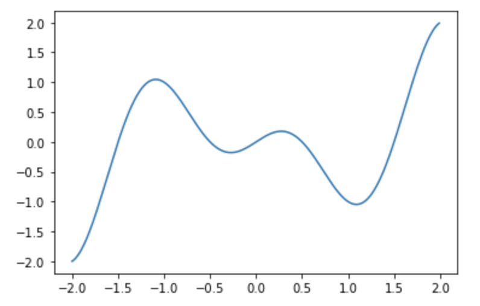
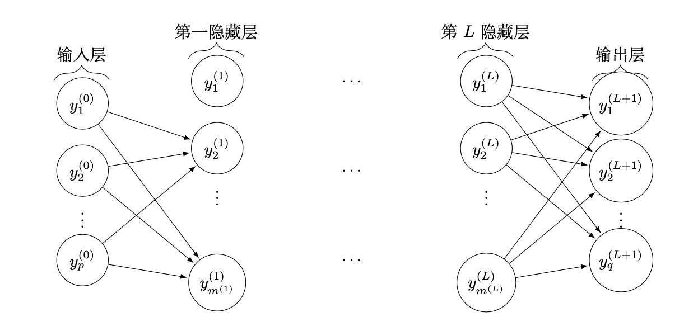
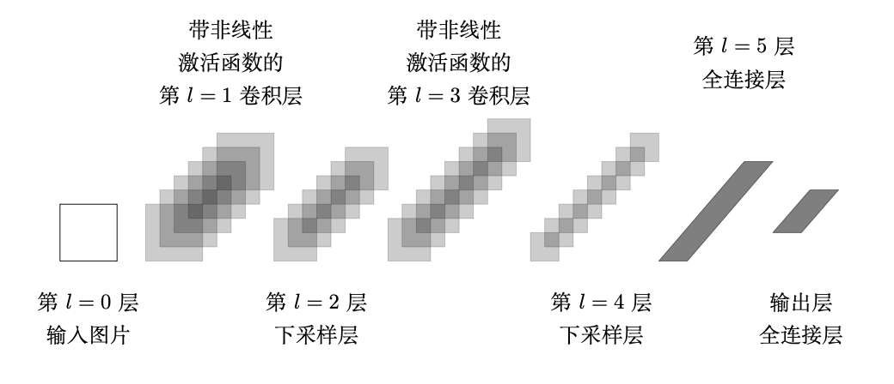

# Chapter 1 Optimization and Deep Learning

&emsp;&emsp;Artificial intelligence is essentially an optimization process. For the intelligence we want to achieve, that is, to find the optimal solution through learning, artificial intelligence technology almost always returns to the optimal solution problem. The core of machine learning and deep learning is models and algorithms, and the optimization task is to tell the model what to learn, how to learn, and how to learn better. 
&emsp;&emsp;Model learning often boils down to finding a mapping function with parameters. It is necessary to use a large amount of data to learn these parameters, and through continuous testing and running, the pros and cons of the parameters in the model can be discovered. 
&emsp;&emsp;The optimization task is to adjust the parameters and adjust them in a good direction. If there is no optimization, the model will not know how to learn and will stagnate. Model training generally randomly assigns initial values ​​to the parameters, and then uses various optimization algorithms to find parameter settings that can reduce information loss or classification error rate. Commonly used algorithms include first-order algorithms (such as stochastic gradient descent, conjugate gradient method, etc.) and second-order algorithms (such as based on BFGS or L-BFGS, truncated Newton method (Hessian-free), Newton-CG, etc.).

## 1.1 The relationship between optimization and deep learning

&emsp;&emsp;In deep learning tasks, whether it is ANN, CNN or RNN, we will define a loss function for the model. Such a loss function is usually called an optimization problemThe objective function of deep learning is the loss function, which represents the gap between the predicted value and the actual value, and then this gap is reduced through a certain optimization algorithm. In most cases, our loss function is very complicated. Unlike solving math problems, we can get a definite and unique analytical solution, but we use mathematical methods to approximate a solution, also known as a numerical solution.

## 1.2 Differences between optimization and deep learning

&emsp;&emsp;Although optimization provides a method to minimize the loss function for deep learning, in essence, the goals of optimization and deep learning are different. By studying some of the content in deep learning, we distinguish between training error and generalization error. Since the objective function of the optimization algorithm is usually a loss function based on the training data set, the goal of optimization is to reduce the training error. The goal of deep learning is to reduce the generalization error. In order to reduce the generalization error, in addition to using the optimization algorithm to reduce the training error, it is also necessary to pay attention to the phenomenon of overfitting.

**Note: **Here we only focus on the performance of the optimization algorithm in minimizing the objective function, not the generalization error of the model.

## 1.3 Mathematical background

&emsp;&emsp;We first introduce some basic concepts in optimization to facilitate the subsequent content.

### 1.3.1 What is optimization? General model of optimization, unconstrained optimization, constrained optimization

&emsp;&emsp;Optimization is a branch of applied mathematics, which mainly refers to the selection of a certain research under certain conditions.A method to achieve the best goal. Optimization problems are widely used in today's military, engineering, management and other fields. With the development of science and technology, the core problems of many disciplines are ultimately reduced to optimization problems. Therefore, optimization has become an indispensable computing tool for discipline research and technical personnel. 

> **Definition**: From several possible arrangements or plans, seeking the best arrangement or plan in a certain sense is called optimization in mathematics. 

&emsp;&emsp;**Decision variables**, **objective function** and **constraints** are the three basic elements of optimization problems. Optimization problems without constraints are called **unconstrained optimization problems**, while other situations are called **constrained optimization problems**. Problems without objective functions are called **feasibility problems**. Some problems can have multiple objective functions, and such problems are often treated as single-objective optimization problems or a series of such problems for discussion. 
&emsp;&emsp;If the decision variables in the optimization problem are restricted to integers, or discrete sets of possibilities, we call it **combinatorial optimization problem** or **discrete optimization problem**. If there are no such restrictions on the variables, it is a continuous optimization problem. Of course, some problems may have both discrete and continuous variables.

### 1.3.2 Basic concepts: feasible solution, global optimal solution, local optimal solution

&emsp;GivenA function $f(x):R^n \rightarrow R$ and a set $S \subset R^n$, find a solution for $x^*$:

$$
\min \limits_{x \in R^{n}} f(x)
$$

is called an optimization problem. $f$ is called the objective function and $S$ is the feasible domain. If $S$ is an empty set, the problem is infeasible. If a sequence of points $x^k \in S$ can be found such that $f (x^k ) \rightarrow - \infty$ when $k \rightarrow \infty$ is found, then the problem is unbounded.

&emsp;&emsp;If the problem is neither infeasible nor unbounded, then it is often possible to find $x^*\in S$ that satisfies

$$
f(x^*) \leqslant f(x), \forall x \in S
$$
Such a $x^*$ is called a global minimum point. If

$$
f(x^*) < f(x), \forall x \in S, x \neq x^{*},
$$
Such $x^*$ is called a strict global minimum point.

&emsp;&emsp;In other cases, we may only find $x^* \in S $ that satisfies

$$
f\left(x^{*}\right) \leq f(x), \forall x \in S \bigcap B_{x^{*}}(\varepsilon)
$$
Where $ B_{x^*} (\varepsilon) = \{ x: \| x - x* \|< \varepsilon \} $.

&emsp;&emsp;Such $x^*$ is called a local minimum of the problem. Similarly, strict local minimums can be defined. In most cases, the feasible set $S$ is displayed using function constraints (equality and inequality). Where $E$ and $I$ are the index sets of equality and inequality constraints.

&emsp;&emsp;Then the usual optimization problem takes the following form:
$$
\begin{array}{ll}
\min & f(x) \\
\text { s.t. } & g_i(x) \leqslant 0, i \in I=\{1,2, \cdots, m\} \\
& h_j(x) = 0, j \in E=\{1,2, \cdots, p\} \\
& x \in D \subset R^n
\end{array}
$$

&emsp;&emsp;There are many factors that affect whether the optimization problem can be effectively solved.For example, the number of decision variables $n$ and the total number of constraints are usually good predictors of the difficulty of solving an optimization problem. Other factors are related to the function that defines the problem. Problems with linear objective functions and linear constraints are easier to solve, and problems with convex objective functions and convex feasible sets are also easier to solve.

## 1.4 Difficulties of optimization in deep learning

&emsp;&emsp;The objective function of a deep learning model may have several local optimal values. When the numerical solution of an optimization problem is near the local optimal solution, the final iterative numerical solution may only minimize the objective function locally rather than globally, because the gradient of the objective function-related solution approaches or becomes zero. Moreover, the fact that the gradient approaches or becomes zero may be caused by the current solution being near the local optimal solution. In fact, another possibility is that the current solution is near a saddle point.

**Local minimum and global minimum**

&emsp;&emsp;Assume the loss function $f(x) = x \cos(\pi x)$ 

```python
import matplotlib.pyplot as plt
import numpy as np

x = np.arange(-2, 2, 0.01)
f = x*np.cos(np.pi*x)
plt.plot(x, f)
plt.show()
```



&emsp;&emsp;Only the function graph of the interval $(-2, 2)$ is drawn. By observing the graph, we find that the function has two troughs, namely the local minimum and the global minimum. When reaching the local minimum, the gradient obtained by the loss function is close to 0, and it is difficult for us to jump out of this local minimum and then optimize to the global minimum, that is, $x=1$.

## 1.5 Case application of optimization in deep learning

&emsp;&emsp;In the past decade, deep learning has entered people's field of vision, and the research on deep learning problems and algorithms has also experienced a new wave. Although the design of convolutional networks is inspired by biology and neuroscience, the current development of deep learning has long surpassed the neuroscience view in machine learning models. It uses simple representations to express complex representations, generalizes from low-level features to more abstract high-level features, and allows computers to mine implicit information and value from experience. We will introduce multi-layer perceptron and convolutional neural network to understand the application of optimization model in deep learning.

### 1.5.1 Multi-layer perceptron

&emsp;&emsp;**Multi-layer perceptron (MLP)** is also called deep feedforward network or feedforward neural network(feedforward neural network), it predicts unknown things through existing information or knowledge. 
&emsp;&emsp;In neural networks, known information is usually represented by data sets, which are generally divided into training sets and test sets: the training set is used to train the neural network so that the neural network can master the information on the training set; the test set is used to test the prediction accuracy of the trained neural network. A common task is classification. Suppose we have a set of pictures of cats and dogs, which are divided into training sets and test sets. The neural network is trying to approximate a function from pictures to $\{0, 1\}$, where 0 represents cats and 1 represents dogs. Because of the structure of the neural network itself and a large amount of training set information, the trained function has a very high consistency with the real result.

&emsp;&emsp;Specifically, we give the training set $D=\{(a_1, b_1),(a_2, b_2), \cdots,(a_m, b_m)\}, a_i \in R^p, b_i \in R^q$. The following figure shows a $L+2$ layer perceptron consisting of $p$ input units and $q$ output units, which contains an input layer, an output layer, and $L$ hidden layers.



&emsp;&emsp;In the $l$th hidden layer, the $i$th unit calculates the output information $y_i^{(l)}$ as
$$
y_i^{(l)} = t \left(z_i^{(l)} \right), \quad z_i^{(l)} = \sum_{k=1}^{m^{(l-1)}} x_{i, k}^{(l)} y_k^{(l-1)}
$$
Among them, the function $t(\cdot)$ is called the activation function.

&emsp;&emsp;The whole process can be described as:$ y^{(0)} \stackrel{x^{(1)}}{\rightarrow} z^{(1)} \stackrel{t}{\rightarrow} y^{(1)} \stackrel{x^{(2)}}{\rightarrow} \cdots \stackrel{t}{\rightarrow} y^{(L+1)}$.

&emsp;&emsp;If the square error is selected as the loss function, we get the optimization model of the multilayer perceptron:
$$
\min \limits_{x} \sum_{i=1}^m \left\| h(a_i ; x) -b_i \right\|_2^2 + \lambda r(x)
$$Among them, $r(x)$ is a regularization term, which is used to characterize certain properties of the solution, such as smoothness or sparsity; $\lambda$ is called a regularization parameter, which is used to balance the degree of model fit and the properties of the solution. If $\lambda$ is too small, the properties of the solution will not be improved; if $\lambda$ is too large, the model is very different from the original problem and may be a poor approximation.

### 1.5.2 Convolutional Neural Network

&emsp;&emsp;**Convolutional neural network (CNN)** is a deep feedforward artificial neural network that is specifically used to process time series data or grid data such as images. CNN has a large number of successful applications in many fields such as computer vision, video analysis, and natural language processing. 
&emsp;&emsp;Unlike the fully connected network corresponding to the above figure (the nodes between two adjacent layers are connected), the **idea** of the convolutional neural network is to greatly reduce the number of parameters through local connections and shared parameters, thereby reducing the dependence on the amount of data and increasing the speed of training. A typical CNN network structure usually consists of one or more convolutional layers, subsampling layers, and fully connected layers. The structure of the fully connected layer is the same as that of the multi-layer perceptron. The convolutional layer is a special network layer that first performs a convolution operation on the input data to generate multiple feature maps., and then use nonlinear activation functions (such as ReLU) to transform each feature. The downsampling layer is usually located after the convolution layer. Its function is to reduce the data dimension and extract the multi-scale information of the data. The result will eventually be output to the next set of transformations.



&emsp;&emsp;The optimization model corresponding to CNN is as follows:
$$
\min \limits_{x} \sum_{i=1}^m \|h (a_i ; x) -b_i\|_2^2 + \lambda r(x)
$$
Wherein, the function $ h(a_i; x) $ is composed of a convolutional neural network, and $x$ is the parameter of the convolutional neural network.