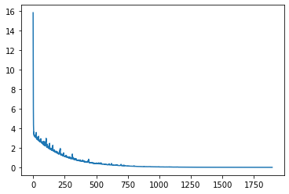

# Chapter 4 Mini-Batch Stochastic Gradient Descent

## 4.1 Background

&emsp;&emsp;Through previous studies, we already know that a major challenge faced in machine learning and deep learning is the contradiction between the size of the training data set and the generalization effect. If you want the generalization performance of the model to be good, you can increase the amount of training data, but you need to choose a suitable optimizer to solve the computational cost problem caused by the large amount of data and the generalization problem of the model. Next, we will discuss the optimization selection under the condition of large data sets.

&emsp;&emsp;In deep learning training, if you want to get a good deep network, the key step is to choose a suitable **Optimizer** to optimize the model parameters. Most neural network training uses **Gradient Descent (GD)** to optimize the model parameters. However, a serious defect of the gradient descent algorithm is that when the `Hessian` matrix condition number of the objective function is large (that is, the problem is more pathological), the convergence speed will become very slow when approaching the minimum value. In addition, the size of the learning rate will also affect the convergence of the problem.

The core idea of ​​Stochastic Gradient Descent (SGD) is: since the data size is very large, can we randomly sample only one sample point each time and iterate over theThe model parameters are optimized, and after iteratively reaching certain conditions, a better model is obtained. In this way, it is not necessary to use all samples, and only some samples are randomly selected for gradient descent. It should be noted that the stochastic gradient descent algorithm cannot guarantee the convergence of the algorithm. Generally, this defect is avoided by dynamically adjusting the learning rate and other techniques.

&emsp;&emsp;Comparing the above two methods, the gradient descent method puts all the data into the calculation, so the speed will be very slow; on the other hand, the gradient descent method cannot handle data sets that exceed the memory capacity limit; and the model cannot be updated online, that is, new samples cannot be added during the operation. Stochastic gradient descent only puts in one sample point at a time, and there is no way to make good use of memory, resulting in inefficient calculation; at the same time, because stochastic gradient descent is frequently updated with high variance, it will cause the objective function value to fluctuate violently. Compared with the convergence of the gradient descent method, which will fall into the local minimum, due to the fluctuation of the target value of stochastic gradient descent, on the one hand, the fluctuation allows stochastic gradient descent to obtain new and potentially better local optimal values; on the other hand, this makes the process of finally converging to a specific minimum value complicated because stochastic gradient descent will continue to fluctuate.

&emsp;&emsp;A natural idea is: Is there a better optimization algorithm that can avoid too much data, make better use of vectorized calculations, improve calculation efficiency, and make the results more stable? Since SGD only draws one sample each time, it is too few.Try to increase the number of samples used for each update, so that the number of updates is reduced, thereby reducing the variance of parameter updates, so that a more stable convergence result can be obtained. This is the **Mini-batch Stochastic Gradient Descent (MBGD)** introduced in this section.

## 4.2 Principle of Mini-batch Stochastic Gradient Descent

&emsp;&emsp;Mini-batch, as the name implies, uses more than one sample, but not all training samples. Usually the number of mini-batches is between 32\~256. Specifically, each parameter update, from a data set with $N$ samples, each time a mini-batch sample data set with a batch size of $n(1 < n < N)$ is extracted, $n$ is generally a small number, generally between 50\~256. It should be noted that no matter how the size of the training set $N$ grows, the batch size $n$ is usually fixed, so when fitting a large sample data set (such as millions), **each batch** only uses a small part of the samples. .

&emsp;&emsp;Assuming that mean square error is used as the loss function, for a sample $(a_i,b_i)$:
$$
\frac{1}{2}\left\|h\left(a_{i} ; x\right)-b_{i}\right\|^{2}
$$
&emsp;&emsp;Wherein, $x$ is the parameter to be optimized for the model $h$. For samples with a batch size of $n$, the loss function is
$$
J(x)=\frac{1}{2 n} \sum_{i=1}^{n}\left(h\left(a_{i} ; x\right)-b_{i}\right)^{2}
$$
&emsp;&emsp;Calculate the gradient of $J$ to $x$
$$
\nabla J(x)=\frac{1}{n} \sum_{i=1}^{n}\left(h\left(a_{i} ; x\right)-b_{i}\right) \cdot h_{x}\left(a_{i} ; x\right)
$$
&emsp;&emsp;The parameter is updated to
$$
x:=x-\eta \cdot \nabla J(x)
$$
&emsp;&emsp;A key parameter in the mini-batch stochastic gradient descent (MBGD) algorithm is the learning rate $\eta$. In actual training, the learning rate decay method is usually used to ensure the convergence of the algorithm. The following is a simple code:

```python
# Set the initial learning rate
learning_rate0 = learning_rate 
for i in range(epochs):np.random.shuffle(data)
# Learning rate decay, beta is the decay rate
learning_rate = learning_rate0 / (1 + beta * i) 
# batch_size is controlled between 50 and 256
for batch in get_batches(data, batch_size): 
params_grad = evaluate_gradient(loss_function, batch, params)
params = params - learning_rate * params_grad
```

## 4.3 Can small batch stochastic gradient descent converge?

#### Lemma (convergence of gradient descent on convex functions)

> Assume that the function $f(x)$ is a convex function and satisfies the $L \text{-Lipschitz}$ condition, $f (x^*)=\inf \limits_{x} f(x)$ exists and is reachable. If the learning rate $\alpha_k$ satisfies $\displaystyle 0<\alpha_k<\frac{1}{L}$, then by iteration
> $$
> x^{k+1}=x^{k}-\alpha_{k} \cdot \nabla f\left(x^{k}\right)
> $$
> The function value of the obtained point sequence $\{x^k\}$ converges to the optimal value $x^*$, and the convergence rate in terms of function value is $\displaystyle \mathcal{O}(\frac{1}{k})$.

#### Definition ($\beta-\text{Smooth}$)

> If the gradient $\nabla f$ of a continuously differentiable function $f$ is $\beta-Lipschitz$, that is:
> $$
> ||\nabla f(x) - \nabla f(y)|| \leq \beta||x-y||
> $$
> Then the function $f$ is said to be $\beta-Smooth$. 

In other words, $\beta-Smooth$ is to set a limit on the curvature of the function. This is equivalent to the eigenvalue of the $Hessian$ matrix being less than $\beta$. Note that there can be non-quadratically differentiable $\beta-Smooth$ functions.

#### Theorem

> If the convex function $f$ is $\beta\text{-Smooth}$, then by iteration
> $$
> x^{k+1}=x^{k}-\alpha_{k} \cdot \nabla f\left(x^{k}\right)
> $$
> The function value of the obtained point sequence $\{x^k\}$ converges to a stable point.

&emsp;&emsp;From the theorem, we can know that gradient descent is guaranteed to converge to a convex function that satisfies $\beta-\text{Smooth}$, but the minimum point is not necessarily unique.

&emsp;&emsp;For the convergence proof of small batch random descent, you can refer to the proof of stochastic gradient descent. The only difference is that SGD independently extracts a sample for update, while the update of small batch stochastic gradient descent is to independently extract a small sample set of ```batchsize``` at a time. In general, the convergence of small batch stochastic gradient descent depends on the selection of step size and the properties of the function itself, and different results will occur under different conditions. For details, please refer to the reference \[3\] and the explanation of the stochastic gradient descent part.

## 4.4 How to choose ```Batchsize``` of mini-Batch?

&emsp;&emsp;Let's review the implementation of mini-batch. If we choose ```Batchsize``` as 64, the parameter update is:
$$
w \rightarrow w^{\prime}=w-\eta \cdot \frac{1}{64} \cdot \sum_{i=1}^{64} \nabla J\left(x_{i}\right)
$$
&emsp;&emsp;When using `mini-batch`, we can put all the samples in a `batch` in a matrix and use the linear algebra library to accelerate the calculation of gradients. This is an optimization method in engineering implementation. A large `batch` can make full use of matrices and linear algebra libraries to accelerate calculations. The smaller the ```Batchsize```, the less obvious the acceleration effect may be, resulting in a long optimization process. Of course, the larger the ```Batchsize```, the better. When it is too large, the weight update will be less frequent. It can be understood that the step size is too large and the optimal parameters cannot be converged in the end.

&emsp;&emsp;In actual training, you can first fix other hyperparameters (not necessarily the best), then try some ```Batchsize```, and then print out the relationship between verification accuracy and time, so as to select the most appropriate ```Batchsize```, which can improve performance the fastest. After selecting ```Batchsize```, continue to optimize other hyperparameters.

## 4.5 Implementation of random mini-batch gradient descent

### 4.5.1 Import necessary libraries and generate experimental data

```python
# Import necessary libraries
import numpyas np
import matplotlib.pyplot as plt

x0=np.random.randint(1,2,10000).reshape(10000,1) 
x1=np.random.randint(1,10,10000).reshape(10000,1)

X=np.hstack((x0,x1))
y=x0+x1
```

### 4.5.2 Implementation of Mini-Batch Stochastic Gradient Descent (MBGD)

```python
def MBGD(X,y):
ept=0.001 #Accuracy (stop condition)
loss=1000 #Define a loss to facilitate entering the loop body and later represent the difference between two iteration loss functions
alpha=0.05 #Learning rate
max_iter=1000 #Number of gradient updates
batch_size = 20 #batch size
theta=np.random.randint(1,10,(X.shape[1],1)) #Parameter initialization
loss_list = []

while max_iter<10000 and loss>ept:#The mini-batch gradient descent here selects two samples each time
i = np.random.randint(0, batch_size-1) # Randomly extract a mini-batch

# Partial derivative of the loss function with respect to theta
partial = (1/2)*X[i:i+2,:].T.dot(X[i:i+2,:].dot(theta)-y[i:i+2,:])
# Parameter update
theta=theta-alpha*partial

max_iter+=1

# Calculate the difference between two iterations (loss function) No obvious difference means that the algorithm has converged to the global optimal solution
loss=(1/(2*X.shape[0]))*np.sum((X.dot(theta)-y)**2)

loss_list.append(loss) # Save training loss
return max_iter,theta,loss_list

max_iter,theta,loss_list=MBGD(X,y)
```

### 4.5.3 Plot

```python
plt.plot(loss_list)
```



&emsp;&emsp;As can be seen from the above figure, small batch random descent will eventually converge, but during the convergence process, due to the uncertainty of random algorithm sampling, the loss during training will fluctuate.

## References

[1] Liu Haoyang, Hu Jiang, Li Yongfeng, Wen Zaiwen. (2021). Optimization: Modeling, Algorithms and Theory. Beijing: Higher Education Press. 
[2] Ruder S. An overview of gradient descent optimization algorithms[J]. arXiv preprint arXiv:1609.04747, 2016. 
[3] Nocedal J. Optimization Methods for Large-Scale Machine Learning [J][J]. Siam Review, 2016, 60(2). 

[4] http://mitliagkas.github.io/ift6085-2019/ift-6085-lecture-3-notes.pdf