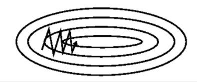
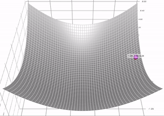
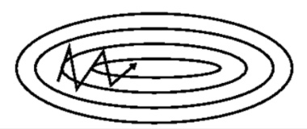
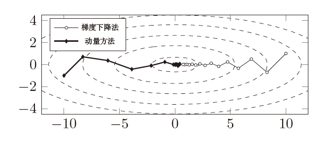
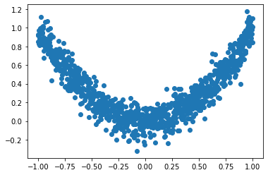
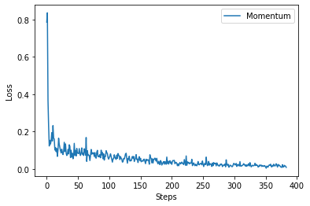
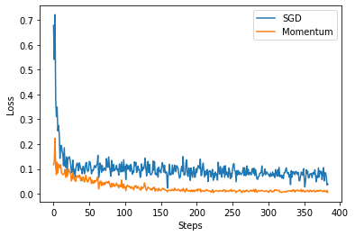

# Chapter 5 Momentum Method (Momentum)

## 5.1 Background

&emsp;&emsp;Using the gradient descent method, each time it moves in the direction where the objective function drops fastest. This update method seems very fast, but in fact there are some problems, that is, it oscillates back and forth near the optimal solution, resulting in poor convergence near the optimal solution.

&emsp;&emsp;Consider a two-dimensional input $[x_1, x_2]$, and the output loss function is $L: R^2 \rightarrow R$. The figure below is the contour of the loss function, which is easy to remember. We can imagine it as a very flat funnel. In the vertical direction, the gradient of the loss function is very large, and correspondingly, the gradient in the horizontal direction is relatively small. Therefore, the learning rate should not be set too large to prevent the parameters from updating too fast in the vertical direction. However, a smaller learning rate will cause the parameters to update too slowly in the horizontal direction, which will affect the final convergence speed.



&emsp;&emsp;In order to overcome the above defects, some scholars proposed the momentum method, which is a gradient descent algorithm with momentum, referred to as the momentum method. The momentum method is proposed to accelerate learning, and it draws on the ideas of physics. Imagine rolling a ball in a frictionless bowl. When there is no resistance, its momentum will increase, but if it encounters resistance, its speed will decrease, as shown belowAs shown in the figure.



&emsp;&emsp;The idea of ​​the momentum method is to retain the direction of the previous update to a certain extent when updating the parameters, while using the gradient of the current batch to fine-tune the final direction. In short, the momentum method accelerates the current gradient by accumulating the previous momentum, increasing stability and convergence speed to a certain extent, as well as the ability to escape the local optimal solution. In summary, the momentum method has two obvious advantages:

1. Momentum moves faster (because of all the momentum it accumulates)

2. Momentum has a chance to escape the local minimum (momentum may push it out of the local minimum), and similarly, as we will see later, it will also pass through the plateau area better

## 5.2 Principle of Momentum Method

### 5.2.1 Formula Derivation

&emsp;&emsp;Formally speaking, the momentum method combines the current gradient with the direction of the previous step to accelerate the convergence of the algorithm. Specifically, it introduces a speed variable $v$, which represents the direction and magnitude of parameter movement. First, let's review the iterative formula of standard gradient descent:

$$
x_{t+1} = x_t - \alpha\nabla f(x_t)
$$

Among them, $\alpha$ is called the step size, or the learning rate, and the momentum method introduces the "momentum term" $\beta(x_t - x_{t-1})$. That is:

$$
x_{t+1} = x_t - \alpha \nabla f(x_t) + \beta(x_t - x_{t-1})
$$
Let $v_t = x_t - x_{t-1}$, simplifying to get:
$$
v_{t+1} = \beta v_{t} - \alpha \nabla f(x_t) \\
$$
Where $v_t$ can represent the current velocity, $\beta$ is the momentum parameter, which is a positive number less than 1.

&emsp;&emsp;If we imagine the current iteration as a mass ball, then the above formula can guide that our gradient descent update should be proportional to the previous step size.

### 5.2.2 Example Derivation

&emsp;&emsp;Next, we use a simple convex function to derive the momentum method. First, we introduce a theorem:

> **Theorem 1:** Given a matrix $A$ in a vector space $M_n$ and $\varepsilon > 0$, there exists a matrix norm $\|\cdot\|$ that satisfies $\|A\| \leqslant \rho(A)+\varepsilon$, where $\rho (A) = \max \{ |\lambda_1, \cdots, \lambda_n|\}$ (i.e. the maximum value in the eigenvector).

&emsp;&emsp;Consider a simple quadratic objective:

$$
\displaystyle f(x) = \frac{h}{2} x^2
$$

So the momentum update rule is:
$$
\begin{aligned}
x_{t+1} &= x_t - \alpha \nabla f(x_t) + \beta (x_t - x_{t-1}) \\
&= x_t -\alpha h x_t + \beta (x_t - x_{t-1}) \\
&= (1+\beta -\alpha h) x_t - \beta x_{t-1}
\end{aligned}
$$

The linear expression can be obtained:

$$
\left[\begin{array}{c}
x_{t+1} \\
x_{t}
\end{array}\right]=\left[\begin{array}{cc}
1-\alpha h+\beta & -\beta \\
1 & 0
\end{array}\right]\left[\begin{array}{c}
x_{t} \\
x_{t-1}
\end{array}\right]
$$

Let $A = \left[\begin{array}{cc} 1-\alpha h+\beta & -\beta \\ 1 & 0 \end{array}\right]$, so $A$ can be recursively $t$ steps to get the relationship between $x_{t+1}$, $x_t$ and $x_1$, $x_0$, as follows:

$$
\left[\begin{array}{c}
x_{t+1} \\
x_{t}
\end{array}\right]=A^{t}\left[\begin{array}{l}
x_{1} \\
x_{0}
\end{array}\right]
$$

Consider comparing $x_t$ with the optimal $x^*$ For comparison, we have:

$$
\left[\begin{array}{c}
x_{t+1}-x^{*} \\
x_{t}-x^{*}
\end{array}\right]=A^{t}\left[\begin{array}{l}
x_{1}-x^{*} \\
x_{0}-x^{*}
\end{array}\right]
$$

Take the norm:

$$
\left\|\left[\begin{array}{c}
x_{t+1} \\
x_{t}
\end{array}\right]\right\|_{2}=\left\|A^{t}\left[\begin{array}{l}
x_{1} \\
x_{0}
\end{array}\right]\right\|_{2} \leq\left\|A^{t}\right\|_{2}\left\|\left[\begin{array}{l}
x_{1} \\
x_{0}
\end{array}\right]\right\|_{2}
$$

From **Theorem 1**, we know that there exists a matrix norm that satisfies:

$$
\left\|A^{t}\right\| \leqslant (\rho(A)+\epsilon)^{t} = O(\rho(A)^t)
$$

Wherein, $\rho (A) = \max \{ |\lambda_1, \lambda_2|\}$, $\lambda_1,\lambda_2$ represent eigenvectors respectively, so:

$$
\left\|\left[\begin{array}{c}
x_{t+1} \\
x_{t}
\end{array}\right]\right\|_{2} \leq(\rho(A)+\epsilon)^{t}\left\|\left[\begin{array}{l}
x_{1} \\
x_{0}
\end{array}\right]\right\|_{2}
= O(\rho(A)^{t})\left\|\left[\begin{array}{l}
x_{1} \\
x_{0}
\end{array}\right]\right\|_{2}
$$

Therefore, the algorithm will converge at a linear rate determined by the maximum absolute value of the eigenvalue of $A$.

## 5.3 How to understand the momentum method

&emsp;&emsp;As shown in the figure below, if we imagine the current iteration as a small ball with mass, then our gradient descent update should be proportional to the previous step size. Next, consider two extreme cases to better understand momentum. If the momentum parameter $\beta = 0$, then it is exactly the same as the initial gradient descent, and if $\beta = 1$, then it will be the same as the frictionless bowl analogy at the beginning, and it will keep swinging back and forth, which is definitely not what we want. In practice, we usually choose the momentum parameter to be around $0.8 \sim 0.9$, which can be imagined as a ball sliding on a frictional surface.So its speed will gradually slow down and eventually stop.


&emsp;&emsp;In summary, the momentum method is equivalent to taking the previous speed into account every time the parameters are updated. In other words, the movement of each parameter in each direction depends not only on the current gradient, but also on whether the gradients in the past are consistent in each direction. If the gradient is updated in the same direction, the magnitude of each update will become larger and larger. When the direction of the gradient keeps changing, the magnitude of the update will be attenuated. In this way, we can use a larger learning rate to make the convergence faster. At the same time, the magnitude of each update in the direction with a larger gradient will be reduced due to momentum, as shown in the following figure:



&emsp;&emsp;Assuming that the gradient is equal to $g$ each time and the direction is the same, the momentum method accelerates the movement of the parameters in the opposite direction, and the following formula is obtained:

$$
\begin{aligned}
v_0 &= 0 \\
v_1 &= \beta v_0 + \alpha g = \alpha g \\ 
v_2 &= \beta v_1 + \alpha g = (1 + \beta ) \alpha g \\
v_3 &= \beta v_2 + \alpha g =(1 + \beta + \beta ^2) \alpha g \\
&\cdots \\
v_{+ \infty} &= (1 + \beta + \beta ^2 + \beta ^3 + \cdots) \alpha g = \frac{1}{1 - \beta } \alpha g \\
\end{aligned}
$$

&emsp;&emsp;If we set $\beta $ to $0.9$, the peak of the update amplitude is $10$ times the original gradient multiplied by the learning rate.

&emsp;&emsp;Essentially, the momentum method is like pushing a ball from a high slope. The ball accumulates momentum as it rolls down, and it will get faster and faster on the way, and finally reach a peak. Corresponding to the algorithm, the momentum term will continue to increase in the same direction as the gradient, and gradually decrease in the direction where the gradient direction changes, resulting in faster convergence and smaller oscillations.

## 5.4 Intuitive comparison between momentum method and gradient descent method

&emsp;&emsp;Assume quadratic function $f(x, y) = x^2 + 10 y^2$, take initial points $(x^0, y^0)$ as $(10, 1)$ and $(-10, -1)$ respectively, and use gradient method and momentum method to perform $15$Iterations, the results are shown in the figure below. It can be seen that the point sequence generated by the ordinary gradient method will move back and forth in the direction of the minor axis of the ellipse, while the point sequence generated by the momentum method converges to the minimum point faster.



## 5.5 Implementation of the momentum method

### 5.5.1 Implementing the momentum method with a custom function

&emsp;&emsp;Next, we manually implement a momentum method, the formula is given above.

1. Import modules

```python 
import torch
import torch.utils.data as Dataa
import torch.nn.functional as F
from torch.autograd import Variable
import matplotlib.pyplot as plt
%matplotlib inline

torch.manual_seed(1) # Fixed random numbers to make the results reproducible
```

2. Define momentum function

```python
def sgd_momentum(parameters, vs, lr,gamma):
for param, v in zip(parameters, vs):
v[:] = gamma * v + lr * param.grad.data
param.data = param.data - v
```

3. Generate data and create `dataset`

For simplicity, let's go for a simple function, $f(x) = x^2 + 0.1\epsilon$, where $\epsilon$ is a perturbation term that follows a standard normal distribution.

```python 
# generate data
x = torch.unsqueeze(torch.linspace(-1, 1, 1000), dim=1)
y = x.pow(2) + 0.1*torch.randn(*x.size())

# batch training
torch_dataset = Data.TensorDataset(x, y)
loader = Data.DataLoader(dataset=torch_dataset,
batch_size=BATCH_SIZE,
shuffle=True)

# plot dataset
plt.scatter(x.numpy(), y.numpy())
plt.show()
```

The result is as follows:



4. Define a simple linear neural network

```python 
# Set hyperparameters
LR = 0.01
BATCH_SIZE = 32
EPOCH = 12

# Define a neural network
class Net(torch.nn.Module):
def __init__(self):
super(Net, self).__init__()
self.hidden = torch.nn.Linear(1, 20) 
self.predict = torch.nn.Linear(20, 1)

def forward(self, x):
x = F.relu(self.hidden(x)) # activation function for hidden layer
x = self.predict(x) # linear output
return x

# Initialization
net_Momentum = Net()

# loss function
loss_func = torch.nn.MSELoss()
losses_momentum = [] # record loss
```

5. Define momentum function

```python
# Initialize velocity to zero tensor with the same shape as parameters
vs = []
for param in net.parameters():
vs.append(torch.zeros_like(param.data))

def sgd_momentum(parameters, vs, lr, gamma):
for param, v in zip(parameters, vs):
v[:] = gamma * v + lr * param.grad.data
param.data = param.data - v
```

6. Model training and plotting `loss` graph

```python 
# training
for epoch in range(EPOCH):
train_loss = 0 
for step, (batch_x, batch_y) in enumerate(loader): # for each training step
b_x = Variable(batch_x)
b_y = Variable(batch_y)

output = net_Momentum(b_x) # get output for every net
loss = loss_func(output, b_y) # compute loss for every net
net_Momentum.zero_grad() # clear gradients for next train
loss.backward() # backpropagation, compute gradients
sgd_momentum(net_Momentum.parameters(), vs, 1e-2, 0.8) # The momentum parameter used is 0.8, and the learning rate is 0.01

train_loss += loss.item()
losses_momentum.append(loss.item()) # loss recoder

print('epoch: {}, Train Loss: {:.6f}'.format(epoch, train_loss / len(train_data)))

plt.plot(losses_momentum, label='Momentum')
plt.legend(loc='best')
plt.xlabel('Steps')
plt.ylabel('Loss')
plt.show()
```

The result is as follows:



**Complete code**

```python
import torch
import torch.utils.data as Dataa
import torch.nn.functional as F
from torch.autograd import Variable
import matplotlib.pyplot as plt
%matplotlib inline

torch.manual_seed(1) # reproducible

# hyper parameters
LR = 0.01
BATCH_SIZE = 32
EPOCH = 12

# generate data
x = torch.unsqueeze(torch.linspace(-1, 1, 1000), dim=1)
y = x.pow(2) + 0.1*torch.randn(*x.size())
# unsqueeze: Returns a new tensor with a dimension of size one inserted at the specified position.

# plot dataset
plt.scatter(x.numpy(), y.numpy())
plt.show()

# batch training
torch_dataset = Data.TensorDataset(x, y)
loader = Data.DataLoader(
dataset=torch_dataset,
batch_size=BATCH_SIZE,
shuffle=True)

# define neural network
class Net(torch.nn.Module):
def __init__(self):
super(Net, self).__init__()
self.hidden = torch.nn.Linear(1, 20)
self.predict = torch.nn.Linear(20, 1)

def forward(self, x):
x = F.relu(self.hidden(x)) # activation function for hidden layer
x = self.predict(x) # linear output
return x

# different optimizer
net_Momentum = Net()

# loss function
loss_func = torch.nn.MSELoss()
losses_momentum = [] # record loss

# Initialize velocity to zero tensor with same shape as parameters
vs = []
for param in net_Momentum.parameters():
vs.append(torch.zeros_like(param.data))

# training
for epoch in range(EPOCH):
train_loss = 0
for step, (batch_x, batch_y) in enumerate(loader): # for each training step
b_x = Variable(batch_x)
b_y = Variable(batch_y)

output = net_Momentum(b_x) # get output for every net
loss = loss_func(output, b_y) # compute loss for every net
net_Momentum.zero_grad() # clear gradients forr next train
loss.backward() # backpropagation, compute gradients
sgd_momentum(net_Momentum.parameters(), vs, 1e-2, 0.8) # Momentum parameter used is 0.8, learning rate 0.01

train_loss += loss.item()
losses_momentum.append(loss.item()) # loss recoder

print('epoch: {}, Train Loss: {:.6f}'
.format(epoch, train_loss / len(train_data)))

plt.plot(losses_momentum, label='Momentum')
plt.legend(loc='best')
plt.xlabel('Steps')
plt.ylabel('Loss')
plt.show()
```

### 5.5.2 Call PyTorch built-in function to implement momentum method

&emsp;&emsp;In fact, PyTorch has a very convenient built-in way to implement momentum method, just use `torch.optim.SGD(momentum=0.8)`, the code is as follows:

```python
import torch
import torch.utils.data as Data
import torch.nn.functional as F
from torch.autograd import Variable
import matplotlib.pyplot as plt
%matplotlib inline

torch.manual_seed(1) # reproducible

# hyper parameters
LR = 0.01
BATCH_SIZE = 32
EPOCH = 12

# generate datas
x = torch.unsqueeze(torch.linspace(-1, 1, 1000), dim=1)
y = x.pow(2) + 0.1*torch.randn(*x.size())
# unsqueeze: Returns a new tensor with a dimension of size one inserted at the specified position.

# plot dataset
plt.scatter(x.numpy(), y.numpy())
plt.show()

# batch training
torch_dataset = Data.TensorDataset(x, y)
loader = Data.DataLoader(
dataset=torch_dataset,
batch_size=BATCH_SIZE,
shuffle=True)

# define neural network
class Net(torch.nn.Module):
def __init__(self):
super(Net, self).__init__()
self.hidden = torch.nn.Linear(1, 20) 
self.predict = torch.nn.Linear(20, 1)

def forward(self, x):
x = F.relu(self.hidden(x)) # activation function for hidden layer
x = self.predict(x) # linear output
return x

net_Momentum = Net()

# loss function
loss_func = torch.nn.MSELoss()
losses_momentum = [] # record loss
opt_Momentum = torch.optim.SGD(net_Momentum.parameters(), lr=LR, momentum=0.8)

# Initialize velocity to zero tensor with the same shape as parameters
vs = []
for param in net_Momentum.parameters():
vs.append(torch.zeros_like(param.data))

def sgd_momentum(parameters, vs, lr, gamma):
for param, v in zip(parameters, vs):
v[:] = gamma * v + lr * param.grad.data
param.data = param.data - v

# training
for epoch in range(EPOCH):
train_loss = 0
for step, (batch_x, batch_y) in enumerate(loader): # for each training step
b_x = Variable(batch_x)
b_y = Variable(batch_y)

output = net_Momentum(b_x) # get output for every net
loss = loss_func(output, b_y) # compute losss for every net
net_Momentum.zero_grad() # clear gradients for next train
loss.backward() # backpropagation, compute gradients
opt_Momentum.step() # Momentum parameter used is 0.9, learning rate 0.01

train_loss += loss.item()
losses_momentum.append(loss.item()) # loss recoder

print('epoch: {}, Train Loss: {:.6f}'
.format(epoch, train_loss / len(train_data)))

plt.plot(losses_momentum, label='Momentum')
plt.legend(loc='best')
plt.xlabel('Steps')
plt.ylabel('Loss')
plt.show()
```

## 5.6 Momentum vs. Stochastic Gradient Descent

&emsp;&emsp;We can compare momentum vs. stochastic gradient descent without momentum:

```python
import torch
import torch.utils.data as Data
import torch.nn.functional as F
from torch.autograd import Variable
import matplotlib.pyplot as plt
%matplotlib inline

torch.manual_seed(1) # reproducible

# hyper parameters
LR = 0.01
BATCH_SIZE = 32
EPOCH = 12

# generate datas
x = torch.unsqueeze(torch.linspace(-1, 1, 1000), dim=1)
y = x.pow(2) + 0.1*torch.randn(*x.size())
#unsqueeze: Returns a new tensor with a dimension of size one inserted at the specified position.

# plot dataset
plt.scatter(x.numpy(), y.numpy())
plt.show()

# batch training
torch_dataset = Data.TensorDataset(x, y)
loader = Data.DataLoader(
dataset=torch_dataset,
batch_size=BATCH_SIZE,
shuffle=True)

# define neural network
class Net(torch.nn.Module):
def __init__(self):
super(Net, self).__init__()
self.hidden = torch.nn.Linear(1, 20) 
self.predict = torch.nn.Linear(20, 1)

def forward(self, x):
x = F.relu(self.hidden(x)) # activation function for hidden layer
x = self.predict(x) # linear output
return x

# different optimizer
net_SGD = Net()
net_Momentum = Net()
# net_RMSprop = Net()
# net_Adam = Net()
nets = [net_SGD, net_Momentum]

opt_SGD = torch.optim.SGD(net_SGD.parameters(), lr=LR)
opt_Momentum = torch.optim.SGD(net_Momentum.parameters(), lr=LR, momentum=0.8)
# opt_RMSprop= torch.optim.RMSprop(net_RMSprop.parameters(), lr=LR, alpha=0.9)
# opt_Adam = torch.optim.Adam(net_Adam.parameters(), lr=LR, betas=(0.9, 0.99))

optimizers = [opt_SGD, opt_Momentum]

# loss function
loss_func = torch.nn.MSELoss()
losses_his = [[], []] # record loss

# training
for epoch in range(EPOCH):
print('Epoch: ', epoch)
for step, (batch_x, batch_y) in enumerate(loader): # for each training step
b_x = Variable(batch_x)
b_y = Variable(batch_y)for net, opt, l_his in zip(nets, optimizers, losses_his):
output = net(b_x) # get output for every net
loss = loss_func(output, b_y) # compute loss for every net
opt.zero_grad() # clear gradients for next train
loss.backward() # backpropagation, compute gradients
opt.step() # apply gradients
l_his.append(loss.item()) # loss recoder
labels = ['SGD', 'Momentum']
for i, l_his in enumerate(losses_his):
plt.plot(l_his, label=labels[i])
plt.legend(loc='best')
plt.xlabel('Steps')
plt.ylabel('Loss')
plt.show()
```

The results are as follows:



&emsp;&emsp;It can be seen that the loss decreases more after adding momentum. In fact, momentum can also be understood as a kind of inertia, so the amplitude of each update will be greater than that without momentum.

## References

[1] Liu Haoyang, Hu Jiang, Li Yongfeng, Wen Zaiwen. (2021). Optimization: Modeling, Algorithms and Theory. Beijing: Higher Education Press, https://bicmr.pku.edu.cn/~wenzw/optbook/opt1.pdf. 
[2] IFT 6169: Theoretical principles for deep learning, https://mitliagkas.github.io/ift6085-dl-theory-class/ 
[3] Pytorch Chinese manual, https://wizardforcel.gitbooks.io/learn-dl-with-pytorch-liaoxingyu/content/3.6.2.html 
[4] Visual explanation of gradient descent (Adam, AdaGrad, Momentum, RMSProp), https://mp.weixin.qq.com/s/LyNrPoEirLk0zwBxu0c18g 
[5] Pytorch learning notes, https://www.yangsuoly.com/2021/04/08/Pytorch/ 
[6] S. Foucart. Matrix norm and spectral radius. University Lecture, 2012. URL http://www.math.drexel.edu/~foucart/TeachingFiles/F12/M504Lect6.pdf