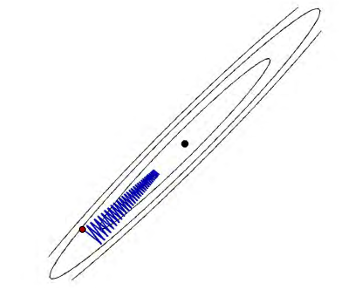
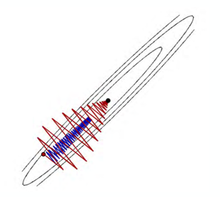
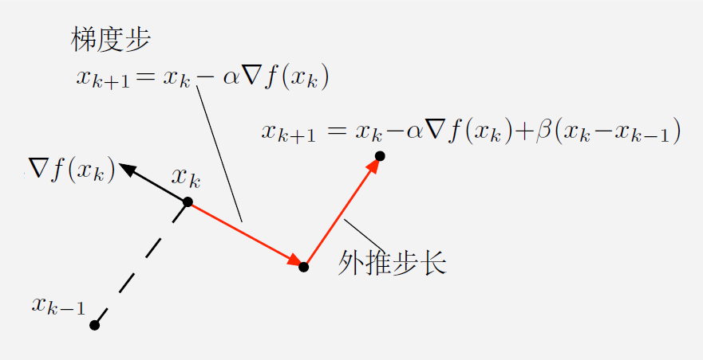

# Chapter 8 Nesterov acceleration algorithm

&emsp;&emsp;The basic iteration form of the Nesterov acceleration method is:
$$
\begin{aligned}
v_{t} &=\mu_{t-1} v_{t-1}-\epsilon_{t-1} \nabla g\left(\theta_{t-1}+\mu_{t-1} v_{t-1}\right) \\
\theta_{t} &=\theta_{t-1}+v_{t}
\end{aligned}
$$
&emsp;&emsp;The difference between the momentum method and the momentum method is that they use the gradient of different points. The momentum method uses the gradient direction of the previous step $\theta_{t-1}$, while the Nesterov acceleration method takes a step forward from $\theta_{t-1}$ to $v_{t-1}$. One explanation is that since we are going to move towards $v_{t-1}$ anyway, we might as well use this information first. Next, we derive the second equivalent form:
$$
\begin{aligned}
\theta_{t} &=\theta_{t-1}+v_{t} \\
&=\theta_{t-1}+\mu_{t-1} v_{t-1}-\epsilon_{t-1} \nabla g\left(\theta_{t-1}+\mu_{t-1} v_{t-1}\right) \\
&=\theta_{t-1}+\mu_{t-1}\left(\theta_{t-1}-\theta_{t-2}\right)-\epsilon_{t-1} \nabla g\left(\theta_{t-1}+\mu_{t-1}\left(\theta_{t-1}-\theta_{t-2}\right)\right)
\end{aligned}
$$
&emsp;&emsp;Then introduce the intermediate variable $y_{t-1}$ , so that it satisfies
$$
y_{t-1}=\theta_{t-1}+\mu_{t-1}\left(\theta_{t-1}-\theta_{t-2}\right)
$$
&emsp;&emsp;Then we get the second equivalent form
$$
\begin{aligned}
&\theta_{t}=y_{t-1}-\epsilon_{t-1} \nabla g\left(y_{t-1}\right) \\
&y_{t}=\theta_{t}+\mu_{t}\left(\theta_{t}-\theta_{t-1}\right)
\end{aligned}
$$
&emsp;&emsp;This can be understood as taking a gradient step first and then taking an acceleration step. These two forms are completely equivalent.
# Heavy ball method
First, we start with the gradient descent method:
$$
x_{k+1}=x_{k}-\alpha_{k} \nabla f\left(x_{k}\right)
$$
Due to the excessive use of local gradient information, oscillation may occur, resulting in slower iteration speed:

Imagine a ball rolling down a hill. At the beginning, the speed is 0, and it will roll bumpy (oscillate). But after a period of time, the momentum (Momentum) accumulates, the oscillation will decrease, and it will roll straight down the hill.

Therefore, we introduce the first acceleration method: the heavy ball method, whose iterative form is:
$$
x_{k+1}=x_{k}-\alpha_{k} \nabla f\left(x_{k}\right)+\beta_{k}\left(x_{k}-x_{k-1}\right)
$$
Among them, $\beta_{k}(x_{k}-x_{k-1})$ is the momentum term, which is to preventOscillation caused by local drive (i.e. gradient direction).

## Convergence of the heavy ball method
Here we briefly introduce its convergence: Considering m-strongly convex and L-Lipshitz smooth functions, taking $\kappa=\frac{L}{m}$, we have the following conclusions:

When the optimal step size is taken, the gradient descent method has a linear convergence rate, that is,

$$
\|x_{k}-x^{*}\| \leq\left(1-\frac{2}{\kappa+1}\right)^{k}\|x_{0}-x^{*}\|_2
$$
When the optimal step size is taken, the heavy ball method has a superlinear convergence rate, that is,
$$
\|x_{k}-x^{*}\| \leq\left(1-\frac{1}{\sqrt\kappa+1}\right)^{k}\|x_{0}-x^{*}\|_2
$$
They look similar in format, but the difference in square root leads to a huge difference in convergence speed.

In order to ensure $\|x_k-x^*\|_2\leq\epsilon \|x_0-x^*\|$
The number of iterations only needs to be:
$$
\begin{aligned}
k> & \frac{\kappa}{2}\log \frac{1}{\epsilon}\quad&\text { Gradient descent method}\\
k> & \frac{\sqrt{\kappa}}{2}\log \frac{1}{\epsilon}\quad&\text { Heavy ball method}
\end{aligned}
$$
This means that when $\kappa$ is very large, the convergence speed of the heavy ball method is much faster than the gradient descent method. For example, when $\kappa=100$, the heavy ball method is 10 times faster than the gradient descent method.

We can rewrite it in the form of descending direction:
$$
\begin{aligned}
p_k&=-\nabla f(x_k)+\beta_k p_{k-1}\\
x_{k+1}&=x_k+\alpha_k p_k
\end{aligned}
$$
Where $\beta_k$ is the momentum term, usually taken as 0.9, and $\alpha_k$ is the step size, which can be selected by line search.

# Nesterov acceleration algorithm
In 1983, Yurii Nesterov proposed a new acceleration algorithm, called the Nesterov acceleration algorithm. He rewrote the iterative format of the heavy ball method:
$$
\begin{aligned}
p_k&=-\nabla f\left(x_k+\beta_k (x_k-x_{k-1})\right)+\beta_kp_{k-1}\\
x_{k+1}&=x_k+\alpha_k p_k
\end{aligned}
$$
Compared to the heavy ball method, the difference between the Nesterov acceleration algorithm and the heavy ball method is that,
when calculating the gradient, it first makes a prediction and then performs gradient descent. The advantage of this prediction is that it can better estimate the gradient of the next step, thereby better guiding the next iteration. At the same time, we no longer need to ensure strong convexity, and the Nesterov acceleration algorithm can also ensure convergence. We only need to ensure that the function is L-Lipshitz smooth.

For the parameter selection of the Nesterov acceleration algorithm, $\alpha_k=\frac{2}{L}$, $\beta_k=\frac{k-2}{k+1}$ are usually taken.

## Convergence of Nesterov acceleration algorithm
Considering the L-Lipshitz smooth function, we have the following conclusions:
The convergence rate of the gradient descent method when taking the optimal step size:
$$
f(x_k)-f(x^*)\leq\frac{2L}{k+4}\|x_0-x^*\|_2^2
$$
The convergence rate of the Nesterov acceleration algorithm:
$$
f(x_k)-f(x^*)\leq\frac{2L}{(k+2)^2}\|x_0-x^*\|_2^2
$$
In order to ensure that $f(x_k)-f(x^*)\leq\epsilon$, we only need to ensure that the number of iterations $k$ satisfies:
$$
\begin{aligned}
k> & \frac{2L}{\epsilon}\|x_0-x^*\|_2^2-4\quad&\text { Gradient descent method}\\
k> & {\frac{2L}{\sqrt\epsilon}}\|x_0-x^*\|_2^2-2\quad&\text { Nesterov acceleration method}
\end{aligned}
$$
This means that if $\epsilon$ is chosen to be very small, the convergence speed of the Nesterov acceleration method is much faster than the gradient descent method. If $\epsilon=10^{-2}$, the Nesterov acceleration method is 10 times faster than the gradient descent method.