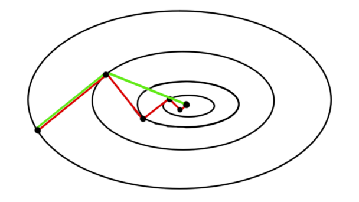
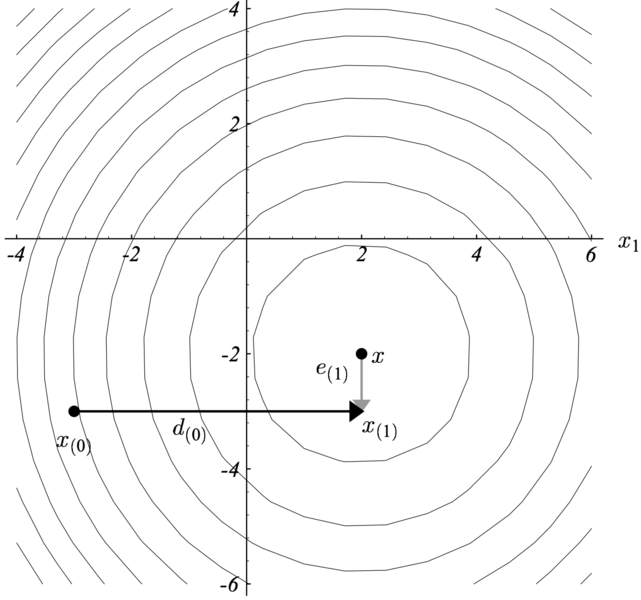
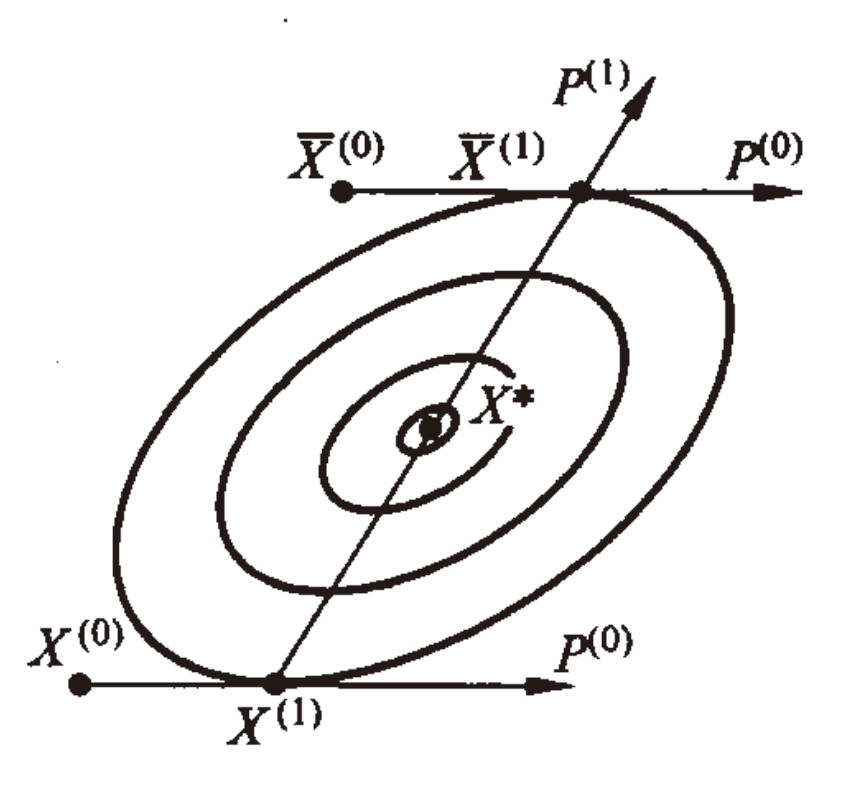
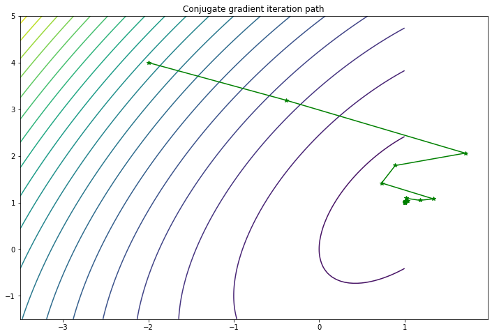

# Chapter 4 Conjugate Gradient Method

## 4.1 Background

&emsp;&emsp;The Conjugate Gradient method (CG) is one of the most popular and well-known iterative techniques for solving sparse symmetric positive definite linear equations. It was first proposed by Hestenes & Stiefel in 1952 as an iterative method for solving linear equations with positive definite coefficient matrices.

&emsp;&emsp;Subsequently, Flecher & Reeves introduced the first nonlinear conjugate gradient method in 1964 for solving large-scale nonlinear optimization problems. After decades of development, there have been many variants based on this initial method, some of which are widely used in practice. The characteristics of these algorithms are that they do not require matrix storage and are faster than the steepest descent method.

&emsp;&emsp;In this chapter, we focus on the simple linear conjugate gradient method. At the same time, for simplicity, the qualifier "linear" will be weakened. If you are interested in the nonlinear conjugate gradient method, you can check the relevant materials for further study on the basis of learning the linear conjugate gradient method (see reference 3).

&emsp;&emsp; The conjugate gradient method is usually implemented in the form of an iterative algorithm and can be considered as an intermediate between Newton's method (a method that combines the Hessianand gradient, which will be introduced later) and the steepest descent method (a first-order method using gradients). Newton's method usually reduces the number of iterations required, but computing the Hessian matrix and its inverse increases the amount of computation required for each iteration. Steepest descent repeats steps in the direction opposite to the function gradient of the current point. It usually takes steps in the same direction as earlier, resulting in slow convergence (as shown in Figure 1). In order to avoid the high computational cost of Newton's method and speed up the convergence of steepest descent, the conjugate gradient method was proposed.



<center>Figure 1 Comparison of Steepest Descent and Conjugate Gradient Descent</center>

&emsp;&emsp;The figure above is a comparison between the convergence paths of gradient descent (red) and conjugate gradient descent (green) in the quadratic function minimization objective. In theory, the conjugate gradient method converges to $n$ steps at most, where $n$ is the size of the coefficient matrix. Here, since it is a quadratic function, $n$ is $2$.

## 4.2 Principle of Momentum Method

### 4.2.1 Principle and Theory

&emsp;&emsp;The idea of ​​CG method is to first select $n$ orthogonal search directions and take exactly one step in each search direction so that the step length is in the same direction as the proposed solution $x$. It was originally invented to solve the problem of minimizing quadratic functions:

$$
\min \phi(X) = \frac{1}{2} x^T A x - b x
$$
Where $A$ is a $n \times n$ symmetric positive definite matrix, $x$ and $b$ are $b \times 1$ vectors. The above problem can be equivalently expressed as solving a system of linear equations, that is, when $\grad \phi(X) = 0 $, we have:
$$
Ax - b = 0
$$
> **Definition 1**: Conjugate direction. Let $X$ and $Y$ be two vectors in the $n$ dimensional Euclidean space $E^n$, if:
> $$
> X^T A Y = 0
> $$
> Then $X$ and $Y$ are said to be conjugate with respect to $A$, or $X$ and $Y$ are $A$ conjugate ($A$ orthogonal).

&emsp;&emsp;Generally, let $A$ be a $n \times n$ symmetric positive definite matrix. If the non-zero vector group $P^{(1)}, P^{(2)}, \cdots, P^{(n)} \in E^n$ satisfies the following conditions:
$$
(P^{(i)})^T A P^{(i)} = 0 \qquad (i \neq j; \quad i,j = 1, 2, \cdots, n)
$$
then the two groups are called $A$ conjugate.If $A = I$ (unit matrix), then the above condition is the usual orthogonal condition. Therefore, the concept of $A$ conjugation is actually a generalization of the usual orthogonal concept.

> **Theorem 1**: Let $A$ be a $n \times n$ symmetric positive definite matrix, $P^{(1)}, P^{(2)}, \cdots, P^{(n)}$ be non-zero vectors conjugated to $A$, then this set of vectors is linearly independent.

> **Theorem 2**: Let vector $P^{(i)}$, $i = 0, 1, 2, \cdots, n-1$, be conjugate to $A$, then starting from any point $X^{(0)}$, the following algorithm is used with $P^{(0)}, P^{(1)}, \cdots, P^{(n-1)}$ as search directions:
> $$
> \left\{
> \begin{align*}
> \min_\limits\lambda \ &f\left({X}^{(k)}+\lambda {P}^{(k)}\right) =f\left({X}^{(k)}+\lambda_{k} {P}^{(k)}\right) \\
> &X^{(k+1)}={X}^{(k)}+\lambda_{k} {P}^{(k)}
> \end{align*}\right.
> $$
> After $n$ one-dimensional searches, it converges to the minimum point $X^*$ of the following problem:
> $$
> \min \phi(X) = \frac{1}{2} X^T A X + B^T X + c
> $$

The proof of the above theorem is not expanded here. Interested readers can refer to the "Operations Research (Fourth Edition)" published by Tsinghua University.

&emsp;&emsp;In order to better understand the idea of ​​conjugation, the coordinate axis can be specified as the search direction, as shown in Figure 2. The first step ($x_{(0)} \to x_{(1)}$) is to solve $X^*$ to the correct $x$ axis coordinate, and the second step ($x_{(1)} \to x$) makes the solution $X^*$ reach the correct $y$ axis and end the search process.



<center>Figure 2 Conjugate direction</center>

&emsp;&emsp;Below, we will explain the case of a two-dimensional positive definite quadratic function so that we can have an intuitive understanding of the above theorem. Consider a general quadratic function:
$$
\min \phi(X) = \frac{1}{2} X^T A X + B^T X + c
$$



<center>Figure 3 Two-dimensional positive definiteContour lines of quadratic functions</center>

&emsp;&emsp;The contour lines of a two-dimensional positive definite quadratic function can be represented by one-dimensional concentric ellipses near the minimum point, as shown in Figure 3. We instruct that any straight line drawn through the center of the ellipse cluster $X^*$ must intersect with the ellipses, and the tangents at each intersection are parallel to each other. If the optimal search is performed in two parallel directions, the minimum points $X^{(1)}$ and $\bar{X}^{(1)}$ of $\phi(X)$ in this direction can be obtained. These two points must be the tangent points of an ellipse in the ellipse cluster and the parallel straight line, and the straight line connecting $X^{(1)}$ and $\bar{X}^{(1)}$ must pass through the center of the ellipse cluster $X^*$.

&emsp;&emsp;Now, starting from any point $X^{(0)}$, we can search along the ray $P^{(0)}$ in one dimension, and then we can get the minimum point of $\phi(X)$ on the ray $X^{(0)} + \lambda P^{(0)}$:
$$
X^{(1)} = X^{(0)} + \lambda_0 P^{(0)}
$$
Among them, $\lambda_0$ satisfies:
$$
\grad \phi(X^{(1)})^T P^{(0)} = 0
$$
&emsp;&emsp;Similarly, from another point $\bar{X} ^{(0)}$​ and also search one-dimensionally along the $P^{(0)}$​ direction, we can get the minimum point of $\phi(X)$​ on the ray $\bar X^{(0)} + \lambda P^{(0)}$:
$$
\bar X^{(1)} = \bar X^{(0)} + \lambda_0 P^{(0)}
$$
Among them, $\lambda_0$ satisfies:
$$
\grad \phi(\bar X^{(1)})^T P^{(0)} = 0
$$
Thus:
$$
\left[\grad \phi (\bar X^{(1)}) - \grad \phi (X^{(1)})\right]^T P^{(0)} = 0
$$
&emsp;&emsp;Since $\grad \phi(X) = A X + B$, if we set $P^{(1)} = \bar X^{(1)} - X^{(1)}$, then:

$$
(P^{(1)})^T A P^{(0)} = 0
$$

That is, $P^{(1)}$ and $P^{(0)}$ are conjugate to $A$.

&emsp;&emsp;The above analysis shows that for a two-dimensional positive definite quadratic function, starting from any point $X^{(0)}$, along the mutually conjugateDirection $P^{(0)}￥ and $P^{(1)}$ are searched twice, and the function can be converged to the minimum point.

### 4.2.2 Formula derivation (optional)

&emsp;&emsp;For a positive definite quadratic function, since $A$ is a symmetric positive definite matrix, there exists a unique minimum point $X^*$, which satisfies:
$$
\begin{aligned}
\min\ \phi(X) &= \frac{1}{2} X^T A X + B^T X + c \\
\grad \phi(X) &= AX + B =0
\end{aligned}
$$
Therefore, we can get $X^* = - A^{-1} B$.

&emsp;&emsp;If a conjugate vector set $P^{(1)}, P^{(2)}, \cdots, P^{(n)}$ is known, Theorem 2 shows that the minimum point algorithm for the above problem can be obtained by the following algorithm:
$$
\left\{
\begin{aligned}
&X^{(k+1)} = X^{(k)} + \lambda_k P^{(k)}, \quad k = 0, 1, 2, \cdots, n-1\\
&\lambda_k: \min_\lambda \phi(X^{(k)} +\lambda P^{(k)}) \\
&X^{(n)} = X^*
\end{aligned}
\right.
$$
The above formula is called the **conjugate direction method**. It requires that the search directions $P^{(1)}, P^{(2)}, \cdots, P^{(n)}$ must be conjugate, and the optimal one-dimensional search must be performed when determining each approximate minimum point. The **conjugate gradient method** is a type of conjugate direction method. Its search direction is generated by the gradient of the function at the minimum point obtained by one-dimensional search. Now let's construct the conjugate gradient method for positive definite quadratic functions.

&emsp;&emsp;Since $\grad \phi(X) = AX + B$, we have:
$$
\grad \phi(X^{(k+1)}) - \grad \phi(X^{(k)}) = A (X^{(k+1)} - X^{(k)})
$$
Where, $X^{(k+1)} = X^{(k)} + \lambda_k P^{(k)}$, we have:
$$
\grad \phi\left({X}^{(k+1)}\right)-\grad \phi\left({X}^{(k)}\right)=\lambda_{k} {A} {P}^{(k)}, \quad k=0,1,2, \cdots, n-1
$$
&emsp;&emsp;Take any initial approximate point $X^{(0)}$, and take the initial search direction as the negative gradient direction of this point, that is, ${P}^{(0)}=-\grad \phi\left({X}^{(0)}\right)$, and perform a one-dimensional search along the ray $X^{(0)} + \lambda P^{(0)}$ to obtain:
$$
\left\{\begin{array}{l}
{X}^{(1)}={X}^{(0)}+\lambda_{0} {P}^{(0)} \\
\lambda_{0}: \min _\limits{\lambda} \phi\left({X}^{(0)}+\lambda {P}^{(0)}\right)
\end{array}\right.
$$
It can be calculated that $\grad\phi ({X}^{(1)})$, in order to determine the optimal step size $\lambda_k$ when performing a one-dimensional search, let:
$$
\frac{{d} \phi \left({X}^{(k+1)}\right)}{{d} \lambda}=\frac{{d} \phi\left[{X}^{(k)}+\lambda {P}^{(k)}\right]}{{d} \lambda}=\grad \phi\left({X}^{(k+1)}\right)^{{T}} {P}^{(k)}=0
$$
Assuming $\grad f\left({X}^{(k)}\right) \neq 0, k = 0, 1, 2, \cdots, n-1$, we have:
$$
\grad \phi\left({X}^{(1)}\right)^{\mathrm{T}} {P}^{(0)}=-\nabla \phi\left({X}^{(1)}\right)^{{T}} \grad \phi\left({X}^{(0)}\right)=0
$$
Thus, we know that $\grad \phi(X^{(1)})$ and $\grad \phi(X^{(0)})$ are orthogonal (here we assume that $\grad \phi(X^{(1)})$ and $\grad \phi(X^{(0)})$ are not equal to zero). $\grad \phi(X^{(0)})$ and $\grad \phi(X^{(1)})$ form an orthogonal system, and we can seek $P^{(1)}$ in the two-dimensional subspace generated by them. To do this, we can set: 
$$
{P}^{(1)}=-\grad \phi \left({X}^{(1)}\right)+\alpha_{0} \grad \phi \left(\boldsymbol{X}^{(0)}\right)
$$
Where $a_0$ is the coefficient to be determined. To make $P^{(1)}$ and $P^{(0)}$ conjugate with $A$, the following conditions must be satisfied:
$$
\begin{aligned}
P^{(1)} {A} {P}^{(0)} &= 0 \\
P^{(1)} \lambda_{k} {A} {P}^{(0)} &= 0 
\end{aligned}
$$
Considering:
$$
\begin{aligned}
\lambda_{k} {A} {P}^{(k)} &= \grad \phi\left({X}^{(k+1)}\right)-\grad \phi\left({X}^{(k)}\right) \\
\rightarrow \quad \lambda_{0} {A} {P}^{(0)} &= \grad \phi\left({X}^{(1)}\right)-\grad \phi\left({X}^{(0)}\right)
\end{aligned}
$$
So:
$$
\left[-\grad \phi \left({X}^{(1)}\right)+\alpha_{0} \grad \phi \left({X}^{(0)}\right)\right]^{{T}}\left[\grad \phi \left({X}^{(1)}\right)-\grad \phi \left({X}^{(0)}\right)\right] =0
$$
Solution:
$$
-\alpha_0 = \frac{\grad \phi(X^{(1)})^T \grad \phi(X^{(1)})}{\grad \phi(X^{(0)})^T \grad \phi(X^{(0)})}
$$
Let $\beta_0 = -\alpha_0$, so we get:
$$
P^{(1)} = -\grad \phi(X^{(1)}) + \beta_0 P^{(0)}
$$
&emsp;&emsp;Using $P^{(1)}$ as the search direction, we can perform the optimal one-dimensional search and obtain:
$$
\left\{\begin{array}{l}
{X}^{(2)}={X}^{(1)}+\lambda_{1} {P}^{(1)} \\
\lambda_{1}: \min _\limits{\lambda} \phi\left({X}^{(1)}+\lambda {P}^{(1)}\right)
\end{array}\right.
$$
Calculate $\grad \phi(X^{(2)})$, assuming $\grad \phi(X^{(2)}) \neq 0$, since $P^{(0)}$ and $P^{(1)}$ are conjugate, so:
$$
\grad \phi \left({X}^{(0)}\right)^T \left[\grad \phi \left({X}^{(2)}\right)-\grad \phi \left({X}^{(0)}\right)\right] =0
$$
Simplify to:
$$
\grad \phi \left({X}^{(0)}\right)^T \grad \phi \left({X}^{(2)}\right) =0
$$
Because $\displaystyle\grad \phi\left({X}^{(k+1)}\right)^{{T}} {P}^{(k)}=0$, we have:
$$\begin{aligned}
\grad \phi\left({X}^{(2)}\right)^{{T}} {P}^{(1)} &= 0 \\
\grad \phi\left({X}^{(2)}\right)^{{T}}\left[ -\grad \phi(X^{(1)}) + \beta_0 P^{(0)} \right] &= 0 \\
\grad \phi\left({X}^{(2)}\right)^{{T}}\left[ -\grad \phi(X^{(1)}) + \alpha_0 \grad \phi(X^{(0)}) \right] &=0 \\
\grad \phi\left({X}^{(2)}\right)^{{T}}\grad \phi(X^{(1)}) &=0 \\
\end{aligned}
$$
That is, $\grad \phi({X}^{(2)})$, $\grad \phi({X}^{(1)})$ and $\grad \phi({X}^{(0)})$ form an orthogonal system. Now, in the three-dimensional subspace generated by them, we seek a $A$ conjugate with $P^{(0)}$ and $P^{(1)}$.Search direction $P^{(2)}$. Let:
$$
{P}^{(2)}=-\grad \phi\left({X}^{(2)}\right)+\alpha_{1} \grad \phi\left({X}^{(1)}\right)+\alpha_{0} \grad \phi\left({X}^{(0)}\right)
$$
Where, $\alpha_0$ and $\alpha_1$ are unknown coefficients. Since $P^{(2)}$ should be conjugate with $P^{(1)}$, we need:
$$
\begin{aligned}
&{\left[-\grad \phi\left({X}^{(2)}\right)+\alpha_{1} \nabla \phi\left({X}^{(1)}\right)+\alpha_{0} \grad \phi\left({X}^{(0)}\right)\right]^{{T}}\left[\grad \phi\left({X}^{(1)}\right)-\grad \phi\left({X}^{(0)}\right)\right]=0} \\
&{\left[-\grad \phi\left({X}^{(2)}\right)+\alpha_{1} \nabla \phi\left({X}^{(1)}\right)+\alpha_{0} \grad \phi\left({X}^{(0)}\right)\right]^{{T}}\left[\grad \phi\left({X}^{(2)}\right)-\grad \phi\left({X}^{(1)}\right)\right]=0}
\end{aligned}
$$
Thus:
$$
\begin{gathered}
\alpha_{1} \grad \phi\left(\boldsymbol{X}^{(1)}\right)^{{T}} \grad \phi\left({X}^{(1)}\right)-\alpha_{0} \grad \phi\left({X}^{(0)}\right)^{{T}} \grad \phi\left({X}^{(0)}\right)=0 \\
-\grad\phi\left({X}^{(2)}\right)^{{T}} \grad \phi\left({X}^{(2)}\right)-\alpha_{1} \grad \phi\left(\boldsymbol{X}^{(1)}\right)^{{T}} \grad \phi\left({X}^{(1)}\right)=0
\end{gathered}
$$
Solution:
$$
\begin{aligned}
&-\alpha_{1}=\frac{\grad \phi\left({X}^{(2)}\right)^{{T}} \grad \phi\left({X}^{(2)}\right)}{\grad \phi\left({X}^{(1)}\right)^{{T}} \grad \phi\left({X}^{(1)}\right)} \\
&\alpha_{0}=\alpha_{1} \frac{\grad \phi\left({X}^{(1)}\right)^{{T}} \grad \phi\left({X}^{(1)}\right)}{\grad \phi\left({X}^{(0)}\right)^{{T}} \grad \phi\left({X}^{(0)}\right)}
\end{aligned}
$$
Let $\beta_1 = -\alpha_1$, then $\alpha_0 = -\beta_1 \beta_0$, so:
$$
\begin{aligned}
{P}^{(2)} &=-\nabla \phi \left({X}^{(2)}\right)-\beta_{1} \grad \phi \left({X}^{(1)}\right)-\beta_{0} \beta_{1} \grad \phi \left({X}^{(0)}\right) \\
&=-\grad \phi \left({X}^{(2)}\right)+\beta_{1}\left[-\grad \phi \left({X}^{(1)}\right)-\beta_{0} \grad \phi \left({X}^{(0)}\right)\right] \\
&=-\grad \phi \left({X}^{(2)}\right)+\beta_{1}\left[-\grad \phi \left({X}^{(1)}\right)+\beta_{0} {P}^{(0)}\right] \\
&=-\grad \phi \left({X}^{(2)}\right)+\beta_{1} {P}^{(1)}
\end{aligned}
$$
Repeat the above steps to get the general formula as follows:
$$
\displaystyle \left\{\begin{array}{l}
{X}^{(k+1)}={X}^{(k)}+\lambda_{k} {P}^{(k)} \\
\displaystyle \lambda_{k}=-\frac{\grad \phi \left({X}^{(k)}\right)^{{T}} {P}^{(k)}}{\left({P}^{(k)}\right)^{{T}} {A} {P}^{(k)}} \\
\displaystyle {P}^{(k+1)}=-\grad \phi \left({X}^{(k+1)}\right)+\beta_{k} {P}^{(k)} \\
\displaystyle \beta_{k}=\frac{\grad \phi \left({X}^{(k+1)}\right)^{{T}} \grad \phi \left({X}^{(k+1)}\right)}{\grad \phi \left({X}^{(k)}\right)^{{T}} \grad \phi \left({X}^{(k)}\right)} \\
k=0,1,2, \cdots, {n}-1
\end{array}\right.
$$
Wherein, $X^{(0)}$ is the initial approximation, $P^{(0)} = -\grad \phi(X^{(0)})$.

&emsp;&emsp;The calculation steps of the conjugate gradient method are summarized as follows:

1. Select the initial approximation $X^{(0)}$ and give the allowable error $\epsilon > 0$;

2. Calculate $P^{(0)} = -\grad \phi(X^{(0)})$ and calculate $X^{(1)}$. The calculation step can also use the one-dimensional search method.

3. In general, assuming that $X^{(k)}$ and $P^{(k)}$ are obtained, the $k+1$th approximation $X^{(k+1)}$ can be calculated.
$$
\left\{\begin{array}{l}
{X}^{(k+1)}={X}^{(k)}+\lambda_{k} {P}^{(k)} \\
\lambda_{k}: \min _\limits{\lambda}\phi\left({X}^{(k)}+\lambda {P}^{(k)}\right)
\end{array}\right.
$$

4. If $\left\|\grad \phi \left(X^{(k+1)}\right)\right\|^{2} \leqslant \varepsilon$ , then stop the calculation, and $X^{(k+1)}$ is the required approximate solution. Otherwise, if $k<n-1$ , then continue to calculate $\beta_k$ and $P^{(k+1)}$ , and go to step 3.

### 4.2.3 Example Derivation

&emsp;&emsp;Next, we use a simple example to practice the conjugate gradient method, considering a simple quadratic objective:

$$
\displaystyle \min f(X) = \frac{3}{2} x_1^2 + \frac{1}{2} x_2^2 -x_1 x_2 -2 x_1
$$

&emsp;&emsp;Convert the above formula into a positive quadratic function, and we get:
$$
A = \left(\begin{array}{rr}
3 & -1 \\
-1 & 1
\end{array}\right)
$$

&emsp;&emsp; Now start from $X^{(0)} = (-2, 4)^T$, because:

$$
\grad f({X})=\left[\left(3 x_{1}-x_{2}-2\right),\left(x_{2}-x_{1}\right)\right]^{{T}}
$$

Therefore:

$$
\begin{aligned}
&\grad f\left({X}^{(0)}\right)=(-12,6)^{{T}}\\
&{P}^{(0)}=-\grad f\left({X}^{(0)}\right)=(12,-6)^{\mathrm{T}}\\
&\lambda_{0}=-\frac{\grad f\left({X}^{(0)}\right)^{{T}} {P}^{(0)}}{\left({P}^{(0)}\right)^{{T}} {A} {P}^{(0)}}=-\frac{(-12,6)\left(\begin{array}{c}
12 \\
-6
\end{array}\right)}{(12,-6)\left(\begin{array}{rr}
3 & -1 \\
-1 & 1
\end{array}\right)\left(\begin{array}{c}
12 \\
-6
\end{array}\right)}=\frac{180}{612}=\frac{5}{17}
\end{aligned}
$$

So:

$$
\begin{gathered}
\displaystyle {X}^{(1)}=\boldsymbol{X}^{(0)}+\lambda_{0} {P}^{(0)}=\left(\begin{array}{r}
-2 \\
4
\end{array}\right)+\frac{5}{17}\left(\begin{array}{c}
12 \\
-6
\end{array}\right)=\left(\frac{26}{17}, \frac{38}{17}\right)^{{T}} \\

\displaystyle \grad f\left({X}^{(1)}\right)=(6 / 17,12 / 17)^{{T}} \\

\beta_{0}=\frac{\grad f\left(\boldsymbol{X}^{(1)}\right)^{{T}} \nabla f\left({X}^{(1)}\right)}{\grad f\left({X}^{(0)}\right)^{{T}} \grad f\left({X}^{(0)}\right)}=\frac{\left(\displaystyle \frac{6}{17}, \frac{12}{17}\right)\left[\begin{array}{c}
6 / 17 \\
12 / 17
\end{array}\right]}{(-12,6)\left[\begin{array}{c}
-12 \\
6
\end{array}\right]}=\frac{1}{289} \\

{P}^{(1)}=-\grad f\left({X}^{(1)}\right)+\beta_{0} {P}^{(0)}=-\left[\begin{array}{l}
6 / 17 \\
12 / 17
\end{array}\right]+\frac{1}{289}\left(\begin{array}{c}
12 \\
-6
\end{array}\right)=\left(-\frac{90}{289},-\frac{210}{289}\right)^{{T}}

\end{gathered}
$$

&emsp;Iteration yields:

$$
\begin{aligned}
\displaystyle \lambda_{1} &=-\frac{\nabla f\left({X}^{(1)}\right)^{{T}} {P}^{(1)}}{\left({P}^{(1)}\right)^{{T}} {A} {P}^{(1)}}\\
&=-\frac{\left(\displaystyle \frac{6}{17}, \frac{12}{17}\right)\left(\displaystyle -\frac{90}{289},-\frac{210}{289}\right)^{{T}}}{\left(\displaystyle -\frac{90}{289},-\frac{210}{289}\right)\left(\begin{array}{rr}
3 & -1 \\
-1 & 1
\end{array}\right)\left(\displaystyle -\frac{90}{289},-\frac{210}{289}\right)^{{T}}}\\
&=\frac{6 \times 17 \times 90+12 \times 17 \times 210}{(-60,-120)(-90,-210)^{{T}}}=\frac{17(6 \times 90+12 \times 210)}{60 \times 90+120 \times 210}\\
&=\frac{17}{10}
\end{aligned}
$$

Therefore:
$$
{X}^{(2)}={X}^{(1)}+\lambda_{1} {P}^{(1)}=\left[\begin{array}{l}
26 / 17 \\
38 / 17
\end{array}\right]+\frac{17}{10}\left[\begin{array}{l}
-90 / 289 \\
-210 / 289
\end{array}\right]=\left(\begin{array}{l}
1 \\
1
\end{array}\right)
$$

## 4.3 Implementation of conjugate gradient method

&emsp;&emsp;Next, we manually implement a momentum method, to achieve the optimization process of the above example.

```python 
import random
import numpy as np
import matplotlib.pyplot as plt

def goldsteinsearch(f,df,d,x,alpham,rho,t):
'''
Linear search subfunction
Number f, derivative df, current iteration point x and current search direction d, t trial coefficient>1,
'''
flag = 0

a = 0
b = alpham
fk = f(x)
gk = df(x)

phi0 = fk
dphi0 = np.dot(gk, d)
alpha=b*random.uniform(0,1)

while(flag==0):
newfk = f(x + alpha * d)
phi = newfk
# print(phi,phi0,rho,alpha ,dphi0)
if (phi - phi0 )<= (rho * alpha *dphi0):
# if abs(np.dot(df(x + alpha * d),d))<=-sigma*dphi0:
if (phi - phi0) >= ((1 - rho) * alpha * dphi0):
flag = 1
else:
a = alpha
b = b
if (b < alpham):
alpha = (a + b) / 2
else:
alpha = t * alpha
else:
a = a
b = alpha
alpha = (a + b) / 2
return alpha

def frcg(fun,gfun,x0):

# x0 is the initial point, fun and gfun are the objective function and gradient respectively
# x, val are the approximate optimal point and optimal value respectively, k is the number of iterations
# dk is the search direction, gk is the gradient direction
# epsilon is the preset accuracy, np.linalg.norm(gk) finds the bi-norm of the vector
maxk = 50
rho = 0.6
sigma = 0.4
k = 0
epsilon = 1e-5
n = np.shape(x0)[0]
itern = 0
W = np.zeros((2, 20000))

f = open("conjugate.txt", 'w')

while k < maxk:
W[:, k] = x0
gk = gfun(x0)
itern += 1
itern %= n
if itern == 1:
dk = -gk
else:
beta = 1.0 * np.dot(gk, gk) / np.dot(g0, g0)
dk = -gk + beta * d0
gd = np.dot(gk, dk)
if gd >= 0.0:
dk = -gk
if np.linalg.norm(gk) < epsilon:
break

alpha=goldsteinsearch(fun, gfun, dk, x0, 1,0.1,2)
# alpha=Wolfesearch(fun,gfun,dk,x0,1,0.1,2)
x0+=alpha*dk

f.write(str(k)+' '+str(np.linalg.norm(gk))+"\n")
# print(k,alpha)
g0 = gk
d0 = dk
k += 1

W = W[:, 0:k+1] # Record iteration points
return [x0, fun(x0), k,W]def fun(x):
# Original function 1.5 * (x1 ** 2) + 2* x2**2 - x1 * x2 - 2 * x1
return 1.5 * (x[0] ** 2) + 0.5 * x[1]**2 - x[1] * x[0] - 2 * x[0]
def gfun(x):
return np.array([3 * x[0] - x[1] - 2, x[1] - x[0]])

if __name__=="__main__":
random.seed(1)
X1 = np.arange(-3.5, 1 + 0.05, 0.05)
X2 = np.arange(-1.5, 5 + 0.05, 0.05)
[x1, x2] = np.meshgrid(X1, X2)
f = 1.5 * (x1 ** 2) + 0.5* x2**2 - x1 * x2 - 2 * x1 # given function
plt.figure(figsize = (12, 8))
plt.contour(x1, x2, f, 20) # Draw 20 contour lines of the function

x0 = np.array([-2., 4.])
x=frcg(fun,gfun,x0)
print("Iteration times:", x[0])
print("Approximate optimal solution:", x[2])
# [1.00000226 1.00000369]
W=x[3]
# print(W[:, :])
plt.title('Conjugate gradient iteration path')
plt.plot(W[0, :], W[1, :], 'g*-') # Draw the trajectory of the iteration point convergence)

plt.show()
```

Results:

```
Iteration times: 22
Approximate optimal solution: [1.00000375 1.00000875]
```



## References

【1】M. R. HESTENES AND E. STIEFEL, Methods of conjugate gradients for solutionng linear systems, Journal of Research of the National Bureau of Standards, 49 (1952), pp. 409–436. 
【2】R. FLETCHER AND C. M.REEVES, Function minimization by conjugate radients,Computer Journal, 7 (1964), pp. 149–154. 
【3】《Operations Research》Textbook Editing Group. (2012). Operations Research, 4th edition. Beijing: Tsinghua University Press. 
【4】Conjugate gradient method implemented in Python. https://www.zhangshengrong.com/p/JKN8EkgmX6/.
【5】Conjugate gradient methods. https://optimization.cbe.cornell.edu/index.php?title=Conjugate_gradient_methods.