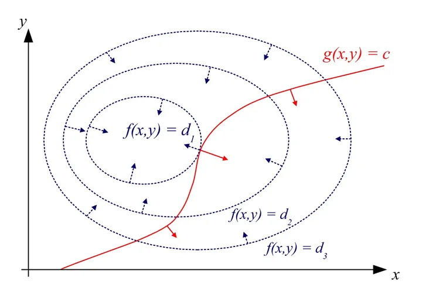

# Lagrangian function method
Table of contents:
[TOC]

## 1. Constrained optimization problems
In practical applications, the optimization problems we often face involve certain constraints. For example, the knapsack problem requires maximizing the value of items in the knapsack without exceeding the capacity of the knapsack. These constraints can be equality constraints or inequality constraints, which can be expressed by the following mathematical expressions:

$$
\begin{aligned}
\min \quad & f(x)\\
\text{s.t.} \quad & g_i(x) = 0; \quad i=1, \dots, n\\
& h_j(x) \leq 0; \quad j=1, \dots, m
\end{aligned}
$$

Where $f(x)$ is the objective function, $g_i(x)$ is the equality constraint, and $h_j(x)$ is the inequality constraint. In order to solve this constrained optimization problem, penalty functions, interior point methods, heuristic algorithms, etc. can be used, but these algorithms are relatively complex. Therefore, this article introduces a common and easy-to-understand method-the Lagrangian function method.

## 2. Lagrangian function method
By introducing Lagrangian multipliers to construct Lagrangian functions, the Lagrangian function method cleverly **converts constrained optimization problems into unconstrained optimization problems**, and thenAnd solve.

### 2.1 Basic steps:

1. **Establish Lagrangian function**:
Suppose there is an optimization problem with constraints:
$$
\begin{aligned}
\min \quad & f(x) \\
\text{s.t.} \quad & g_i(x) = 0; \quad i = 1, 2, \ldots, m\\
\end{aligned}
$$

Where \( f(x) \) is the objective function and \( g_i(x) \) is the constraint. First, introduce the Lagrange multiplier \( \lambda_i \) and define the Lagrange function:
\[
L(x, \lambda) = f(x) + \sum_{i=1}^{m} \lambda_i g_i(x)
\]

2. **Solve the gradient of the Lagrange function**:
Take the partial derivative of the Lagrange function \( L(x, \lambda) \) with respect to the variable \( x \) and the Lagrange multiplier \( \lambda \) and set it to zero to obtain the system of equations:
\[
\frac{\partial L}{\partial x} = 0, \\\quad \frac{\partial L}{\partial \lambda_i} = 0, \quad i = 1, 2, \ldots, m
\]
Solve this system of equations to get the optimal solution \( x^* \) and Lagrange multiplier \( \lambda^* \).

3. **Find the optimal solution to the original problem**:
Substitute the optimal solution \( x^* \) into the objective function of the original problem to get the optimal solution to the original problem.

### 2.2 Example
The following is a simple example to illustrate the application of the Lagrangian method:

Suppose there is an optimization problem:
$$
\begin{aligned}
\min_{x} &\quad x^2 \quad \\
\text{s.t.} &\quad x-2 = 0
\end{aligned}
$$
Where the objective function \( f(x) = x^2 \), the constraint \( g(x) = x - 2 = 0 \).

First, construct the Lagrangian function:
\[
L(x, \lambda) = f(x) + \lambda g(x) = x^2 + \lambda (x - 2)
\]

Then, solve the gradient of the Lagrangian function and set it to zero：
$$
\begin{aligned}
\frac{\partial L}{\partial x} &= 2x + \lambda = 0, \\
\frac{\partial L}{\partial \lambda} &= x - 2 = 0
\end{aligned}
$$

Solving this system of equations, we can get the optimal solution \( x^* = 2 \) and the Lagrange multiplier \( \lambda^* = -4 \).

Finally, substitute the optimal solution \( x^* = 2 \) into the objective function of the original problem, and the optimal solution of the original problem is \( f(x^*) = 2^2 = 4 \).

### 2.3 Understanding
What exactly does the Lagrange function method do? Let's look at the following figure first:



The elliptical dotted line in the figure is the contour line of the objective function $f(x,y)$, and the red solid line is the constraint condition $g(x,y)=c$. We can find that **when the constraint curve $g(x,y)=c$ and the contour line $f(x,y)=d_1$ are tangent, the objective function $f(x,y)$ reaches an extreme value**. The two curves are tangent, which means that their normals at this point are parallel, and the difference is only a constant multiple (set as $-\lambda$).

Simultaneous equations:

$$
\begin{aligned}
\nabla f(x,y) &= -\lambda \nabla g \\
g(x, y) &= c \\
\end{aligned}
$$

Substitute into $2.2$ example:
$$
\begin{aligned}
2x &= -\lambda \\
x &= 2 \\
\end{aligned}
$$
Solving it, we know that $x^* = 2$. It can be found that this set of equations is equivalent to the set of equations for solving the gradient of the Lagrangian function in $2.2$.

Therefore, the Lagrangian method is actually **finding the extreme point where the objective function is tangent to the constraints**, which is also the stationary point of the Lagrangian function and the solution to the original optimization problem.

### 2.4 Advantages and Disadvantages
The Lagrangian method **converts a constrained optimization problem into an unconstrained problem**, thereby simplifying the solution of the problem and is applicable to various types of constraints, including equality constraints and inequality constraints.

However, the solution obtained by the Lagrangian method may also fall into a local optimum rather than a global optimum; and as the number of constraints increases, the derivative equations of the Lagrangian function may become very complicated, resulting in an increase in the amount of calculation.

## 3. Augmented Lagrangian Function Method

The augmented Lagrangian function method **adds a quadratic penalty term* to the Lagrangian function method*, combines the advantages of Lagrangian function method and quadratic penalty function method. The augmented Lagrangian function method can transform the constrained optimization problem into an unconstrained optimization problem, simplifying the solution of the problem; the introduction of penalty terms strengthens the satisfaction of constraint conditions, which helps the algorithm **converge to a feasible solution faster**. Compared with the quadratic penalty function method, the augmented Lagrangian function method has **smaller constraint violation** and more stable solution.

### 3.1 Equality constraints
$$
\begin{aligned}
min \quad &f(x) \\
\text{s.t.} \quad & c_i(x) = 0, i \in \mathcal{E} \tag{3.1}
\end{aligned}
$$

The augmented Lagrangian function is:

$$
L_\sigma (x, \lambda) = f(x) + \sum\limits_{i\in \mathcal{E}} \lambda_i c_i (x) + \frac{\sigma}{2} \sum\limits_{i\in \mathcal{E}} (c_i (x))^2
$$

Where, $\sigma$ is the penalty factor, and $\lambda$ is the Lagrange multiplier. When solving, you can fix one term first, update the other, and iterate in this way.The steps are: 
- Fix $\lambda$, update $x$:
$$
x^{k+1} = \underset{x}{\text{argmin}} \, L_{\sigma}(x, \lambda^k)
$$
That is:
$$
\nabla_x L_{\sigma_k}(x^{k+1}, \lambda_k) = \nabla f(x^{k+1}) + \sum\limits_{i\in \mathcal{E}} (\lambda_{i}^{k} + \sigma_k c_i (x^{k+1})) \nabla c_i (x^{k+1}) = 0
$$

- Update $\lambda$:
$$
\lambda_i^{k+1}=\lambda^k + \sigma_k c_i (x^{k+1})
$$

### 3.2 Inequality Constraints
For general optimization problems with inequality constraints:
$$
\begin{aligned}
min \quad &f(x) \\
\text{s.t.} \quad & c_i(x) = 0, i \in \mathcal{E}, \\
& c_i(x) \leq 0, i\in \mathcal{I} \tag{3.2}
\end{aligned}
$$
Slack variables can be introduced to transform inequality constraints into equality constraints and simple non-negative constraints:
$$
\begin{aligned}
min \quad &f(x) \\
\text{s.t.} \quad & c_i(x) = 0, i \in \mathcal{E}, \\
& c_i(x) + s_i= 0, i\in \mathcal{I}, \\
& s_i \geq 0, i\in \mathcal{I}. \tag{3.3}
\end{aligned}
$$
Retaining the non-negative constraints, the Lagrangian function can be constructed:
$$
\begin{aligned}
L(x, s, \lambda, \mu) &= f(x) + \sum\limits_{i\in \mathcal{E}} \lambda_i c_i (x) + \sum\limits_{i\in \mathcal{I}} \mu_i (c_i(x) + s_i), \\
& s_i \geq 0, i\in \mathcal{I}.
\end{aligned}
$$

Let the quadratic penalty function of problem $(3,3)$ be $p(x,s)$, then
$$
p(x,s) = \sum\limits_{i\in\mathcal{E}} c^2_i (x) + \sum\limits_{i \in \mathcal{I}} \mu_i (c_i(x) + s_i)^2
$$

So, the augmented Lagrangian function is:
$$
\begin{aligned}
L_\sigma (x, s, \lambda, \mu) &= f(x) + \sum\limits_{i\in \mathcal{E}} \lambda_i c_i (x) + \sum\limits_{i\in \mathcal{I}} \mu_i (c_i(x) + s_i) + \frac{\sigma}{2}p(x,s), \\
& s_i \geq 0, i\in \mathcal{I}
\end{aligned}
$$

Where $\sigma$ is the penalty factor.

So, we can transform the problem $(3.3)$ into the following problem:
$$
\begin{aligned}
\underset{x,s}{min} \quad & L_{\sigma_k}(x,s,\lambda^k, \mu^k), \\
\text{s.t.} \quad & s \geq 0
\end{aligned} \tag{3.4}
$$

It is necessary to solve $x^{k+1}, s^{k+1}$. This solution can be obtained by using the projected gradient method, or by eliminating $s$ first and solving the optimization problem only for $x$. First, fix $x$, and the subproblem about $s$ can be expressed as follows:

$$
\underset{s\geq 0}{min} \quad \sum\limits_{i\in \mathcal{I}} \mu_i (c_i(x) + s_i) + \frac{\sigma_k}{2} \sum\limits_{i\in \mathcal{I}} (c_i(x) + s_i)^2
$$

The derivative is 0, and we know that $s$ is a global optimal solution to the above problem if and only if
$$
s_i = max \{- \frac{\mu_i}{\sigma_k}-c_i(x), 0\}, i\in \mathcal{I}
$$

Substitute the expression of $s_i$ into $L_{\sigma_k}$, we have:

$$
\begin{aligned}
L_\sigma (x, \lambda^k, \mu^k) &= f(x) + \sum\limits_{i\in \mathcal{E}} \lambda_i c_i (x) + \frac{\sigma_k}{2}\sum\limits_{i\in \mathcal{E}}c^2_i (x) + \\
& \frac{\sigma_k}{2} \sum\limits_{i\in \mathcal{I}} (max\{\frac{\mu_i}{\sigma_k}+ c_i(x), 0\}^2 - \frac{\mu^2_i}{\sigma^2_k})
\end{aligned}
$$

So, problem $(3.4)$ Equivalent to

$$
\underset{x\in \mathbb{R^n}}{min} \quad L_{\sigma_k}(x, \lambda^k, \mu^k)
$$

In this way, we eliminate the variable $s$ and can solve the minimum point in the low-dimensional space $\mathbb{R^n}$.

The KKT condition for problem $(3.3)$ is:

$$
\begin{aligned}
0 &= \nabla f(x^*) + \sum\limits_{i\in \mathcal{E}}\lambda^*_i \nabla c_i(x^*) + \sum\limits_{i\in \mathcal{I}} \mu_i^* \nabla c_i (x^*), \\
\mu^*_i & \geq 0, i\in \mathcal{I}, \\
s^*_i & \geq 0, i\in \mathcal{I}.
\end{aligned}
$$

The KKT condition for problem $(3.4)$ is:

$$
\begin{aligned}
0 = & \nabla f(x^{k+1}) + \sum\limits_{i\in \mathcal{E}} (\lambda^k_i + \sigma_k c_i (x^{k+1})) \nabla c_i (x^{k+1}) + \\ 
& \sum\limits_{i\in \mathcal{I}} (\mu_i^k + \sigma_k (c_i (x^{k+1}) + s_i^{k+1})) \nabla c_i (x^{k+1}), \\
s_i^{k+1} = & max \{ -\frac{\mu_i^k}{\sigma_k} - c_i (x^{k+1}), 0\}, i\in \mathcal{I}.
\end{aligned}
$$

Comparing the KKT conditions of the two problems, it is easy to know that the update form of the multiplier is:
$$
\begin{aligned}
\lambda_i^{k+1} &= \lambda_i^k + \sigma_k c_i (x^{k+1}), &i\in \mathcal{E}, \\
\mu_i^{k+1} &= max\{\mu_i^k + \sigma_k c_i(x^{k+1}), 0\}, &i\in \mathcal{I}.
\end{aligned}
$$

### 3.3 Code example
Take the example in Section $2.2$ as an example:

$$
\begin{aligned}
\min_{x} &\quad x^2 \quad \\
\text{s.t.} &\quad x-2 = 0
\end{aligned}
$$

Construct the augmented Lagrangian function:

$$
\begin{aligned}
L(x, \lambda) &=f(x) + \lambda g(x) + \frac{\sigma}{2} g^2(x) \\
&= x^2 + \lambda (x - 2) + \frac{\sigma}{2} (x-2)^2
\end{aligned}
$$

Write code to solve:

```python
import numpy as np
from scipy.optimize import minimize

# Objective function
def objective(x):
return x**2

# Constraint function
def constraint(x):
return x - 1

# Augmented Lagrangian function
def augmented_lagrangian(x, lambda_, sigma):
return objective(x) + lambda_ * constraint(x) + (sigma / 2) * constraint(x)**2

# Solve constrained optimization problem
def solve_constrained_optimization():
# Initialize parameters
x0 = np.array([0.0]) # Initial point
lambda_ = 0.0 # Initial Lagrangian multiplier
sigma = 1.0 # Initial penalty parameter

# Define optimization problem
def objective_with_constraints(x):
return augmented_lagrangian(x, lambda_, sigma)

# Solve optimization problem
result = minimize(objective_with_constraints, x0, constraints={'type': 'ineq', 'fun': constraint})
return result

# Solve and output results
result = solve_constrained_optimization()
print("Optimal solution x:", result.x)
print("Objective function value:", result.fun)
```

Running results:
```
Optimal solution x: [1.]
Objective function value: 1.0
```

## 4. References
[1] [【知乎】How to understand the Lagrange multiplier method? ](https://www.zhihu.com/question/38586401) 
[2] [Liu Haoyang, Hu Jiang, Li Yongfeng, Wen Zaiwen. (2021). Optimization: Modeling, Algorithms and Theory. Beijing: Higher Education Press](https://bicmr.pku.edu.cn/~wenzw/optbook/opt1.pdf)